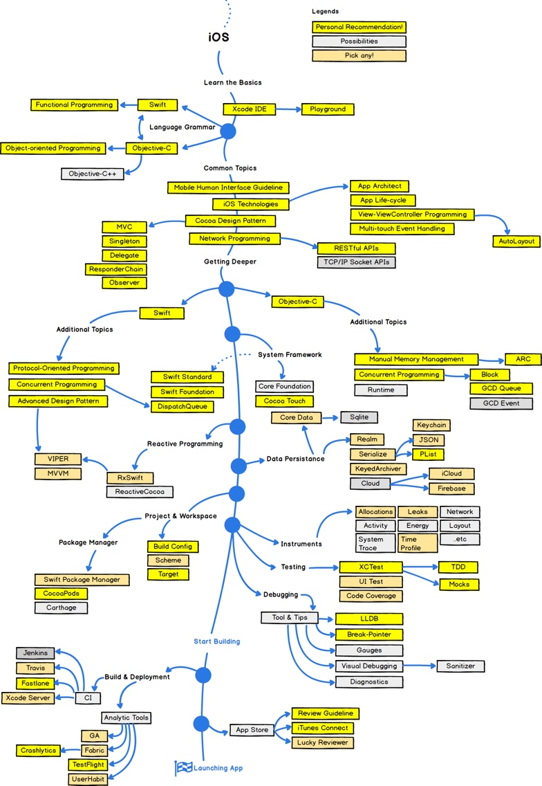
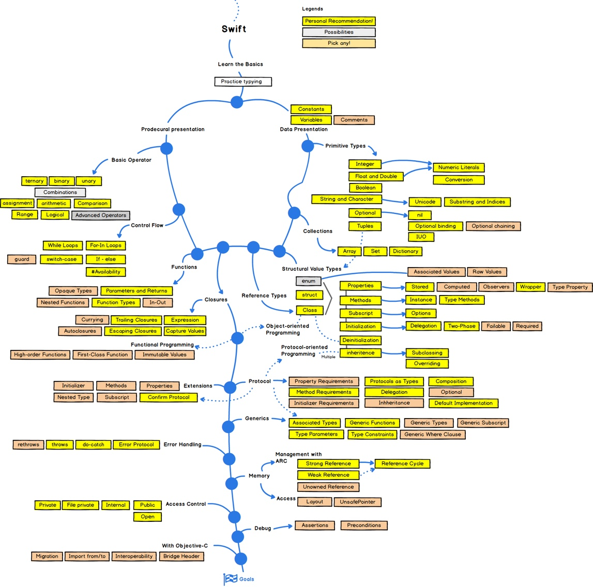
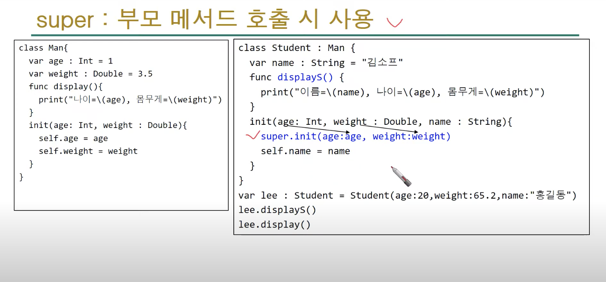

# Swift-5.0


- [x] You can refer to it through the playground
- [x] You can use swift
- [x] Now Submit to Swift


## 개발로드맵
### **iOS**


### **Swift**



## iOS 
- [iOS Fonts](http://iosfonts.com/)
- [App Store 심사지침](https://developer.apple.com/kr/app-store/review/guidelines/)
- [Apple ID](https://developer.apple.com/library/archive/documentation/General/Conceptual/DevPedia-CocoaCore/AppID.html#//apple_ref/doc/uid/TP40008195-CH64-SW1)
- [Apple Update News](https://developer.apple.com/kr/news/)
- [Apple Human-interface ](https://developer.apple.com/design/human-interface-guidelines/ios/visual-design/color/)

## WWDC 2020

- [ios-14](https://www.hackingwithswift.com/articles/221/whats-new-in-swiftui-for-ios-14)
- [UIMenu](https://zeddios.tistory.com/1098?category=682195)
- []

## Swift 

- [Objective-C 와swift차이](#Objective-C와swift차이 )
- [AppDelegate](#AppDelegate)
- [iOS Application State](#iOSApplicationState)
- [ViewController Life Cycle(생명주기)](#ViewControllerLifeCycle)
- [Main run loop](#MainRunLoop)
- [Update Cycle](#UpdateCycle)
  - [Layout](#Layout)
  - [Display](#Display)
  - [Constraints](#Constraints)
- [CoreAnimation](#CoreAnimation)
- [CALayer](#CALayer)
- [iOS UIClassDiagram](#UIClassDiagram)

**[문법]**
- [데이터 타입](#데이터타입)
  - [Int](#Int)
  - [Double](#Double)
  - [Bool](#Bool)
  - [Character](#Character)
  - [String](#String)
  - [특수문자,이스케이프시퀀스](#특수문자,이스케이프시퀀스)
  - [var(변수)](#var)
  - [let(상수)](#let)
  - [타입어노테이션과 타입추론](#타입어노테이션과타입추론)
- [Tuple](#Tuple)
- [as](#as)
- [is](#is)
- [Any와 AnyObject](#Any)
- [연산자](#연산자)
  - [nil 합병 연산자](#Nil합병연산자)
- [제어문](#제어문)
  - [for](#for)
  - [while](#while)
  - [break](#break)
  - [continue](#continue)
  - [if문사용하기](#if문사용하기)
  - [guard](#guard)
  - [switch](#switch)
  - [where](#where)
  - [fallthrough](#fallthrough)
- [함수기초](#함수)
  - [내부 매개변수와 외부 매개변수](#내부외부)
  - [디폴트 매개변수 : Default Parameter](#디폴트매개변수)
  - [여러개의 결과 반환](#여러개결과반환)
  - [가변매개변수 : Variafic Parameter](#가변매개변수)
  - [inout매개변수](#inout매개변수)
  - [함수를 매개변수와 리턴값으로 사용](#함수를매개변수로사용)
  - [swift함수명](#swift함수명)
  - [클로저표현식 : 클로저와 후행 클로저](#클로저표현식)
- [then(with: 전수열)](#then)
- [Class](#Class)
  - [Class 기초](#Class기초)
  - [클래스 선언하기](#클래스선언하기)
  - [클래스에 property추가하기](#클래스에property추가하기)
  - [메서드 정의](#메서드정의)
  - [타입(클래스)메서드](#타입메서드)
  - [인스턴스 초기화하기 : init()](#인스턴스초기화하기)
  - [Self](#Self)
  - [CulatedProperty : get, set](#CulatedProperty)
  - [overloading ~ Failable Initializers](#overloading)
- [상속](#상속)
  - [super](#super)
  - [override](#override)
  - [extension](#extension)
- [접근제어](#접근제어)
- [protocol](#protocol)
- [enum: 열거형](#enum)
- [struct](#struct)
- [클래스/구조체,열거형 비교](#비교)
- [메모리 구조&관리](#메모리구조)
- [print](#print)
- [func](#func)
- [inout](#inout)
- [Optional](#Optional)
  - [Optional unwrapping](#Optionalunwrapping)
  - [Optional Binding](#OptionalBinding)
  - [Implicitly Unwrapping](#implicitlyunwrapping)
  - [Optional Chaining](#OptionalChaining)
- [오류처리](#오류처리)
  - [throwing function](#throwingfunction)
  - [do~try catch](#dotrycatch)
  - [Result](#Result)
- [Generic](#Generic)
- [Delegate](#Delegate)
  - [UIPickerViewDelegate로 든 예제](#UIPickerViewDelegate)
  - [UITableViewDataSource](#UITableViewDataSource)
  - [UITableViewDelegate](#UITableViewDelegate)
- [mutable/Immutable](#mutable)
- [initializer](#initializer)
  - [designated initializer](#designatedinitializer)
  - [convenience initializer](#convenienceinitializer)
  - [failableinitializer](#failableinitializer)
  - [SuperClass Initializing](#SuperClassInitializing)
  - [initalizer의 상속](#initalizer상속)
  - [required initializer](#requiredinitializer)
- [MVC](#MVC)
- [bundle](#bundle) 
- [Nib/Xib](#Nib와Xib)
- [SDK와 API차이](#SDK와API차이)


**[Xcode]**

- [Debugging](#Debugging)


**[SwiftUI]**

- [SwiftUI](#SwiftUI)
- [SwiftUI사용](#SwiftUI사용)


## Language house(in Swift)


### Objective-C와swift차이 

- swift는 ios8에 개발에 사용됨.
- swift는 타입 추정, 타입 세이프가 제공됨.(명시할 필요 없어짐)
- swift는 isEqual메서드를 이용할 필요없이 == 연산자만으로 비교가능.
- swift는 switch문으로 분기가 가능함. objective-c는 if문으로 처리해야했음. 
- swift는 Generic타입 제공. 
- Objective-C는 class, swift는 struct 기반임. 


***

### AppDelegate

**UIResponder** 
- [http://blog.naver.com/hobin1019/221302910865](http://blog.naver.com/hobin1019/221302910865) 
- UIKit app의 이벤트핸들링을 위해 있는 것.
- UIApplication, UIViewController, UIView(UIWindow의 일종)이 모두 이벤트 responder에 포함됨.
- 이벤트가 발생하면, UIKit는 각각의 responder오브젝트로 처리하게 시킴

*event*
- 이벤트에는 터치이벤트, 모션이벤트, 리모트콘트롤이벤트, 누르는 이벤트가 있는데, 특정 이벤트를 처리하기 위해 responder는 반드시 특정 메소드를 override해야함. 
- 예를들면, 터치이벤트를 처리하기 위해 responder는 touchesBegan, touchesMoved, touchesEnded, touchesCancelled를 구현해야함.
- 터치의 경우 responder는 UIKit로부터 제공되는 이벤트 정보를 사용. 
- 터치에 대해 바뀐 점을 찾을 수 있고, 적절하게 앱의 인터페이스에 반영할 수 있게됨. 

*UIkit responder* 
- UIkit responder들은 처리되지 않은 이벤트를 당신의 app의 다른 부분으로 전달 되기도 함. 
- 주어진 respinder이 이벤트를 처리하지 않으면, 다음 이벤트 responder 체인으로 그 이벤트를 넘김. UIKit는 responder체인을 동적으로 관리하며, 미리 정해진 규칙에 따라 다음에 이벤트를 받게 될 오브젝트를 결정한다. 
- 예를 들면, view는 super view로 전달하고, root view는 ViewController로 전달함.

reponders는 UIEvent오브젝트를 처리하며, input view를 통한 custom input을 처리하기도 한다. 키보드가 input view의 한 예이다. 유저가 UITextField나 UITextView를 화면에 탭한 경우, view는 최초의 responder가 되고, 그것의 Input view(keyboard)를 보여준다. 

*Respinding to touch events*
- touchesBegan
- touchesMoved
- touchesEnded
- touchesCancelled

*Respinding to Motion events*
- motionBegan
- motionEnded
- motionCancelled

*Respinding to press events*
- pressesBegan
- presserChanged
- presserEnded
- presserCancelled

*Respinding to remote-control events*
- remoteControlRecieved


**application**: 앱 시작 전에 필요한 작업들을 여기에 작성

**applicationWillResignActive** : 앱이 비활성화 되는 단계에 들어갈 때 실행되는 메소드

**applicationDidEnterBackground**: 앱이 백그라운드 상태에 들어갔을 때 실행되는 메소드 

**applicationWillEnterForeground** :앱이 백그라운드에서 다시 화면으로 나올 때 실행되는 메소드 

**applicationDidBecomeActive** : 앱이 화면으로 나오고 나서 실행되는 메소드

**applicationWillTerminate** : 앱이 종료할 때 실행되는 메소드 

***

### iOSApplicationState

**Not Running** : 앱이 실행되지 않았거나, 시스템에 의해 종료된 상태.

**Active** : 앱이 Foreground에서 실행되고 있고, 이벤트를 받을 수 있는 상태. 

**Inactive** : 앱이 Foreground에서 실행되고 있으나, 이벤트를 받지 못하는 상태

**Background** : 앱이 Foreground에서 실행중인 상태, Home버튼을 눌렀을 때 일시적으로 Background상태가 됨

**Suspended** : 실행이 중단되어 대기중인 상태, 잠시동안 Background상태를 거친 후에 이 상태가 됨

***

### ViewControllerLifeCycle

- ViewController에서의 생명주기는 화면에 보여졌다가 사라지는 주기를 일컬음.


**loadView()** 
- 화면에 띄워줄 view를 만드는 메소드로 view를 만들고 메모리에 올림.
- 설명서 보면, 이 메소드는 직접 호출하지 말라고 쓰여있음. 
- 모두를 직접적으로 코딩하여 만드는 경우를 제외하고는 override하지 않는 것이 좋음. 자세한 설명은 아래 링크
- [https://leehonghwa.github.io/blog/loadView/](https://leehonghwa.github.io/blog/loadView/)

**loadViewIfNeeded(iOS9이상)**
- 뷰 컨트롤러의 뷰가 아직 설정되지 않은 경우로드

**viewDidLoad**
- 뷰의 컨트롤러가 메모리에 로드 된 후 호출되며 시스템에 의해 자동으로 호출됨.
- 사용자가 화면이 보여지기 전에 데이터를 뿌려주는 행위에 대한 코드를 작성 할 수 있음.
- 일반적으로 리소스를 초기화하거나, 초기화면을 구성하는 용도로 쓰임
- ViewController생에 **딱 한 번** 호출 되는 것이 특징.

**viewWillAppear**
- 뷰 컨트롤러의 화면이 올라오고 난 후 뷰가 화면에 나타가기 직전에 호출됨.
- 즉, 뷰가 로드된 후 눈에 보이기 전에 컨트롤러에게 알리는 역할.
- 다른 뷰로 이동했다가 되돌아올 때 재 호출되는 메소드로 화면이 나타날 때 마다 수행해야하는 작업을 정의하기 좋음. 
- 처음 어플리케이션이 수행 되고 첫 화면이 띄워질 때 호출되는 것은 viewDidLoad()와 동일하지만, 화면 전환을 통해 **다시 현재의 화면으로 돌아올 때 viewDidLoad가 아닌 viewWillAppear가 호출됨.** 

**viewDidAppear**
- view가 데이터와 함께 완전히 화면에 나타난 후 호출 되는 메소드

**viewWillLayoutSubviews**
-경계가 확정되는 라이프사이클 첫단계. 뷰 컨트롤러의 뷰의 layoutSubviews 메서드가 호출되기 직전에 호출됨.**뷰의 bounds(좌표,크기)가 최종적으로 결정되는 최초시점.** (변경될 때, 뷰는 하위뷰의 위치를 조절한다.) 뷰가 하위 뷰의 배치를 조절하기 전에 뷰 컨트롤러는 이 메서드를 override할 수 있다. 
- 컨스트레인트나 오토레이아웃을 사용하지 않았다면, 서브뷰의 레이아웃을 업데이트하기 적합한 시점
- 여러 번 중복으로 호출될 수 있다.
- 메인뷰의 서브뷰가 로드되는 경우 (테이블뷰나 컬렉션뷰가 로드된 경우? )
- 기본값 nop으로 아무것도 하지 않음

**viewDidLayoutSubviews**
- 뷰 컨트롤러에 하위 뷰가 설정되었음을 알림
- 서브뷰가 셋업되고 난 후 호출
- 서브뷰가 셋팅된 후 변경할 점이 있다면 여기서 수정하기 적합함
- 기본값 nop으로 아무것도 하지 않음

**viewWillDisappear**
- 다음 ViewController화면이 전환하기 전이거나, viewController가 사라지기 직전에 호출되는 메소드
**viewDidDisappear**
- ViewController들이 화면에서 사라지고 나서 호출되는 메소드
- 화면이 사라지고 나서 필요없어지는 (멈춰야하는) 작업을을 이곳에서 함.

**viewDidUnload /viewDidDispose** 
- iOS6이후 사용하지 않음. (Objective-C에서이 부분은 메모리관리 및 릴리스를 수행하는 곳이지만 자동으로 처리되므로 Swift에서 할 필요가 거의 없음.)
- viewDidUnload의 경우 메모리 경고 발생시 뷰가 해제되어 사라지는 메소드 

***

### MainRunLoop

- 유저가 일으키는 input이벤트 들을 처리/응답 해주는 것을 담당하는 프로세스. 
- UIApplication은 Main Run Loop 를 View 와 관련된 이벤트나 View 의 업데이트에 활용. Main Run Loop 는 View와 관련되어 있기 때문에 main 쓰레드에서 실행됨.


*그림.사용자 이벤트(user interaction) 발생 및 처리과정*
1. 유저가 이벤트를 일으킴(터치,줌인등의 input)
2. 시스템을 통해 이벤트가 생성됨.
3. UIKit 프레임워크를 통해 생성된 port로 해당 이벤트가 앱으로 전달
4.이벤트는 앱 내부적으로 Queue의 형태로 정리되고, Main Run Loop에 하나씩 매핑됨.
5. Application object(애플리케이션 객체)는 유저로부터의 input 이벤트를 해석하고 그에 상응되는 애플리케이션의 Core object들 안에 있는 핸들러를 호출(여기서 핸들러란 개발자가 입력한 코드)
6. 이러한 메서드들이 반환되면 다시 컨트롤은 main run loop로 돌아가서 Update Cycle이 다시 시작됨
7. Update Cycle은 View 들을 배치하고 다시 그리는 역할


*그림.전달받은 이벤트를 앱의 run loop에서 처리하는 과정*

1. run loop 대기 중 이벤트 발생(주로 입력소스와 타이머소스 처리)
2. 정해진 메소드 호출(타이머에서 설정한 시간데 따라)
3. 메소드 완료 후 변경될 필요가 있는 사항 적용(뷰의 경우 setNeedsLayout, setNeedsDisplay)
4. runUntil- 메소드에서 정한 시간까지 유지, 할일 없으면 suspend 상태.
[https://developer.apple.com/library/archive/documentation/Cocoa/Conceptual/Multithreading/RunLoopManagement/RunLoopManagement.html](https://developer.apple.com/library/archive/documentation/Cocoa/Conceptual/Multithreading/RunLoopManagement/RunLoopManagement.html)


***

### UpdateCycle

- Update Cycle은 애플리케이션이 유저로부터의 모든 이벤트 핸들링 코드를 수행하고 다시 main run loop로 컨트롤을 반환하는 지점임. 바로 이 지점에서 시스템은 우리의 View들을 배치하고(layout), 보여주고(display) 제약(constraints)함
- 만약 우리가 이벤트 핸들러들을 처리하는 과정에서 어떤 UIView에 대해 변화를 준다면, 이 UIView는 다시 그려져야(redraw) 한다고 표시됨.
- 유저가 상호작용하는 것과 레이아웃이 변하는 시간의 갭은 유저가 인지하지 못할 정도여야 하며, iOS 애플리케이션은 초당 60프레임을 보여주기 때문에, 한 번의 Update Cycle은 1/60초 가 걸림(매우 신속).
- Update Cycle은 빠르게 업데이트 되기 때문에 유저는 UI와 상호작용 간의 차이를 느끼지 못함. 
- 그러나, Update Cycle에 대한 이해가 중요한 이유는 이벤트가 처리되는 시점과 실제로 View가 다시 그려지는 시점에 차이가 있기 때문에, View는 우리가 View를 업데이트 하기를 원하는 run loop의 특정 시점에 업데이트가 되지 않을 수 있으므로 주의 필요. 

*MainRunLoop가 한바퀴 돌 때, Update Cycle이 언제 발생하는지 표현한 그림*


***

### Layout

- 화면에서 UIView의 크기와 위치를 의미. 모든 View는 frame을 갖고 있고, 이는 부모 뷰의 Coordinate System(좌표계)에서 어디에 위치하고 얼마나 크기를 차지하는지를 나타냄. 
- UIView는 시스템에게 UIView의 레이아웃이 변했다고 알려줄 수 있는 메서드나, View의 레이아웃이 다시 계산되는 시점에 특정한 작업을 실행할 수 있게 오버라이딩할 수 있는 콜백 메서드도 제공함. UIView의 하위 메서드는 아래와 같다. 


**layoutSubviews()**
- 서브 뷰들의 위치나 크기를 결정하는 제약조건을 사용함에 따라 View(부모)와 자식뷰들의 위치와 크기를 재조정(배치). 

```
해당 메서드는 재귀적으로 모든 자식 뷰의 layoutSubviews까지 호출해야 하기 때문에 실행 시에 부하가 큰 메서드임. 시스템은 layoutSubviews를 뷰의 frame을 다시 계산해야 할 때 호출하기 때문에 layoutSubviews를 오버라이딩해서 frame이나 특정한 위치와 크기를 조절할 수 있지만, 레이아웃을 업데이트해야 할 때 layoutSubviews를 직접 호출하는 것은 금지되어 있음.

layoutSubviews가 완료될 때, viewDidLayoutSubviews가 View를 소유한 ViewController에서 호출되기 때문에, layoutSubviews는 View의 layout이 변화했다는 유일한 콜백으로 레이아웃의 크기나 위치와 연관된 로직을 viewDidLoad나 viewDidAppear가 아닌, viewDidLayoutSubviews에 호출해야 함. 이것이 오래된 레이아웃이나 위치 변수를 다른 계산에 사용하는 실수를 막는 유일한 방법이 됨..

이러한 방식들은 모두 run loop가 돌아가는 동안 layoutSubviews가 실행되는 시점이 다르며, 직접 layoutSubviews를 호출하는 것보다는 부하가 덜하므로 사용됨
```

*Automatic refresh triggers*

다음과 같은 이벤트들은 자동으로 View가 그것들의 layout에 변화가 생겼다고 표시를 해주어서 개발자가 직접 요청할 필요 없이, layoutSubviews가 다음 기회에 호출이 되게 해줌.
- View를 Resizing
- SubView를 추가
- UIScrollView를 스크롤할 때, UIScrollView와 그것의 부모뷰에 layoutSubviews가 호출
- Device를 회전(orientation change)
- View의 Constraint를 변경

위의 방법들은 자동으로 시스템이 View의 위치가 변했고, 다시 계산되도록 하여 결국엔 layoutSubviews가 호출되게 해줌. 그러나 layoutSubviews를 직접 호출해줄 수 있는 방법들도 존재함(아래).


**setNeedsLayout()**

- 가장 적은 부하로 호출할 수있는 메서드.(layoutSubview가 호출 됨)
- setNeedsLayouts은 시스템에게 이 View의 layout이 다시 계산되어야 한다고 알려줌
- 그러나,  **setNeedsLayout은 즉시 반환되지만, 실제로 View를 업데이트해주는 것은 아님**메서드가 완료되어 즉시 반환되기 때문에 비동기 액티비티의 성질을 가짐. (그러나 레이아웃과 다시 그리는 작업이 실제로 발생하기 전까지는 아직 이른상태이고 업데이트 주기가 언제일지도 모르는 상태.)
- 다만, 시스템이 다음 Update Cycle에서 layoutSubviews를 View와 자식 View들에게 호출하게 하고 그 시점에 setNeedsLayout이 호출된 뷰들은 Update Cycle에서 업데이트가 되도록 해줌.
- 호출 시  needsLayout flag가 YES로 변경.
- 여러 부분에서 호출하더라도, 다음 run loop에서 한번만 적용
- 레이아웃 업데이트를 하나의 업데이트 주기로 통합할 수 있으며, 일반적으로 성능향상에 도움이 됨. 

**layoutIfNeeded()**

- 만약 View가 레이아웃이 재조정되어야 한다면, 즉시 layoutSubviews를 호출함. 레이아웃 업데이트가 보류중인 경우, 하위 View를 즉시 레이아웃(배치)합니다 (layoutSubview가 호출 됨) 이 메소드를 사용하면 View가 레이아웃을 즉시 업데이트 할 수 있음. 
- layoutIfNeeded를 호출했는데 View가 재조정되어야 하는 이유가 없다면, layoutSubviews는 호출되지 않음
- 동일한 run loop에서 레이아웃의 업데이트 없이 layoutIfNeeded를 두 번 호출했다면, 두 번째 호출은 layoutSubviews를 발생시키지 않음
- layoutIfNeeded를 사용한다면, 레이아웃을 하는 것과 자식 View들을 다시 그리는 것은 즉시 실행되고, 해당 메서드가 반환되기 전에 실행됨.(애니메이션을 제외하고). setNeedsLayout 과는 다르게, 이 메서드는 다음 Update Cycle까지 뷰의 변화를 기다릴 수 없는 상황에서 유용함.
- 재조정되어야하는 상황이 아니라면 그냥 setNeedsLayout을 호출해서 다음 Update Cycle에 뷰가 업데이트되어 run loop 한번 당 View업데이트가 한 번만 이루어지게 하는 것이 이상적
- 호출 시 needsLayout flag를 체크하여 YES인 경우 뷰 변경을 즉시 적용.
- 호출 즉시 뷰 변경을 적용하기 때문에 여러 부분에서 사용할 경우 성능상의 문제가 생길 수 있음
- 메서드가 반환되기 전에 실행(즉시 실행)되는 것으로 동기적 성질을 띰. setNeedsLayout과 layoutIfNeeded의 차이점은 동기적으로 동작하느냐 비동기적으로 동작하느냐의 차이.

*layoutIfNeeded는 Constraints를 애니메이션 하는 상황에서 특히 유용*

애니메이션이 시작하기 전에 layoutIfNeeded를 호출하여 모든 레이아웃 업데이트가 애니메이션 전에 수행되도록 한 뒤, 새로운 Constraints를 설정하고, 애니메이션 클로저 안에서는 또 layoutIfNeeded를 호출해서 애니메이션이 올바른 상태로 진행되도록 하는 방법이 있음. 

- [https://developer.apple.com/documentation/uikit/uiview/1622507-layoutifneeded](https://developer.apple.com/documentation/uikit/uiview/1622507-layoutifneeded)

* setNeedsLayout()와 layoutIfNeeded()차이에 대한 github*
- [https://github.com/lmacfadyen/UIViewLifecycleLayoutDisplay](https://github.com/lmacfadyen/UIViewLifecycleLayoutDisplay)

*정리*
- 하위 클래스는 이 메서드를 하위 클래스의 뷰들을 보다 정확하게 배치하기 위해 재정의 할 수 있다. 
- autoresizing과 하위 뷰의 동작에 따른 constraint가 원하는 행동을 하지 않을 경우에만 이 메서드를 재정의 해야 한다. 
- 하위 뷰의 프레임을 설정하기 위해서 이 메서드를 재정의 할 수 있다.
- 강제로 배치를 update 하기 위해서는 이 메서드를 직접 호출하지 말고 다음에 그려질 것이 update 하기 이전에 setNeedsLayout 메서드를 호출하거나, 뷰들의 레이아웃을 즉각적으로 update 하기 위해야한다면 layoutIfNeeded 메서드를 호출할 것.

***

### Display

- Layout 이란 것이 뷰의 위치와 크기를 의미한다면, Display는 뷰의 속성들 중 크기와 위치나 뷰의 자식 View들에 대한 정보를 갖지 않는 속성들을 포함함. 예) 색, 텍스트, 이미지, Core Graphics 그리기 등
- Display는 Layout 과정과 유사함. 시스템이 자동으로 업데이트가 되게 하는 방식과 우리가 명시적으로 업데이트를 해주게 하는 방식(메서드들)이 존재.(아래)


**draw(_:)**

- Apple문서 정의 : 전달된 사각형 내에서 receiver(수신자)의 이미지를 그립니다.
- 여기서 **전달된 사각형**이란 파라미터로 받은 **CGRect**타입을 의미
- UIView의 draw 메서드는 Layout 업데이트 과정에서의 layoutSubviews와 같은 역할을 하지만, 큰 차이점은 draw 메서드는 자식 View들의 draw까지 호출해주지는 않는다 점이있음. 
- layoutSubviews와 마찬가지로 draw를 직접 사용하는 것은 좋지 않음!


*이해를 위해 zedd님 블로그에서 가져왔다*
```
View가 처음 로드됨 -> 모든 View들이 준비됨(viewDidLoad. 즉 View객체들이 메모리에 올라감.) -> 컨텐츠를 그려줄때 이때!!!! 처음 draw메소드가 불림 -> View업데이트가 발생함 -> View업데이트해야하니 draw메소드를 호출해볼까?ㅋㄹㅋㅎㅋㅎ ==> XXX!!!! 절대 이 메소드를  직접 호출하면 안됨. View업데이트가 필요하면 setNeedsDisplay() 또는 setNeedsDisplay(_ :) 메소드를 호출해. -> ㅇㅋㅇㅋ요청받았어! 다음 드로잉 사이클에 업데이트 해줄게  -> 다음 드로잉 사이클때 View가 업데이트 됨(우리가 직접 draw메소드를 호출하진 않았지만, setNeedsDisplay () 또는 setNeedsDisplay (_ :) 메소드를 호출했기 때문에 draw메소드가 불림.)

출처: https://zeddios.tistory.com/359 [ZeddiOS]
```


**setNeedsDisplay()**

- setNeedsDisplay는 setNeedsLayout와 유사
- View의 Content가 업데이트 되게 하는 내부 플래그를 활성화시키고 실제로 View가 다시 그리기 전에 메서드는 반환함. 그러면, 다음 Update Cycle에 시스템은 이 플래그가 활성화되어있는 View들을 draw를 호출해서 다시 그려줌. (만약 View의 일부분만 다시 그려지길 원한다면, setNeedsDisplay 메서드의 인자로 rect를 전달할 수 있음)
- 뷰의 내용을 다시 그려야 함을 시스템에 알림.. 이 메서드는 지정된 사각형을 뷰의 현재 잘못된 사각형 목록에 추가하고 즉시 반환함. 뷰는 무효화 된 모든 뷰가 업데이트되는 다음 드로잉주기까지 실제로 다시 그려지지 않음.
- 호출 시 needsDisplay flag가  YES로 변경.
- 호출 즉시 뷰가 적용되는 것이 아니라 다음 run loop에 뷰 변경이 적용
- 여러 부분에서 호출하더라도, 다음 run loop에서 한번만 적용
- drawRect가 호출 됨
- 정리하자면,  setNeedsDisplay()메서드는 View의 컨텐츠가 변하면 이 View가 변했다는 사실을 시스템에 알려주기 위해서 사용하고, 그리고 이 setNeedsDisplay()메서드는 시스템에게 다음 [드로잉 사이클](#)때 View업데이트하라고 전달함.


*Apple 개발자가이드에서 setNeedsDisplay정의*


```
View의 실제 컨텐츠가 변경될 때, View를 다시 그려야함을 시스템에 알리는 것은 당신(개발자)의 책임입니다. 

View의 setNeedsDisplay () 또는 setNeedsDisplay (_ :) 메소드를 호출하여 이 작업을 수행할 수 있습니다.

이 메소드는 다음 드로잉 사이클(next drawing cycle)동안 View를 업데이트해야 함을 시스템에 알립니다. View를 업데이트하기 위해 다음 드로잉 사이클때까지 기다리기 때문에, 여러 View에서 이 메소드를 호출하여 동시에 업데이트 할 수 있습니다. 

```
- 뷰의 UI 컴포넌트를 업데이트하는 것은 View의 dirty flag를 활성화시켜 우리가 명시적으로 setNeedsDisplay를 호출하지 않아도 다음 Update Cycle에 뷰가 다시 그려지도록 유도함. 그러나, 만약 UI 컴포넌트와 직접적으로 연관되어 있지 않지만 매 Update Cycle마다 다시 뷰를 그려주어야 하는 속성이 있다면 우린 didSet 속성 감시자를 설정하고 setNeedsDisplay를 명시적으로 호출해줄 수 있다.(아래 코드참고)

예시) 커스텀으로 View그리기를 예로 설명 
```swift
class MyView: UIView {
    var numberOfPoints = 0 {
        didSet {
            setNeedsDisplay()
        }
    }

    override func draw(_ rect: CGRect) {
        switch numberOfPoints {
        case 0:
            return
        case 1:
            drawPoint(rect)
        case 2:
            drawLine(rect)
        case 3:
            drawTriangle(rect)
        case 4:
            drawRectangle(rect)
        case 5:
            drawPentagon(rect)
        default:
            drawEllipse(rect)
        }
    }
}
```
- numberOfPoints가 변하면 draw(_:) 안에서 View를 그리는 방식이 달라지기 때문에 didSet 블록 안에 setNeedsDisplay를 명시적으로 호출해준 예시임.
- Layout 과정과 다르게 Display는 즉시 draw(_:)를 호출해주는 메서드는 존재하지 않음. 이유는 뷰가 다시 그려지기 위해 다음 Update Cycle을 기다리는 것이 아무런 문제가 없기 때문.


**displayIfNeeded()**
- Apple문서 정의 : 필요에 따라 이 메서드를 호출하여 레이어의 내용을 표준 업데이트 주기 외로 강제 업데이트 할 수 있습니다.. 그러나 그렇게 하는 것은 일반적으로 필요하지 않으며, 레이어를 업데이트하는 가장 좋은 방법은 setNeedsDisplay()를 호출하고, 다음주기 동안 시스템이 레이어를 업데이트 하도록 하는 것입니다.
- layoutIfNeeded와 유사하게 동기방식임.
- NSView, NSWindow, [CALayer](#CALayer)에 포함된 메소드
- 호출 시 needsDisplay flag를 체크하여 YES인 경우 뷰 변경을 즉시 적용.
- 호출 즉시 뷰 변경을 적용하기 때문에 여러 부분에서 사용할 경우 성능상의 문제가 생길 수 있음
- drawRect가 호출 됨


***
### Constraints

- Auto Layout에서 Layout하고 Draw하는 것에 대해 3단계의 과정이 있음.
- **Constraints를 업데이트한다 :** 시스템이 View에 필요한 Constraints들을 계산하고 설정한다.

- **Layout 단계 :** 레이아웃 엔진이 View들의 Frame과 자식View들의 Frame을 계산하고 배치한다.

- **Display 단계 :** View의 컨텐츠를 다시 그리고 필요하다면 draw 메소드를 호출한다.


**updateConstraints()**

- Auto Layout을 이용시 View의 Constraints를 동적으로 변경할 때 사용.
- Layout 단계에서 layoutSubviews나 Display 단계에서 draw 같이, updateConstraints는 오직 오버라이딩되어야 하며 명시적으로 호출되어서는 안됨.
- 보통 updateConstraints에서 동적으로 변해야 하는 Constraints들을 구현하는데, 정적인 Constraints들은 Interface Builder나 View의 생성자나 viewDidLoad에서 정의됨.
- Constraints를 활성화/비활성화하거나 Constraints의 우선순위나 constant를 변경하거나 View를 View계층에서 삭제하는 것은 updateConstraints를 다음 Update Cycle에서 호출하게 함. 
- 그러나, UpdateConstraints를 명시적으로 호출하는 방법 또한 존재함.(아래)

**setNeedsUpdateConstraints**
- setNeedsUpdateConstraints를 호출하는 것은 다음 Update Cycle에서 Constraint가 업데이트되는 것을 보장해줌. 이 메서드는 setNeedsLayout이나 setNeedsDisplay와 비슷하게 작동함.

**updateConstraintsIfNeeded**
- 이 메서드는 layoutIfNeeded 와 유사함. 그러나 오직 Auto Layout을 사용하는 뷰에만 유효. 
- 이 메서드는 Constraint Update Flag(이 Flag는 자동으로 설정되거나, setNeedsUpdateConstraints를 통해 설정되거나, invalidateIntrinsicContentSize를 통해 설정될 수 있습니다.)를 검사함. (만약 Constraints가 업데이트가 되어야 하면, updateConstraints를 즉시 호출.)

**invalidateIntrinsicContentSize**
- Auto Layout을 사용하는 몇몇 View들은 intrinsicContentSize 속성을 갖는데, 이는 View가 갖고 있는 Content의 크기임.
- intrinsicContentSize는 전형적으로 View가 갖고 있는 요소들의 Constraints으로 결정되지만, 이것 또한 커스텀 한 동작을 오버라이딩하여 제공할 수 있음. 
- invalidateIntrinsicContentSize를 호출하는 것은 View가 갖고 있는 intrinsicContentSize가 낡았으며, 다음 Update Cycle에서 다시 계산되어야 한다고 플래그를 활성화시켜줌.


*run loop에서의 모든 것이 연결되려면(layer,display,constraints)*

**정리**
1. View의 Layout과 Display 그리고 Constraints는 run loop에서 다른 시점에 어떻게 업데이트되고, 명시적으로 업데이트할 수 있는지에 대해 유사한 패턴을 가짐. 
2. 각 컴포넌트들은 layoutSubviews, draw, updateConstraints과 같은 실제로 업데이트를 전파하는 메서드들을 가지며, 명시적으로 호출되면 안 되기 때문에 이를 호출하도록 유도할 수 있는 방법들이 있음
3. 이러한 메서드들은 run loop의 마지막에 View의 해당 flag가 활성화되어있으면 시스템이 호출해주는 방식임. 
4. 몇 가지의 자동적으로 이 Flag들을 활성화해주는 방식들이 있고 명시적으로 활성화시켜주는 방식도 있음. 
5. Layout과 Constraints에 관련된 업데이트들에 대해서는 만약 다음 Update Cycle까지 기다릴 수 없다면, 즉시 업데이트가 되도록 요청하는 메서드들도 존재함. 
6. 아래와 같은 표는 이러한 각 메서드들이 작동하는 방식임.


- 위 표를 보면 Update Cycle과 Event Loop 그리고 위에서 설명한 메서드들이 Cycle 동안 어떻게 호출되는지 설명이 됨. 
- 우리는 명시적으로 layoutIfNeeded나 updateConstraintsIfNeeded를 run loop의 아무 시점에서나 호출할 수 있고, loop의 끝은 Update Cycle임. 
- Update Cycle은 Constraints, Layout 그리고 Display를 해당 플래그가 활성화되어있다면 업데이트해줌. 
- 이러한 업데이트들이 완료되면, run loop는 다시 시작함..... ㅎ 아래 그림과 같은 모습으로


***

### CALayer

- UIView는 내부적으로 CALayer를 통해 구현됨. 또, Core Animation과 상호작용
- 레이어의 위치와 크기 / 레이어의 배경색/ 레이어에 그려질 컨텐트 (이미지를 출력하거나 혹은 Core Graphic를 통해 그려진 그래픽 등)/ 레이어의 모서리가 동글게 그려져야 하는지/레이어에 그림자를 추가하기/
레이어에 외곽선을 그려주기 등
- CALayer는 실제로 UIView에 속하며 UIView를 지원해주는 역할을 함
- 각 뷰마다 루트 layer는 하나씩 존재하고 이 루트 layer는 각각 SubLayer들을 가짐.
- UIView는 레이아웃과 터치 이벤트 처리등 많은 작업을 하지만 실제로 뷰 위에 컨텐츠나 애니매이션을 그리는 행위는 직접적으로 다루지 않고 UIKit가 Core Animation에 위임함. 즉, 실질적으로 뷰 위에 컨텐츠와 애니매이션을 그리는 행위는 CALayer가 담당


- UIView는 사실 CALayer를 감싸고 있는 것에 불과하고, UIView의 bounds가 변경되면 UIView는 자신의 루트 layer의 bounds를 변경하게 되어 루트 layer의 레이아웃은 속해있는 UIVIew에 맞추어 자동으로 변경함. (하지만 SubLayer들은 자동으로 맞추어지지 않음..)
- 쉽게 차이를 보자면, **ClipeToBounds**는 **UIView**에 속해있고, **makeToBounds**는 **CALayer**에 속해 있는 것. 

- [https://developer.apple.com/CALayer 애니메이션 가능 속성](https://developer.apple.com/library/archive/documentation/Cocoa/Conceptual/CoreAnimation_guide/AnimatableProperties/AnimatableProperties.html#//apple_ref/doc/uid/TP40004514-CH11-SW1)
- [사용예제에 대한 글 : https://points.tistory.com/11](https://points.tistory.com/11)
- [참고 : https://baked-corn.tistory.com/110](https://baked-corn.tistory.com/110)

***

### Core Animation
- [https://developer.apple.com/documentation/quartzcore](https://developer.apple.com/documentation/quartzcore)
- Apple문서 정의 : 시각적 요소(visual elements)를 렌더링, 합성하고 애니메이션화합니다.
- CPU에 부담을 주지 않고 앱 속도를 저하시키지 않으면서 높은 프레임 속도와 부드러운 애니메이션을 제공. 
- 애니메이션의 각 프레임을 그리는데 필요한 대부분의 작업이 수행. 
- [https://developer.apple.com/library/archive/documentation/Cocoa/Conceptual/CoreAnimation_guide/CoreAnimationBasics](https://developer.apple.com/library/archive/documentation/Cocoa/Conceptual/CoreAnimation_guide/CoreAnimationBasics/CoreAnimationBasics.html#//apple_ref/doc/uid/TP40004514-CH2-SW3)
- 시작 및 종료지점과 같은 몇가지 애니메이션 매개변수를 구성하고 Core Animation이 시작하도록 지시. 
- Core Animation은 나머지 작업을 수행하여 렌더링 작업을 가속화 하기 위해 대부분의 작업을 전용 그래픽 하드웨어에 넘김. 
-  CALayer 를 상속한 CATiledLayer, CAEAGLLayer 등이 있는데, 상황에 따라 rendering performance 를 높일 수 있음.
- ore Animation Framework 는 CALayer 의 property 들을 직접 modify 하지 않음.
- Core Animation은 2개의 Layer tree를 관리하는데, 하나는 Model layer tree, //CALayer, [CALayer modelLayer], 다른 하나는 Presentation layer tree. //Animation 중에만 관리되는 녀석, [CALayer presentationLayer]

*정리 짱이라서 첨부*
- [참고: https://aroundck.tistory.com/4760](https://aroundck.tistory.com/4760)

***


*next drawing cycle(드로잉 사이클)*

- 다음에 정리..
- [https://zeddios.tistory.com/359](https://zeddios.tistory.com/359)

- [View Programming Guide for iOS](https://developer.apple.com/library/archive/documentation/WindowsViews/Conceptual/ViewPG_iPhoneOS/WindowsandViews/WindowsandViews.html#//apple_ref/doc/uid/TP40009503-CH2-SW9)
- [Drawing and Printing Guide for iOS](https://developer.apple.com/library/archive/documentation/2DDrawing/Conceptual/DrawingPrintingiOS/GraphicsDrawingOverview/GraphicsDrawingOverview.html#//apple_ref/doc/uid/TP40010156-CH14-SW1)

- [참고](https://medium.com/@rz1477/swift-drawing-cycle-and-screen-refresh-5396b86a4849)


***

### UIClassDiagram


- NSObject : 스티브잡스가 자기가 만든 회사에서 쫒겨남. 80년 중반. => 독을 품고 새로운 회사 만듦 => 넥스트 OS => 10년만에 대박 터트림. => 넥스트 기술로 맥, 애플에 다시 들어감.

***
## 기초문법

### 데이터타입
- 자료형, data type
- swift에서 숫자를 저장 
```swift
var mynumber = 10
```
- mynumber라는 **변수 생성**과 **숫자 10 할당**
- var mynumber : Int = 10
- 위와 같이 초깃값이 있을 경우 컴파일러가 자동으로 타입추론(type inference)을 하므로 데이터 타입(자료형)을 명시할 필요 없음
- Bool, Character, Int, Double, String, Void등이 있음
- var x : Int
- **x= 10** // error '=' must have consistent whitespace on both sides(공백을 명확히 처리할 것)

- 일반적으로 초깃값을 주지 않을 경우에만 자료형을 씀. 

### Int 
- 정수 데이터 타입 
  - 양수, 음수, 0 값을 담을 수 있는 부호 있는(sifned)정수
  - 0, 양수만 담을 수 있는 부호 없는 (unsigned)정수
- 8비트,16비트,32비트,64비트 지원(Int8, Int16, Int32, Int64)
- 부호없는 정수 : UInt8, UInt16, UInt32, UInt64
- 애플은 특정 크기의 데이터 타입보다 Int데이터 타입을 권장
- 32비트 부호 있는 정수 데이터 타입에 대한 최솟값과 최댓값을 출력 
```
//\(출력하고 싶은 변수나 상수)
pirnt("Int32Min = \(Int32.min) Int32Max = \(Int32.max)")
Int32Min = -2147483648 Int32Max = 2147483647 
```

### Double 
- 소수점이 있는 숫자
- Double형이 기본
- Double : 64비트로 부동 소수점 수를 저장, 소수점 15자리 정확도
- Float : 32비트로 부동 소수점 수를 저장, 소수점 6자리 정확도
```
var myWeight : Double
var myWeight : Double = 58.5
```

### Bool
- 참 또는 거짓을 처리할 데이터 타입
- Boolean 데이터 타입을 처리하기 위하여 두개의 불리언 상수 값(true/false)사용
```
var orangesAreOrange : Bool
var orangesAreOrange : true  
```

### Character
- 문자, 숫자, 문장부포, 심볼 같은 유니코드(Unicode)문자 하나를 저장
- 스위프트에서의 문자들은 문자소 묶음(Grapheme cluster)의 형태로 저장
- 문자소 묶음은 하나의 문자를 표현하기 위하여 유니코드 코드 값들로 이루어짐 
- var 변수명 : Character = "초깃값"
```
var myChar1 : Character
var myChar2 : Character = ":"
var myChar3 : Character = "X"
//Character는 생략불가, 생략하면 String형이 됨. 
```
- 유니코드를 이용하여 변수에 문자 X를 할당
- var myChar4 = "\ u{0058}"

### String 
- 단어나 문장을 구성하는 일련의 문자
- 저장, 검색, 비교, 문자열 연결, 수정 등의 기능을 포함
- 문자열 보간(string interpolation)을 사용하여 문자열과 변수, 상수, 표현식, 함수 호출의 조합으로 만들 수도 있음 
```
var userName : String = "Qussk"
var inboxCount = 29
let maxCount = 100
var message = "\(userName) has \(inboxCount) message. Message capacity remaining is \(maxCount - inboxCount)"
print(message)
```

### 특수문자,이스케이프시퀀스
- 표준 문자 세트뿐 아니라 문자열에 개행, 탭, 또는 유니코드 값과 같은 항목을 지정할 수 있는 여러 특수 문자도 포함
- 이스케이프 시퀀스(escape sequence)
- 특수 문자들은 역슬래시를 접두어로 하여 구별
- var newline = "\n" //newline
- 역슬래시로 시작되는 모든 문자는 특수문자로 간주
- 역슬래시 문자자체 
- var nackslach = "\ \"
많이 사용하는 특수 문자
```
\n - 개행
\r - 캐리지 리턴(carriage return)
\t - 수형탭 
\ \ - 역슬래시
\ " = 큰따옴표(문자열 선언부에 큰 따옴표를 쓰고 싶을 경우에 사용됨)
\ ' = 작은따옴표(문자열 선언부에 작은 따옴표를 쓰고 싶을 경우에 사용됨)
\ u{uu} - nn위치에 유니코드 문자를 표현하는 두개의 16진수가 배치되는 1바이트 유니코드 스칼라
\ u{nnnn} - nnnn위치에 유니코드 문자를 표현하는 네 개의 16진수가 배치되는 2바이트 유니코드 스칼라
\ u{nnnnnn} - nnnnnn위치에 유니코드 문자를 표현하는 네 개의 16진수가 배치되는 4바이트 유니코드 스칼라

```
### var
- 기본적으로 변수(variable)는 프로그램에서 사용될 데이터를 저장하기 위한 메모리 공간
- 변수에 할당된 값은 **변경 가능**
- var myVariable = 10 
- var x = 0.0 , y = 0.0 , z = 0.0 (다중 사용 가능)

### let
- 상수(constant)는 데이터 값을 저장하기 위하여 메모리 내의 명명된 공간을 제공한다는 점에서 변수와 비슷
- 어떤 값이 한 번 할당되면 이후에 변경 될 수 없음
- 상수는 코드 내에서 반복적으로 사용되는 값이 있을 경우에 유용
- 코드 내에서 반복적으로 사용되는 특정 값을 매법 사용하는 것 보다, 그 값을 상수에 할단한 다음 코드 내에서 참조하면 코드 읽기가 더 수월
- let maximumNuber = 10
- 변수나 상수명은 영문자, 숫자 Unicode도 가능...
- 애플은 코드의 효율성과 실행 성능을 높이기 위해 var보다는 let를 사용하라고 권장

### 타입어노테이션과타입추론
- 스위프트는 타입안전(type safe) 프로그래밍 언어 
  - 변수의 데이터 타입이 식별되면 그 변수는 다른 타입의 데이터를 저장하는 데 사용될 수 없음
  - 변수가 선언된 후에도 다른 데이터 타입을 저장할 수 있는 느슨한 타입(loosely typed)의 언어와 대조적
- 상수와 변수의 타입을 식별하는 방법은 두가지.   
  - 첫번째 
  - 변수 또는 상수가 코드 내에서 선언되는 시점에 타입 어노테이션(type annitation)을 사용하는 것
  - 변수 또는 상수 이름 다음에 타입 선언을 두면됨 
  - Int타입의 userCount라는 이름의 변수를 선언
  - var userCount: Int = 10 // Int가 type annotation
  - 두번째 
  - 선언부에 타입 어노테이션이 없으면 스위프트 컴파일러는 상수 또는 변수의 타입을 식별하기 위하여 타입추론(typr inference)사용
  - 해당 상수 또는 변수에 값이 할당되는 시점에서 그 값의 타입을 확인하고 그와 같은 타입처럼 사용
```
var signalStrenght = 2.231 // var signalStrenght : Double = 2.231
let companyName = "My Company"
//signalStrength라는 변수를 Double타입(스위프트의 타입추론에서 모든 부동 소수점 수는 Double타입)
//companyName이라는 상수는 String으로 간주
```
- 상수를 선언할 때도 타입 어노테이션을 사용하면 나중에 코드에서 값을 할당할 수 있다. 
예제)
```swift
let bookTitle: String
var book = true
if book {
bookTitle = "iOS"
}else{
bookTitle = "Android"
}
print(bookTitle)
```
- 상수에는 값을 한 번만 할당할 수 있다.
- 이미 값이 할당된 상수에 다시 값을 할당하려고 시도한다면 구문 에러(syntac error)가 발생 
***

### Tuple
- 튜플은 스위프트 프로그래밍 언어에서 가장 강력한 기능중 하나
- 여러 값을 하나의 개체에 일시적으로 묶는 방법
- 튜플에 저장되는 항목들은 어떠한 타입도 될 수 있으며, 저장된 값들이 모두 동일한 타입이어야한다는 제약도 없음
- let myTuple = (10,12.1,"Hi")
- 튜플의 요소들은 여러 다른 방법들을 사용하여 접근할 수 있음
- 특정 튜플 값은 인덱스 위치를 참조하면 간단하게 접근
- 맨 첫번째 값은 인덱스0
- 인덱스 2위치를 추출하고 그 값을 새로운 무자열 변수에 할당
```
let myTuple = (10, 12.1, "Hi")
var myString = myTuple.2
print(myString) //"Hi"
```
- 단 한줄의 코드로 튜플의 모든 값을 추출하여 변수 또는 상수에 할당
```
let myTuple = (10, 12.1, "Hi")
let (myInt, myFloat, myString) = myTuple
```  
- 튜플의 값을 선택적으로 추출하는데 사용될 수 있으며, **무시하고 싶은 값에 밑줄(언더바)을 사용하면 그 값은 무시**
```
var (myInt, _, myString) = myTuple 
```
- 튜플을 생성할 때 **각 값에 이름을 할당**할 수도 있음
```
let myTuple = (count: 10, lenght: 12.1, message: "Hi")
```
- 튜플에 저장된 값에 할당된 이름은 각 값을 참조하는 데 사용
- myTuple인스턴스의 message값을 출력하는 코드
```
print(message.message)// "Hi"
```
- 튜플의 가장 강력한 점은 함수에서 여러 값들을 한 번에 반환하는 것

***
### as
**형 변환(as로 upcasting)**

- 상속 관계가 있는 클래스들끼리만 타입 캐스팅 가능
- 자식(부모로부터 상속받아 더 많은 것을 가지고 있음)을 부모로 캐스팅하는 것은 문제가 없음
  - **as** 연산자를 이용한 타입 변환(Type casting)
  - **자식인스턴스 as 부모클래스** // upcasting 안전한 캐스팅, 자식이. 추상화됨.
  - 업캐스팅은 객체를 부모 클래스의 객체로 형 변환
  - 형 변환은 성공할 것이기 때문에 보장된 변환(guaranteed conversion)
  - UIButton은 UIControl의 자식 클래스이므로 안전하게 형 변환
  - let myButton : UIButton = UIButton()
  - let myControl = myButton as UIControl // 자식인스턴스 as 부모클래스
  - 자식인스턴스인 myButton을 부모 클래스 형으로 형 변환 
   
**형 변환(as! as?로 downcasting)**
- 다운캐스팅은 어떤 클래스에서 다른 클래스로 변환할 때 안전한 변환을 보장할 수 없음
- 다운 캐스팅에서 유효하지 않은 형 변환이 이뤄졌는데 컴파일러가 에러를 잡지 않았다면, 런타임에서 에러가 발생
- 다운 캐스팅은 주로 자식 클래스로 변환하는 데 사용
- 성공 확신이 있으면 as! 키워드를 사용하여 강제 변환(forced conversion) //변환 안되면 crash
- 성공 확신이 없으면 as?를 사용하여 안전하게 반환 // 변환이 안되면 nil을 리턴하므로 옵셔널 타입으로 반환함
- 부모 인스턴스 as! 자식 클래스 // downcasting 일반 타입으로 반환.확신있는 경우
- 부모 인스턴스 as? 자식 클래스 //downcasting 옵셔널 타입으로 반환. 확신이 없을 경우

***
### is
- 타입검사 (is)
- is 키워드를 이용하여 값의 타입 검사(Type check)
  - 지정된 객체가 MYClass라는 이름의 클래스의 인스턴스인지 검사
  - 인스턴스가 해당 클래스인가?
  - 인스턴스 is 클래스
```
if mtobject is MyClass {
  //myobject는 MyClass의 인스턴스이다
}
```
***
### Any
**Any**
- Any can represent an instance of any type at all, including function types
- 클래스, 구조체, 열거형, 함수타입도 가능 
**AnyObject**
- AnyObject can represent an **istance of any class type.**
- 범용타입
- 상속관계가 아니라도 타입 캐스팅 가능한 타입
- 어떤 클래스의 객체도 저장 가능
- 가장 추상화된 최상위 클래스(Obj-C의 NSObject와 비슷)
- 클래스만 허용하여 구조체나 열거형은 허용하지 않음

***
### 연산자
- [https://jusung.gitbook.io/the-swift-language-guide/language-guide](https://jusung.gitbook.io/the-swift-language-guide/language-guide/02-basic-operators)
- 할당 연산자(=)는 두 개의 피연산자를 가짐
- 왼쪽에 있는 피연산자는 값이 할당되는 변수 또는 상수이며, 그 결과는 왼쪽 피연산자인 변수나 상수에 할당
```
var x : Int? //옵셔널 Int변수를 선언함
var y = 10 //일반 Int변수를 선언하고 초기화함
x = 10 //값을 x에 할당함, Optional(10) 
x = x! + y //x+y의 결과를 x에 할당함, Optional(10)
x = y //y의 값을 x에 할당함, Optional(10)
```

*산술 연산자*
- 보통 두 개의 피연산자를 받는 이항(binary)연산자
- 예외로는 값이 음수임을 가리키는 단항 마이너스 연산자(unary negative operator)인 '-'
- var x = 10 //변수 x에 -10을 할당하기 위해 사용되는 단항 - 연산자
- x = x - 5 //x에서 5를 빼는 뺄셈 연산자
  - -(단항) 변수 또는 표현식의 값을 음수로 만듦
  - \* 곱
  - / 나눗셈
  - \+ 덧셈
  - \- 뺄셈
  - % 나머지
- 하나의 표현식 안에 여러 개의 연산자를 사용할 수 있음
- x = y * 10 + x - 5 / 4 

*복합 할당 연산자*
- x = x + y
- x += y
- 변수 x값과 변수 y값을 더하고 그 결과를 변수 x에 저장

|복합 할당 연산자|결과|
|:------:|:---:|
|x += y|x와 y를 더하고 그 결과를 x에 할당|
|x -= y|x와 y를 빼고 그 결과를 x에 할당|
|x *= y|x와 y를 곱하고 그 결과를 x에 할당|
|x /= y|x와 y로나누고 그 결과를 x에 할당|
|x %= y|x와 y로 나눈 나머지를 x에 할당|
|x &= y|x와 y의 bit AND 연산 결과를 x에 할당 |
|x \|= y|x와 y의 bit OR 연산 결과를 x에 할당 |

*증가 연산자와 감소 연산자*
- 단항 연산자
- x = x + 1 //x 변수의 값을 1씩 증가
- x = x - 1 //x 변수의 값을 1씩 감소
- 위의 표현식은 x의 값을 1증감
- 이러한 방법 대신 ++ 와 --로 사용할 수 있었지만 현재는 폐지(Swift3)

*불리언 논리 연산자*
- NOT (!), AND (&&), OR(||)와 XOR(^)
- NOT(!) 연산자는 불리언 값 또는 표현식의 결과를 현재와 반대로 바꿈
- var flag = true //참
- var secondFlag = !flag // secondFlag 는 거짓
- OR(||)연산자는 두 개의 피연산자 중에 하나라도 참이면 참(TRUE)을 반환하고, 두 개 모두 거짓이면 거짓(false)을 반환
```
if (10 < 20) || (20 < 10) {
print("Expression is true")
}
```
- AND(&&)연산자는 두 개의 피연산자가 모두 참일 때만 참(TRUE)을 반환
```
if (10 < 20) && (20 < 10){
print("Expression is true")
}
```

*범위 연산자*
**닫힌 범위 연산자(closed range operator)**

: x...y (x에서 시작해서 y로 끝나는 범위에 포함된 숫자), 5...8(5,6,7,8)

**반 열린 범위 연산자(helf-open range operator)**

: x..< y (x부터 시작하여 y가 포함되지 않는 숫자), 5..<8(5,6,7)

**One-Sided Ranges**

: let names = ["A","B","C","D"]
```
for name in names[2...]{ //[...2],[..<2]
print(name) 
}//C , D 
```

*삼항 연산자 ?:*
- 비교 연산을 빠르게 하기 위해 삼항 연산자(Ternary operator)를 지원
- [조건] ? [참 표현식] : [거짓 표현식]
- 삼항 연산자는 [조건] 부분을 계산하여 참(true)혹은 거짓(false)을 확인하여 결과가 참이면 [참 표현식] 부분이 실행되며, 거짓이면 [거짓 표현식] 부분을 수행
```
var x = 10
var y = 20
print("Largest number is \(x>y ? x:y)")
// Largest number is 20
```
- x가 y보다 큰 지 검사시 거짓. y가 사용자에게 표시

### Nil합병연산자
- nil-CoalescingOperator
- 옵셔널 변수 **?? nil**일 때 할당되는 값
- 옵셔널 변수의 값이 nil이면 ?? 다음 값으로 할당됨
```swift
let defaultColor = "black"
var userDefinedColor : String? // defaults to nil

var myColor = userDefinedColor ?? defaultColor
//nil이므로 defaultColor인 black으로 설정됨 
print(myColor) //black

userDefinedColor = "red"
myColor = userDefinedColor ?? defaultColor
//nil이 아니므로 원래 값이 red가 할당됨
print(myColor) // red 주의, optional(red)가아님, 자동으로 풀림.
```
```
let defaultAge = 1
var age : Int?
age = 3
print(age) //3
var myAge = age ?? defaultAge 
print(myAge) //3
```
*비트AND연산자*
- AND연산자는 단일 앰퍼샌드(&, ampersand)로 표현
- 해당 위치의 비트가 모두 1일 경우에 결과 값의 해당 위치가 1
```
10101011 AND
00000011
===========
00000011

var x = 171
var y = 3
var z = x & y 
print("Result is \(z)")
```

*비트OR연산자*
- 두 개의 피연산자의 비트 중에 하나만 1이어도 결과가 1
- 하나의 수직 바(Vertical bar) 문자 (|)로 표현
```
10101011 OR
00000011
===========
10101011

var x = 171
var y = 3
var z = x | y 
print("Result is \(z)")
```
*비트XOR연산자*
- 배타적 논리합(exclusive OR)
- 캐럿(caret)문자인 '^'로 표현
- 두 피연산자의 비트중 한 쪽의 비트가 1일 경우에 1
```
10101011 XOR
00000011
===========
10101000

//결과는 10101000으로, 십진수로 변환하면 168
var x = 171
var y = 3
var z = x ^ y 
print("Result is \(z)")
```
***
### 제어문
### for
- 조건-증가(condition-increment) for문
- for - in 반복문은 컬렉션 또는 숫자 범위 내에 있는 목들을 반복
```
for 상수명 in 컬렉션 또는 범위 {
//실행될 코드
}
```
- 상수명은 반복문이 돌면서 컬렉션 또는 범위에서 가져온 항목을 담게될 상수
(일반적으로 반복문의 몸체에 있는 코드는 반복문을 통해 가져온 현재 항목의 참조체로 상수명을 사용)
- '컬렉션 또는 범위'는 반복문이 반복되면서 현재의 항목을 참조
```swift
//문자열 값들의 배열이거나 범위 연산, 또는 문자들로 구성된 문자열일 수 있음
for index in 1...5 {
print("Value or index is \(index)")
}
```
- index라는 이름의 상수에 현재 항목이 할등되면서 시작
- for 반복문이 숫자 1부터 시작하여 5로 끝난다는 것으 가르키는 닫힌 범위 연산자를 선언하고 있음

*_참조체(i)로 생략가능*
```swift
for _ in 1...5 {
print("안녕")
}
for i in 1...5 {
print("\(i) 안녕")
}
```
*배열의 항목 접근*
```swift
let names = ["Anna", "Alex", "Brina", "Jack"]
for name in names { 
print(name) 
//Anna 
//Alex 
//Brina 
//Jack
}
```
*딕셔너리의 항목 접근*
```swift
let numberOfLegs = ["spider": 8, "ant": 6, "cat":4]
for (animalNAme, legCount) in numberOfLehs {
print ("\(animalName)s have \(legCount) legs")
}
// spiders have 8 legs
// ants have 6 legs
// cats have 4 legs
```

### while
- for 반복문읜 몇 번 정도 반복해야 할지를 이미 아는 경우에 사용
- 어떠한 조건이 되기 전에 대체 몇 번 정도 반복해야 할지를 알 수 없지만 그 조건을 만족할때까지는 반복해야하는 경우 while반복문 사용(참이면 무한 반복)
- 기본적으로 while은 지정된 조건을 만족할 떄까지 작업을 반복
```swift
while 조건식 {
//실행코드
}
```
- 위의 코드에서 조건식은 참,거짓을 반환하는 표션식이며, 주석부분은 조건이 참인 동안에 실행될 코드를 나타냄
- myCount변수가 100보다 크지 않을 때까지 반복될 것이며, 100이 되는 시점에서 반복문이 종료됨
```swift
var myCount = 0 
while maCount < 100 {
myCount += 1
}
print(myCount) 0...100
```

*repeat...while*
- repeat...while 반복문의 몸체는 적어도 한번은 실행
```swift
repeat { 
}while 조건식


var i = 10
 repeat{
 i = i - 1
 print(i) 
}while (i>0) // 9...0
```

### break
: 반복문에서 빠져나오기
- 반복문을 생성했다면 반복문이 완료되는 조건에 다다르기 전에 반복문을 빠져나오는 어떤 조건을 만들 수도 있음. (특히 무한루프를 생성할 경우)
- 반복문에서 빠져나오기 위해 break문 사용
- 현재의 반복문에서 빠져나와 반복문 바로 다음에 있는 코드를 실행
- j의 값이 100을 넘을 때까지 계속 수행할 것이며, 100을 넘으면 반복문이 종료되고 반복문 밑의 코드를 실행
```swift
var j = 10
for i in 1..<100 {
j += j
  if j > 100 {
  break
  }
print ("j = \(j)")
}
//j = 20
//j = 40
//j = 80
```
### continue 
- continue는 반복문에서 continue문 이후의 모든 코드를 건너뛰고 반복문의 사단 시작 위치로 돌아감
- 변수 i의 값이 짝수 일 경우에만 print함수가 호출
- continue 문은 i의 값을 2로 나눈 나머지가 있으면 print호출하는 코드를 건너뜀
- continue 문이 실행되면 while 반복문의 상단으로 이동하고 바복문을 다시 실행
```swift
var i = 1
while 1 < 20 {
i += 1
  if (1 % 2) != 0 {
  contonue
  }
print("i = \(i)") //2~20
}
```

### if문사용하기
```
if 불리언 표현식 {
//불리언 표현식이 참일 경우 수행될 코드
}
```
- 다른 프로그래밍 언어들과 다르게, 스위프트에서는 **if문 다음의 실행코드가 한 줄이라도 괄호 { }를 필수적으로 사용해야한다. 
- 기본적으로 '불리언 표현식'이 참으로 판단되면 괄호로 감싸인 코드 실행
- '불리언 표현식'이 거짓이면 괄호로 감싸인 코드는 건너뛴다
```swift
var x = 10
if x > 9 {
print("x is greater than 9!")
}
```

*if else if ... 문 사용하기*
- 다양한 조건을 바탕으로 결정해야할 때 if..else..if 구문을 사용
```swift
var x = 9
if x == 10 {
   print("x is 10")
 }else if x == 9 {
   print("x is 9")
 }else if x == 8 {
   print("x is 8")
 }
}
```
- 적당한 개수의 비교에는 잘 동작하지만, 너무 많은 수의 비교에는 복잡
- 이러한 경우 switch문을 씀( 더 유연하고 효과적인 해결책 제시)


### guard
: 조건이 거짓이면 실행 
- guard는 siwft2에 도움
- **guard문은 표현식이 거짓으로 판단 될 경우에 수행 될 else절을 반드시 포함해야함**
- else 절에 속한 코드는 현재의 코드 흐름을 빠져 나갈 수 있는 구문(return, break, continue, throw 구문)을 반드시 포함해야함
- 또는 다른 함수를 else코드 블록 안에서 호출할 수도 있음
```swift
guard 불리언 표현식 else {
//표현식이 거짓일 경우 실행될 코드 
코드 블록을 빠져나갈 구문
}
//표현식이 참일 경우에 실행되는 코드는 이곳에 위치 
```
- guard문은 기본적으로 특정 조건에 맞지 않을 경우에 현재의 함수나 반복문에서 빠져나갈수 있도록 하는 '조기출구(early exit)'전략을 제공

```swift
func multiplyByTen(value : Int? ) {
  guard let number = value, number < 10 else { //(옵셔널3)조건이 거짓일 때 실행
  print("수가 10 보다 크다")
return 
} 
print(number*10) //조건식이 참일 때 실행, 주의 : number를 여기서도 사용가능
}
multiplyByTen(value: 3) //30
```
- guard문은 값을 언래핑(unwrap)하기 위해서 옵셔널 바인딩을 이용하여, 그 값이 10보다 작은지 검사
- 변수를 언래핑 할 수 없거나 그 값이 10보다 크면, else절이 실행되어 에러 메세지가 출력되며, 이 함수에서 빠져 나가도록 return 실행
- 10보다 작은 값이면, guard문 아래에 있는 코드가 실행되어 그 값에 10이 곱해진 값이 출력된다.
- **언래핑된 number변수를 gurad 문 밖에 있는 코드가 사용할 수 있다!!**
(if 문을 이용하여 언래핑된 변수는 그렇게 못함)
```swift
var index : Int?
index = 3
var treeArray = ["Oak","Pine","Yew","Birch"]
  if let myValue = index { //옵셔널 변수 값을 상수 myValue에 대입
    print(treeArray[myValue]) //Birch
    } else {
    print("index does not contain a value") // ⚇ 여기서 index 못씀. 
    }
  }
```

### switch
- '표현식'은 값 또는 값을 반환하는 표현식을 나타낸다.
- 각각의 가능한 경우마다 case 문이 필요하여, 해당하는 일치 값(match)을 다음에 쓴다
- 각각 case문은 표현식을 처리한 결과와 동일한 데이터 타입이어야 한다
- case문 당므에는 해당 case문과 일치했을 때 실행되는 스위프트 구문을 쓴다
- 마지막 default문은 표현식과 일치하는 case문이 ㅇ벗을 경우를 위한 것.
```swift
var value = 4
switch (value)
{ 
case 0 : 
print("zero") //break문 눈에 보이지 않지만 숨어있음
case 1 :
print("one")
(..중략)
default: 
print("Integer out reange")
}
```
*case문 결합하기*
- 위의 예제 에서 각각의 case문은 각자의 실행할 구문을 가졌다
- 때때로 여러 가지 서로 다른 경우에 대해서 동일한 코드를 실행해야할 경우가 있다.
- 이런경우, 실행될 공통 코드로 그룹 case문을 만들 수 있다
- 위의 예제를 수정하여 값이 0,1, 또는 2일 경우에 동일한 코드가 실행되도록 할 수 있다. 
```swift
var value = 1
switch value {
case 0,1,2 :   //이런식으로
print("zero, one or two")
case 3 : 
print("three")
(..중략)
default: 
print("Integer out reange")
}
```
*switch에서의 매칭 범위*
- switch문에 있는 case문은 매칭 범위를 구현하도록 할 수도 있다
```swift
var temperature = 83
switch temperature {
case 0..49 : // 0~49
print("cold")
case 50...79 : 
print("Warm")
(..중략)
```
### where
- where문은 switch case에 **부가적인 조건**을 추가하기 위하여 사용될 수 있다.
- 값이 속하는 범위뿐만 아니라 그 숫자가 홀수인지 짝수인지도 검사한다.
```swift
var  temperature = 54
switch temperature {
case 0...49 where tempetature % 2 == 0 :  //tempetature가 2로 나누어서 짝수면,, 
print("Cold and even")
case 50...79 where temperature % 2 == 0 : 
print("Warm and even")
(..중략)
}
```


### fallthrough
- C/C++, 오브젝-C와 같은 언어와 달리 case문 당므에 break문을 포함할 필요가 없다. 
- 다른언어들과는 다르게, 스위프트는 일치하는 case문을 만나면 자동으로 빠져나온다.
- **case별로 빠져 나가지 않고 아래로 계속 내려가게 하려면 fallthrough문을 사용한다.**
```swift
var  temperature = 54
switch temperature {
case 0...49 where temperature % 2 == 0 : 
 fallthrough //빠져나가지 않고 아래로 내려감
print("Cold and even")
case 50...79 where temperature % 2 == 0 :
 fallthrough
print("Warm and even")
(..중략)
default : 
print("ddd")
} 
```
- 스위프트 switch문에서는 보통 break문이 사용되지 않지만, 다음과 같이 default case에서 해야할 경우 유용하다
```swift
default : 
break
}
```
***

### 함수
- 특정 작업을 수행하는 코드 블록
- 수행하기 위하여 데이터가 제공될 수 있으며, 함수를 호출한 코드에 작업한 결과를 반환할 수도 있음
- 매개변수(perameter, 인자)와 인수(argument)는 차이가 있음
- 함수 정의부의 값을 **매개변수**, 호출시의 값은 **아규먼트**라고 함
```
내 동전 = 전달인자(argument)
자판기 안의 내 동전 = 매개변수(parameter)
리턴 값 = return value 
```

*method*
- 특정 클래스, 구조체, 열거형 내의 함수
- 함수를 스위프트 클래스 내에 선언하면 메서드라 부름

*함수를 선언하는 방법*
- func 함수라는 것을 컴파일러에 알려줌
- 함수명 - 함수이름
- 매개변수 이름 - 함수 코드 내에서 참조되는 매개변수의 이름
- 매개변수 타입 - 함수에 전달되는 매개변수의 타입
- 반환값 타입 - 함수가 반환하는 결과에 대한 데이터 타입
(반환하지 않으면 Void -> 생략가능 )
```swift
//message함수는 문자열과 정수를 받아 문자열로 반환. 
func message(name : String, age: Int) -> String {
return ("\(name), \(age)") 
}
```

*정의와 호출*
```swift
func satHello(){
 print("Hello")
}
sayHello() //(헬로우를 프린트하는) 함수 호출
```


*C에서 Swift로 함수 변경하기*
```swift
int add(int x, int y) { //C, C++ //x,y는 파라메터
 return(x+y)
}
add(10,20); //10,20은 아큐먼트

//타입의 자료형은 무조건 대문자
func add(x: Int, y: Int) -> Int {
return(x+y)
}
add(x: 10, y:20)
```

### 내부외부
*내부 매개변수 이름과 외부 매개변수 이름*
```swift
func add(first x : Int, seconf y : Int) -> Int {
//외부 내부: 자료형, 외부 내부: 자료형 -> 리턴형
return x + y //함수 정의할 떄는 내부 매개변수명을 사용 
             //return (first+second)하게 되면 오류
}
add(first: 10, secound : 20)  // add(x:10, y:20)은 오류
//호출시 반드시 외부 매개변수명을 사용 --> 함수바깥에서 호출할 때 사용
```
*외부이름 생략*
```swift
// _언더스코어: 언더바라고 읽지 말래..
//외부매개변수명 생략한다는 의미
func add(_ x: Int, _ y: Int) -> Int {
return x + y
}
print(add(10,20))


//첫번째 외부매개변수명만 생략하는 경우가 많음,두번 째 매개변수부터는 외부매개변수 사용(제일 많이 쓴다고함) 
func add(_ x: Int, with: Int) -> Int {
return x + y
}
print(add(10, with: 20))
```
*앱으로 예를들면*
```swift
@objc func changeDetePiker(_ sender : UIDatePicker) {
let datePickerView = sender
let formatter = DateFormatter()
formatter.dateDormat = "yyyy-MM-dd HH:mm:ss EEE"
lblPickerTime.text = "선택시간: " + formatter.string(from: datePickerView)
}
```

```swift
//내부이름 : pickerView,row,component
//이런 내부이름으로 함수 안에서 개발하게 됨. 
func pickerView(_ pickerView: UIPickerView, didSelectRow row : Int, inComponent component: Int) {

lblImageDileName.text = imageFilName[row]
imageView.image = imageArray[row]
}

```

### 디폴트매개변수
: Default Parameter
- 아규먼트로 전달하는 값이 없는 경우, 디폴트 매개변수 값을 사용
- 함수를 선언할 떄 매개변수에 디폴트 값을 할당
- 이름이 인자로 전달되지 않을 겨웅에 디폴트로 "Kim"이라는 문자열이 사용되도록함 
```swift
func vuildMessage(count: Int, name: String = "Kim") -> String {
return ("\(name), you are customer number \(count)")
}
```
- 이 함수는 고객 이름 값을 전달하지 않고도 호출할 수 있다.
```swift
var message = buildMessage(count: 100)
print(message) // Kim, you are customer number 100 
```
- 고객 이름을 가지고 함수를 호출하면 아규먼트를 참조함
```swift
var message = buildeMessage(count : 50, name : "Lee")
print(message) //Lee, you are customer number 50
```

### 여러개결과반환
- 함수는 여러 결과 값들을 튜플로 감싸서 반환할 수 있음 
- 인치 단위의 수를 매개변수로 받아 야드, 센티미터, 미터로 변환하고 이 세개의 값을 하나의 튜플()에 넣어 반환 
```swift
func sizeConverter(length: Float) -> (yards: Float, centimeters: Float, meters: Float){
 let yards = length * 0.02777778
 let cnetimeters = length * 2.54
 let meters = length * 0.0254 

retrun (yards, cnetimeters, meters)
}

var lengthTuple = sizeConverter(length:20)
print(lenthTuple.yards)
print(lenthTuple.cnetimeters)
print(lenthTuple.meters)
```

*직접해봄* 
```swift
func adc(leg: Float) -> (a: Float, b:Float, c:Float) {
  let a = leg * 0.0277
  let b = leg * 2.52222
  let c = leg * 4.533
return (a,b,c)
}

var oo = adc(leg: 2)
print("a는 \(oo.a)")
print("b는 \(oo.b)")
print("c는 \(oo.c)")
```

*2개의 정수를 입력받아 가감제 리턴 *
```swift
fucn sss(x : Int, y : Int) -> (sum: Int, sub: Int, div: Double){
let sum = x + y
let sub = x - y
let div = Double(x)/Double(y) //x,y를 Double로 바꾸기 
//서로 다른 자료형은 연산이 안됨.

return (sum, sub, div)
}
var result = sss(x: 15, y: 14)
print(result.sum)
print(result.sub)
print(result.div)
```
swift print format으로 구글링하여 소수점 원하는 만큼 출력

### 가변매개변수
: variafic parameter
- 함수가 지정된 데이터 타입으로 개수에 상관없이 매개변수를 받는다면 세 개의 점(...)사용
- 임의의 개수의 String 값을 매개변수로 받아서 콘솔에 출력
```swift
func displayStrings(strings: String...)
 {
 for string in strings {
 print(String)
 }
}
displayStrings(strins: "one", "two", "three", "four")
displayStrings(strins: "one", "two")
```
*임의의 개수의 정수값의 합을 출력하는 함수를 작성하여 호출하기*
```swift
/*
add(numbers: 1,2,3) //6
add(numbers: 2,2,2,2,2)//10
add(numbers: 1,1,1,1,1,1,1,1,1,1)//10
를 출력하는 함수 만들어보기
*/

func add(numbers : Int...) -> Int {
  var result = 0
  for index in numbers {
    result += index
  }
  return result
}
var number = add(numbers: 1,2,3)
print(number) //6


func add2(numbers: Int...) -> Int {
  var result = 0
  for index in numbers {
    result += index
  }
  return result
}
var number2 = add2(numbers: 2,2,2,2,2)
print(number2) //10


func add3(numbers : Int...) -> Int {
  var result = 0
  for index in numbers {
    result += index
  }
return result
}

var number3 = add3(numbers: 1,1,1,1,1,1,1,1,1,1)
print(number3) //10


```

### inout매개변수
: call by referecn 구현
- swift는 기본적으로 call by value형식임
- swift에서 call by refernce를 구현하는 방법
- 함수가 값을 반환한 후에도 매개변수에 일어난 변화를 유지하려면, 함수의 선언부에서 매개변수를 입출력 매개변수(inout parameter)로 선언해야함

```swift
//1.call by reference하고 싶은 매개변수의 자료형 앞에 inout씀.
//2.call by reference하고 싶은 변수에 &붙여서 호출
var myValue = 10
func daoubleValue(value: inout Int) -> Int {
  value += value
  return(value)
}
print(myValue) //10
print(daoubleValue(value: &myValue))//20
print(myValue) //20

```

### 함수를매개변수로사용
- swift는 함수를 데이터 타입처럼 사용할 수 있음
- 다음과 같이 함수를 상수 또는 변수에 할당하는 것이 가능
```swift
func inchesToFeet(inches: Float) -> Float {
retrun inches * 0.0873636
}
let toFeet = inchesToFeet //함수를 자료형처럼 사용
```
- 함수를 호출하려면 원래의 함수이름 대신에 상수이름을 사용하여 호출가능
```swift
var result = toFeet(10) //inchesToFeet(10)
```
- 어떤 함수에 다른 함수를 매개변수나 반환 값으로 함수를 사용할 수 있음
(스위프트 함수는 1급 객체(first class object) 또는 1급시민(first class citizen)
- 위 함수는 Float형 매개변수, Float형 결과를 반환하기 때문에 함수의 데이터 타입(자료형)
(Float) -> Float // (매개변수형)-> 리턴형
- Int와 Double형을 매개변수로 받아서 String을 반환하는 함수의 데이터 타입
(Int, Double) -> String
- 매개변수로 함수를 받으려면, 함수를 받게 될 함수는 함수의 데이터 타입을 선언함
```swift
func addTowInteger(x: Int, y: Int) -> Int {
return x + y
}//의 자료형은 ? ((Int, Int) -> Int).Type
```

### 함수를매개변수나리턴값으로사용
- swift의 함수는 1급 객체이다.
-  다음 조건을 충족하는 객체를 1급 객체라고 한다.
1) 변수에 저장할 수 있다.
2) 매개변수로 전달할 수 있다.
3) 리턴값으로 사용할 수 있다. 
```swift
func inchesToFeet(inches: Float) -> Float {
 return inches * 0.0873636
}

func inchesToYarde (inches: Float) -> Float {
 return inches * 0.0277778
}
let toFeet = inchesToFeet
let toYard = inchesToYarde

//print(toFeet(inchesToFeet(inches: 30))) //0.22897196
//print(toYard(inchesToYarde(inches: 40))) //0.030864248
```
- 단위를 변환하고 콘솔에 결과를 출력하는 다른 함수
```swift
//converterFunc: 는 (Float) -> Float 자료형만 들어갈 수 있음(위의 toFeet, toYard같은 자료형)
func outputConversion(converterFunc: (Float) -> Float, value: Float) {
 let result = converterFunc(value)
 print("Result = \(result)")
}
```
- outputConversion 함수를 호출할 때 선언된 데이터 타입과 일치하는 함수 전달
- 매개변수로 적절한 변환함수를 전달하면 인치를 피트 또는 야드로 변환하기 위하여 동일한 함수가 호출될 수 있음
```swift
outputConversion(converterFunc: toFeet, value: 14) //피트로 변환하는 inchesToFeet함수 호출
outputConversion(converterFunc: toYard, value: 14) //야드로 변환하는 inchesToYard함수 호출
```
- 반환타입으로 함수의 타입을 선언하면 함수도 반환될 수 있음
- 다음 함수는 Boolean 매개변수의 값에 따라 toFeat 함수 또는 toYard함수를 반환
```swift
//매개변수형 리턴형이 함수형 : ()가 있으면 일단 함수구나! 생각해야함 : (Float) -> Float 
finc decideFunction(feet: Bool) -> (Float) -> Float {
 if feet {
 return toFeet //함수를 리턴
 } else {
 return toYard
 }
}
```

### swift함수명
- 함수명(외부매개변수 : 외부매개변수: ...)
- : 의 개수가 매개변수의 개수
```swift
func add(x: Int, y: Int) -> Int {
return x + y
}
//add( : : )
```
```
func add(first x: Int, second: Int) -> Int {
return x + y
}
//add(first: second: )
```

- numberOfRows(inSection:)
```swift
func numberOfRows(inSection section: Int) -> Int
```
- tableView(_ : cellForRowAt: )
```swift
func tableView(_ tableView: UITableView, cellForRowAt indexPath: IndexPath) -> UITableViewCell
```
- tableView(_ numberOfRowsInSection: )
```swift
func tableView(_ tableView: UITableView, numberOfRowsInSection section: Int) -> Int
```

### 클로저표현식 
- C,C++,Objc-C의 block
- Java의 Lambda function
- C#의 Delegates
- 클로저표현식은 독립적인 코드 블록
- 클로저 : 익명함수(이름이 없는 함수)
```swift
//기존함수
func add(x: Int, y: Int) -> Int {
return x + y
}
print(add(x:10, y:20))

//클로저 이용
let add = {(x: Int, y: Int) -> Int in 
retrun x + y
}
print(add(x:10, y:20))
//매개변수를 바로 사용
```
- 클로저 표현식은 매개변수를 받거나, 값을 반환하도록 만들 수도 있음
```
{(<매개변수 이름> : <매개변수 타입>, ... ) -> <반환타입> in 
//클로저 표현식 코드
}
```
- 클로저 표현식을 선언하고 상수에 할당한 다음, 함수를 호출
```swift
let sayHello = { print("Hello") }
sayHello() //상수처럼 함수 호출
```
- 두개의 정수 매개변수를 받아서 정수 결과 값을 반환
```swift
let multiply = {(val1: Int, val2: Int) -> Int in 
return val1 * val2
}//여기서 multiply의 자료형은 (Int, Int) -> Int 
let result = multiply(10,20) //상수를 함수처럼 호출, 200
```

### 후행클로저
: trailing closure (꼬리 클로저)
- 클로저가 함수의 마지막 아규먼트라면 마지막 매개변수 이름(여기서는 handler: )을 생략한 후 함수 소관호 외부에 클로저를 구현
```swift
let onAction = UIAlertAction(title: "아니오, 켭니다(on).",
style: UIAlertAtion.style.default) { Action in //->handler 날려버림. //마지막 인자의 경우에 생략가능
self.lampImag.image = self.imagOn
self.isLampOn = true
} 

let removeAction = UIAlertAction(title: "네, 제거합니다.",
style: UIAlertAtion.style.destructive, handler : { Action in
self.isLampOn = false
}
```

***
### then
- ios개발자 전수열님이 만든 라이브러리.
- [https://github.com/devxoul/Then](https://github.com/devxoul/Then)
-  Swift Package Manager 이용. 

*UIView*
```siwft
/*
보통의 예
 private let backImage : UIImageView = {
   let i = UIImageView()
   i.contentMode = .scaleAspectFill
 return i
 }()
  
  private let backImage : UIImageView = {
     $0.contentMode = .scaleAspectFill
   return $0
  
  위 형태를 then으로 처리 -> 클로져화
 */

private let backgroundImageView = UIImageView(frame: .screenBounds).then {
  $0.image = UIImage(named: "sunny")
  $0.contentMode = .scaleAspectFill
}

private let blurView = UIVisualEffectView(frame: .screenBounds).then {
  $0.effect = UIBlurEffect(style: .dark)
}

private let topInfoView = UIView()
private let locationLabel = UILabel().then {
  $0.textColor = .white
  $0.textAlignment = .center
  $0.font = .systemFont(ofSize: 18, weight: .black)
}
private let timeLabel = UILabel().then {
  $0.textColor = .white
  $0.textAlignment = .center
  $0.font = .systemFont(ofSize: 12, weight: .black)
}

let reloadButton = UIButton(type: .system).then {
  $0.setTitle("↻", for: .normal)
  $0.setTitleColor(.white, for: .normal)
  $0.titleLabel?.font = .preferredFont(forTextStyle: .title1)
  $0.alpha = 0
}
let tableView = UITableView().then {
  $0.rowHeight = Layout.currentWeatherCellHeight
  $0.tableFooterView = UIView()
  $0.backgroundColor = .clear
  $0.separatorColor = .white
  $0.allowsSelection = false
  $0.showsVerticalScrollIndicator = false
}
```
- $0으로 view에 대한 내용 간단하게 처리 

*Foundation*
- then은 프롵토콜인ㅁ. 

```swift
import Foundation

protocol Then {}
extension NSObject: Then {}

extension Then where Self: AnyObject {
  func then(_ configure: (Self) -> Void) -> Self {
    configure(self) //셀프를 받아서 --> 셀프 왜써? $0임을 알려줘여하기 떄문에
    return self //셀프를 리턴
    
    //타입 : Self -> void를 뱉는 함수타입.
  }
}
 then은 프로토콜임
 extension으로 NSObject을 채택,
 
 //프로토콜 채택하면서도, AnyObject인 경우. AnyObject은 클래스타입임. 클래스 타입일 떄 이 작업을 해라.
 extension Then where Self: AnyObject {
 
```
- 예시는 backgroundImageView로 듦.
-  **then**을 사용시, **configure**에 **self**를 넣고, **self**를 반환한다는 뜻. 
- 클로저의 내용은 configure -> then 이후의 **$0.어쩌구** 부분.

아래

- **configure(self)** 부분에 **$0**이 무엇인지 알려주어야함.
- self의 type은 imageView()
- return 은 imageView를 반환하게 됨.

***

### Class
*프로퍼티*
  - 저장 프로퍼티 : 인스턴스의 변수나 상수 
  - 연산 프로퍼티 : 특정 연산을 수행한 결과값을 가짐
  - 타입 프로퍼티 : 인스턴스가 아닌 타입자체에 속판 프로퍼티
  - 프로퍼티 감시자 : 프로퍼티값이 변경이되면 호출되는 메서지(willSet, didSet)
  
*메서드*
  - 인스턴스 메서드 : 특정타입에 인스턴스에 속한 메서드(일반적인)
  - 타입(클래스) 메서드 : 타입자체에서 호출이 가능한 메서드
  
*접근제어* 
  - 코드끼리 상호작용할 때 파일 간 또는 모듈간에 접근을 제한 할 수 있는 기능. 접근제어를 구현은 숨기고 허용된 기능만 노출할 수 있음.
  
|접근수준|키워드|접근도|범위|비고|
|:------:|:---:|:---:|:---:|:---:|
|개방접근|open|높음|모듈 외부까지|클래스에서만 사용|
|공개접근|public| |모듈 외부까지| |
|내부접근|Internal| |모듈 내부| |
|개방접근|fileprivate| |모듈 내부| |
|비공개접근|private|낮음|기능 정의 내부| |


### Class기초
- 청사진이나 설계사의 그림이 건물이 완성된 후의 모습을 나타내고 있는 것처럼 클래스(class)는 객체가 생성되었을 때 어떠한 모습이 보일 것인지 정의
- 메서드는 어떠한 일을 하고 어떠한 속성이 있는지 등을 정의
- 붕어빵을 만드는 데 붕어빵을 만드는 틀.
- 클래스로부터 만들어진 객체(붕어빵들) ==> 인스턴스
- When an object is created by a constructor of the class, the resulting object is called an instance of the class.
클래스로부터 만들어진 객체를 인스턴스라 한다. 
- 클래스 : Dog { var 객체  ==> 인스턴스 : 멍멍이, 해피, 메리
 
 **객체지향 용어 비교**
 

*Swift*
- **자동차**라는 **Class**에 **문,핸들,바퀴,의자** 특정 멤버변수(Mamber VarLable)는 **프로퍼티(Property)**, **움직인다,정차한다, 감속한다**는 행위의 멤버함수(Member Function)은 **메소드(Method)**
- 캡슐화할때, 명사는 프로퍼티, 동사는 메소드로 진행됨. 프로퍼티와 메소드가지고 논다. 프로퍼티는 데이터, 처리하는 동작은 메소드

*인스턴스(instance)*
 - 실제로 메모리에 할당된 객체(object)
 - In object-oriented programming(OOP), an instanc is a concrete(실체가 있는) occyrrence of any object, existing usually durinhg the runtime of a computer program. Formally, "instance" is synontmous with "object" as they are each a particular value (realization), and these may be called an instance object. "instance" emghasize the distinct identity(분명한 정체성) of the object .
 - 소프트웨어 애플리케이션을 개발하는 데 사용되는, 쉽게 사용할 수 있으며 재사용할 수 있는 기능을 가진 모듈
 - 객체의 구성
   - 데이터 변수(data variable) or 속성(property)
   - 함수 or 메서드(method)
 
### 클래스선언하기
- C#과 비슷
```
class 새로운 클래스 이름 : 부모클래스 {
//프로퍼티
//인스턴스 메서드 (일반적인 메서드)
//타입, 메서드(클래스 메서드)
}
```
- "프로퍼티" 부분은 클래스 내에 포함되는 변수(var)와 상수(let)를 정의한다
- "인스턴스 메서드"는 객체가 호출하는 메서드를 정의한다
- "타입 메서드"는 클래스가 호출하는 메서드를 정의한다.

### 클래스에property추가하기
- 프로퍼티는 초기값이 있거나 Init을 이용해서 초기화하거나 옵셔널 변수(상수)로 선언
- 프로퍼티는 저장 프로퍼티(stored property)와 계산 프로퍼티(calculated property)가 있다.
- age, weight는 stored property
- 프로퍼티는 초기값이 있거나 옵셔널 변수(상수)로 선언
```swift
class Man {
var age : Int = 20
var weight : Double = 3.3
}

class Man {
var age : Int?
var weight : Double!
}
```
### 메서드정의
- 인스턴스(instance) 메서드, 클래스 또는 타입(class or type)메서드
- 인스턴스 메서드는 인스턴스에서 동작
- Man으로부터 만들어진 인스턴스가 display()를 가지고 노는 것임.
```swift
class Man {
var age : Int = 20
var weight : Double = 3.3
 
 func display() {
 print ("나이 = \(age), 몸무게=\(weight))
 }
}

var kim : Man = Man()
kim.display()
print(kim.age)
```

*인스턴스 생성과 메서드와 프로퍼티 접근*
```siwft
var x : Int
var kim : Man (erro, variable 'kim' used before being initalized)
var age : Int = 0 
var 변수명: 자료형 = 초기값
var 인스턴스명 : 클래스명 = 클래스명()
var 인스턴스명 = 클래스명() //괄호는 눈에 보이지 않는 default initializer을 나타냄
var kim : Man = Man()
var kim = Man()

인스턴스.프로퍼티 // kim.age
인스턴스.인스턴스메서드 // kim.display
```

### 타입메서드
: 클래스 메서드 or 타입 메서드라고도 부름 
- 클래스.클래스메서드
- 타입 메서드 또는 클래스 메서드는 **클래스 레벨에서 동작하는 것**으로, 클래스의 새로운 인스턴스를 생성하는 것과 같은 동작
- 타입 메서드는 인스턴스 메서드와 동일한 방법으로 선언하지만 class나 static키워드를 앞에 붙여서 선언
- class키워드로 만든 클래스 메서드는 자식 클래스에서 override가능함
```swift
class Man {
var age : Int = 20
var weight : Double = 3.3
 
 func display() {
 print ("나이 = \(age), 몸무게=\(weight))
 }
 
  calss func cM(){ //override가능
  print("cM은 클래스 메서드입니다.")
  }
  
  static func scM(){
  print("scM은 클래스 메서드(static)")
  }
}

var kim : Man = Man()
kim.display() //kim은 cM,scM을 가지고 놀 수 없다. 
Man.cM() //클래스와 스태틱은 클래스 자체가 가지고 놂.
Man.scM() //클래스와 스태틱은 클래스 자체가 가지고 놂.
```

### 인스턴스초기화하기
: init()
- 클래스, 구조체, 열거형(enum) 인스턴스가 생성되는 시점에서 해야할 초기화 작업
- 인스턴스가 만들어지면서 자동 호출됨
- init 메서드(생성자)
```
init(){
}
```
- desiganted initaializer (데지그네이트 이니셜라이저) : 모든 프로퍼티(age, weight)를 다 초기화 시키는 생성자
- 소멸자 
  - 인스턴스가 사라질 때 자동 호출
  - deinit { } //소괄호 없음

```swift
class Man {
var age : Int = 20
var weight : Double = 3.3

  func display() {
  print ("나이 = \(age), 몸무게=\(weight))
  }
 init(yourAge: Int, yourWeight: Double){
   age = yourAge
   weight = yourWeight
} //desiganted initaializer

//var kim : Man = Man() //error
var kim : Man = Man(yourAge: 10, yourWeight: 5.6) //디폴트로 생김 -> 꼭 만들어진 형식대로 호출해야함. 
kim.display()

```
- 초기값이 고정이라면 위의 var 프로퍼티에서 해주는 게 좋음. 하지만, 값이 매번 바뀌어야하고 다른 값을 넣어주고 싶은 상황이라면 Init으로 받음. 

### Self
- 현재 클래스 내 메서드나 프로퍼티를 가리킬 때 메서드나 프로퍼티 앞에 self.을 붙임
- 아래 소스에서는 self를 붙여도 되어 생략해도 됨
```swift
class Man {
var age : Int = 20
var weight : Double = 3.3
 
  init(yourAge: Int, yourWeight: Double){
    age = yourAge //self.age = yourAge (현재 클래스 내의 age의 가르키므로 생략가능)
    weight = yourWeight
    }
```
- 아래 소스에서는 매개변수와 구분하기 위해 반드시 써야함
```swift
class Man {
var age : Int = 20
var weight : Double = 3.3
  
  init(age : Int, weight: Double){
  self.age = age  // 매개변수의 age와 프로퍼티의 age를 구분하기 위해 self붙임. (서로를 명시하기 위해)
  self.weight = weight
  }
}
var kim : Man = Man(age: 10, weight: 20.5)
kim.display()
```

### CulatedProperty
: calculated property는 프로퍼티가 설정되거나검색 되는 시점에서 계산 또는 파생된 값
- 계산 프로퍼티는 게터(getter)메서드와 계산을 수행하기 위한 코드를 포함하는 세터(setter)메서드를 생성하여 구현
- manAge는 계산 프로퍼티로 저장프로퍼티 age의 값에서 1을 뺸 값으로 하겠다.
```swift
class Man {
var age : Int = 20
var weight : Double = 3.3
var manAge : Int { //메서드 같지만 저장프로퍼티임 {}열어서 시작
  get {
   return age - 1
  }
}

 func display(){
 print ("나이 = \(age), 몸무게=\(weight))
 }
 init(age: Int, weight: Double){
 slef.age = age
 slef.weight = weight
 }
}
var kim : Man = Man(age: 10, weight : 20.5)
kim.display()
print(kim.manAge) //9

```
- **getter :** setter가 없으면 get { }은 생략할 수 있으며 변경하지 않더라도 var로 선언해야함.

```siwft
var manAge : Int { //메서드 같지만 저장프로퍼티임 {}열어서 시작
 return age - 1
}
//그래서 이렇게 get을 없앨 수 있다,, get이 숨어있는 형태인 것임.
```
```swift
class Man {
var age : Int = 20
var weight : Double = 3.3
var manAge : Int { //메서드 같지만 저장프로퍼티임 {}열어서 시작
  get {
   return age - 1
  }
  set (USAAge) {
  age = USAAge + 1  
 }
}

 func display(){
 print ("나이 = \(age), 몸무게=\(weight))
 }
 init(age: Int, weight: Double){
 slef.age = age
 slef.weight = weight
 }
}
var kim : Man = Man(age: 10, weight : 20.5)
kim.display()
print(kim.manAge) //19, get호출
print(kim.age) // 20
kim.manAge = 3 // manAge에 3 대입. ==> setter 호출
print(kim.age) // 4 ==> set가 동작하므로 4가됨 +1

```
- **setter :** setter가 있으면 get { }은 생략할 수 없음.
- 매개변수 명은 nuwValue가 기본
```
set (newValue) {
  age = newValue + 1
 }
```
- Shorthand Setter Declaration
  - setter의 매개변수명이 newValue인 경우에만 이렇게 "(newValue)"생략 가능.
```
  set {
    age = newValue + 1
   }
```  
- getter와 setter를 갖는 계산 프로퍼티 manAge
```swift
class Man {
var age : Int = 20
var weight : Double = 3.3
var manAge : Int { //메서드 같지만 저장프로퍼티임 {}열어서 시작
  get { return age - 1 }
  set { age = newValue + 1 }
}

 func display(){
 print ("나이 = \(age), 몸무게=\(weight))
 }
 init(age: Int, weight: Double){
 slef.age = age
 slef.weight = weight
 }
}
var kim : Man = Man(age: 10, weight : 20.5)
kim.display()
print(kim.manAge) //19, get호출
print(kim.age) // 20
kim.manAge = 3 // manAge에 3 대입. ==> setter 호출
print(kim.age) // 4 ==> set가 동작하므로 4가됨 +1
```

### overloading 
: method overloading  생성자 중첩 
- 매개변수의 개수와 자료형이 다른 같은 이름의 함수를 여러 개 정의
- 매개변수가 다른 두 생성자를 토앻 두가지 방법으로 인스턴스를 만들 수 있음
- 하나의 클래스나 같은 이름의 함수가 올 수 있는 것을 객체지향 언어에서 오버로딩이라고 함!
```swift
class Man {
var age : Int = 1
var weight : Double = 3.3

 func display(){
 print ("나이 = \(age), 몸무게=\(weight))
 }
 init(age: Int, weight: Double){ //1 나이,몸무게 동시 초기화
 slef.age = age
 slef.weight = weight
 }
 init(age : Int){ //2 나이만 초기화
 self.age = age 
 }
}
var kim : Man = Man(age: 10, weight: 20.5) //1
var kim2 : Man = Man(age: 10) //2
kim.display()
kim2.display()
```

*앱으로 예를 들면*
- 앱에서 이미지 데이터를 고나리하는 클래스 UIImage는 15개의 Init()가 overloading되어 있음
- let myImage : UIImage = UIImage(named: "apple.png")!
- var aNewUIImage = UIImage(CGImage: imageRef)

1. Loaing and Caching Images  //한번 캐시를 하면 빠르게 할 수 있는 인잇 메서드
  - init?(named: String, in: Bundle?, compatibleWith: UITraitCollection?)
  - init?(named: Strinf)
  - init(imageLiteralResurecName: String)
2. Creating and Initializing Image Objects //매번 이니셜라이저하는 인잇 메서드
  - init?(contentsOffile: String)
  - init?(data: Data)
  - init?(data: Data, scale : CGFloat)
  - init(cgImage: CGImage)
  - init(cgImage: CGImage, scale: CGFloat, orientation: UIImage.Orientation)
  - init(ciImage: CIImage, scale: CGFloat, orientation: UIImage.Orientation)

... 이런식

*init후에 ?표가 있는 차이 무엇?*

**Failable Initializers(실패가능한 생성자 : init?)**
- let myImage: UIImage = UIImage(named: "apple.png")!
- apple.png파일이 업ㅅ으면 인스턴스를 만들 수 없어 nil 반환
- nil 값도 저장할 수 있으려면 inite다음에 "?"을 하며 옵셔널 값이 리턴됨
- init?(named name : String) // Failable initializers  //옵셔널로 리턴이됩니다.
- init?로 만든 인스턴스는 옵셔널형으로 만들어져서, 사용하려면 옵셔널을 언래핑해야해서 위의 예제에서 제일 마지막에 "!" 가 있음


***

### 상속
- superclass(부모 class)와 <=== subclass(자식 class) : class다이어그램
- 상속, 클래스, 하위 클래스
- 상속받은 클래스는 부모 클래스의 모든 기능을 상속받으며, 자신만의 기능을 추가
- 상속받은 클래스들을 하위 클래서(subclass)또는 자식 클래스(child class)
- 하위 클래스가 상속받은 클래스는 부모 클래스(parent class) 또는 상위 클래서 (superclass) 
- 단일 상속(single inheritence) : 스위프트에서 하위 클래스틑 단 하나의 부모 클래스만 상속받을 수 있음

*스위프트의 상속*
```
class 자식 : 부모 { 
}
```
- C#에서와 동일, C++에서는 3가지방법 (퍼블릭,프라이벗,프로택티드), 자바는 익스텐즈 
- 부모 클래스는 하나만 가능하며 여러 개라면 나머지는 프로토콜 
- class 클래스명 : 부모명 , 프로토콜명 { } // 부모 다음에 표기
- class 클래스명 : 프로토콜명 { } //부모가 없으면 프로토콜 명만 기재
- class 클래스명 : 프로토콜명 1, 프로토콜명2 {}
- 클래스, 구조체, 열거형, extension에 프로토콜을 채택(adopt)할 수 있음 
//프로토콜은 상속이아니라 채택의 개념임
```swift
//부모
class Man { 
var age : Int : 1
var weight : Double = 3.5

 func display(){
 print("나이 = \(age), 몸무게 = \(weight)")
 }
 init(age: Int, weight: Double){
 self.age = age
 self.weight = weight
 }
}

//자식 - 부모가 가진 것을 물려받아요!!
class Student : Man {
//비어있지만 Man의 모든 것을 가지고 있음
}
var kim : Man = Man(age:10, weight: 20.5)
kim.display() //age: 10
var lee : Strudent = Student(age: 20 ,weight: 65.2) //Strudent를 타입으로 해도 Man의 프로퍼티를 쓸 수 있음
lee.display()
print(lee.age) //age: 20

```

### super
: 부모 메서드 호출 시 사용 

```swift
//부모
class Man { 
var age : Int : 1
var weight : Double = 3.5

 func displayS(){
 print("나이 = \(age), 몸무게 = \(weight)")
 }
 init(age: Int, weight: Double){
  self.age = age
  self.weight = weight
 }
}

//자식 - 부모가 가진 것을 물려받아요!!
class Student : Man {
var name : String = "Qussk"

  func display2(){
  print("이름 = \(name), 나이 = \(age), 몸무게 = \(weight)")
  }
  init(name: String, age: Int, weight: Double){
   super.init(age:age, weight: weight) //부모메서드 호출 -> 꼭 부모것을 super.init으로 호출해야함.
   self.name = name 
 }
}
var lee : Strudent = Student(name: "안젤라", age: 20 ,weight: 65.2) //Strudent를 타입으로 해도 Man의 프로퍼티를 쓸 수 있음
lee.display2() //안젤라, 20, 66.2
lee.display() //부모에 있는 함수 가져옴. // 1, 3.5 //***나이랑 몸무게만 가져옴.

//보충 
init(name: String, age2: Int, weigh2t: Double){
 super.init(age:age2, weight: weight2) //부모메서드 호출 -> 꼭 부모것을 super.init으로 호출해야함.
 self.name = name 
}
var lee : Student = Student(age2: 20, weight2: 65.2, name: "홍길동")
```
**관계도**


### override
: 부모와 자식에 같은 메서드가 있으면 자식 우선
- overoading과 override의 차이점 알아보기
  - overoading은 함수이름이 같은 init메서드 여러개 중첩하여 사용.
  - override은 부모와 자식간의 관계에서 똑같은 이름의 메서드가 있을 때, 자식쪽의 메서드를 우선적으로 호출한다. 
- 사전적 의미 :무엇보다도. //부모것 무시하고 자식거 먼저 해줄게~~
- 부모와 자식에 display()라는 메서드가 있어서 Student클래스는 display()메서드가 두 개임
- Student클래스의 인스턴스 lee가 display()를 호출할 때, 자식 클래스가 새로 만든 display() 메서드가 우선적으로 호출되려면 func 앞에 override키워드 씀
```swift
//부모
class Man { 
var age : Int : 1
var weight : Double = 3.5

 func displayS(){
 print("나이 = \(age), 몸무게 = \(weight)")
 }
 init(age: Int, weight: Double){
  self.age = age
  self.weight = weight
 }
}

//자식
class Student : Man {
var name : String = "Qussk"

  override func display() { //자식이 만든 새로운 display()를 먼저 호출해주세요.
  print("이름 = \(name), 나이 = \(age), 몸무게 = \(weight)")
  }
  init(age: Int, weight: Double, name: String){
   super.init(age:age, weight: weight) 
   self.name = name 
 }
}
var lee : Strudent = Student(age: 20 ,weight: 65.2, name: "홍길동")
lee.display() //20, 65.2, "홍길동"

```
### extension
: 확장
- 스위프트 클래스, 구조체, 열거형, protocol에 새로운 기능을 추가
- 원래 소스코드(소급 모델링(retroactive modeling))에 접근하지 못하는 타입을 확장하는 능력도 포함. (확장은 Objective-C에서의 카테고리와 비슷.
- Objective-C 카테고리와 다르게, Swift의 확장은 이름을 가지지 않음
- 익스텐션은 하위 클래스를 생성하거나 참조(상속)하지 않고 기존 클래스에 메서드, 생성자, 계산프로퍼티 등의 기능을 추가하기 위하여 사용
- 스위흐트 언어의 built-in클래스와 iOS 프레임워크에 내장된 클래스에 기능을 추가할 때, 익스텐션을 이용하면 매우 효과적임
- 클래스(구조체, 열거형, protocol)는 다음과 같은 형태로 확장(익스텐션)된다.
```
extension 기존타입이름 {
//새로운 기능
}
```
- 표준 자료형 Double 구조체에 두 배의 값을 반환하는 프로퍼티를 추가
- Double형의 인스턴스 myValue를 다음과 같이 사용할 수 있다.
```swift
extension Double {
 var squared : Double {
 return self * self
 }
}
let isValue : Double = 3.0
print(isValue.squared) //0.22897196
print(3.0.squared) //Double형 값에도 .으로 바로 사용 가능.
//0.030864248

```
*extension 기능*
- 계산 인스턴스 프로퍼티와 계산 타입 프로퍼티를 추가
- 인스턴스 메소드와 타입 메소드를 정의
- 새로운 초기화 제공
- 서브스크립트 정의
- 새로 중첩된 타입을 정의하고 사용
- 기존 타입에 프로토콜을 준수하도록 만들기

*제네릭이 있는 경우*
- [https://docs.swift.org/swift-book/LanguageGuide/Generics.html#ID553](https://docs.swift.org/swift-book/LanguageGuide/Generics.html#ID553)

```swift
extension Stack where Element: Equatable {
    func isTop(_ item: Element) -> Bool {
        guard let topItem = items.last else {
            return false
        }
        return topItem == item
    }
}
```
***

### 접근제어
: access control

**access modigier(or access apeciifiers)**
- 접근 속성(접근 수정자, 액세스 수정자, 액세스 지정자)는 클래스, 메서드, 멤버의 접근 가능성을 설정하는 객체지향 언어의 키워드
- 구성 요소를 캡슐화하는 데 사용
- *은 언어별 디폴트 접근 속성(기본 속성) - 생략하게 되면 프라이벗 됨.

|keyword|C#|C++|Java|
|:------:|:---:|:---:|:---:|
|**private**|class|*calss, and/or, friend classes |class|
|**private protected**|deived classes in the ame assembly|-|-|
|**protexted internal**|same assemnly, and/or, derived classes|-|-|
|**protected**|derived classes|deived(자식) classes, and/or, feiend classes|with its package|
|**package**|-|-|*within its package|
|**internal**|*same assembly|-|-|
|**public**|everybody|everybody|everybody|

private : 기본
protected : 상속받은 자식까지 허용
public : 누구에게도 다 허용


*Swift의 access control*

[https://jusung.gitbook.io/the-swift-language-guide/language-guide/25-access-control](https://jusung.gitbook.io/the-swift-language-guide/language-guide/25-access-control)
[https://docs.swift.org/swift-book/LanguageGuide/AccessControl.html](https://docs.swift.org/swift-book/LanguageGuide/AccessControl.html)
```
public class MyClass {
fileprivate var name : String = "Kim"
private func play(){}
func display(){}
}
```
- 접근제어를 생략하면 Internald이 기본


- 모듈은 하나의 앱, framework(UIKit), 외부라이브러리
- 쉽게 말해서 import 되는 것들이 모듈.
- open class var blue : UIColor { get }
  - open : 모듈 외부까지(클래스에만 사용) 접근 가능
  - class : 클래스 프로퍼티, 스테틱 프로퍼티
  - 읽기 쓰기 가능한 프로퍼티는 정의 뒤에 { get set }
  - 읽기만 가능한 프로퍼티는 정의 뒤에 { get }


***

### protocol

- 특정 역할을 하기 위한 메소드. 프로퍼티, 기타 요구사항 등의 청사진.
- 구조체, 클래스, 열거형은 프로토콜을 채택해서 특정 기능을 실행하기 위한 프로토콜의 요구사항을 실제로 구현할 수 있음.
- 프로토콜은 정의를 하고 제시를 할 뿐 스스로 기능을 구현하지 않음.
- 하나의 타입으로써 사용되며, 타입이 허용되는 모든 곳에 사용할 수 있음.
```
- 함수, 메소드, 이니셜라이저의 파라미터 타입 혹은 리턴 타입
- 상수, 변수, 프로퍼티의 타입
- 배열, 딕셔너리의 원소타입
```

*기본*
```swift
protocol 프로토콜이름 {
 // 프로토콜 정의
}
```

*직접 사용해 봤던 것*
```swift
//1. 기능추가
extension ViewController: StartViewControllerDelegate {
  func handleDismiss() {
    let MainVC = MainViewController()
    MainVC.modalPresentationStyle = .fullScreen
    self.present(MainVC, animated: false)
  }
}
```
```swift
//2. 필요한 곳에 정의
protocol StartViewControllerDelegate: class {
  func handleDismiss()
}

//2-1. 변수에 담아서 사용하기
  weak var delegate: StartViewControllerDelegate?
```
```swift
//3. 버튼에 사용
@objc func setupButton(_ sender: UIButton){
  dismiss(animated: false, completion: {
    self.delegate?.handleDismiss()
  })
```

*protocol은*
- 특정 클래스와 관련없는 프로퍼티, 메서드 선언 집합 
  - 함수(메서드) 정의는 없음
  - 기능이나 속성에 대한 설계도
  - 클래스(구조체, 열거형)에서 채택(adopt)하여 **메서드를 구현해야함.**
- 자바, C#의 intetface, C++의 abstrack base calss
- Protocol Oriented Programming(POP)
  - 프로토콜 단위로 묶어 표현하고, extension으로 기본적인 것을 구현(protocol default implementation)을 해서 단일 상속의 한계를 극복
  
  *스위프트 상속과 프로토콜 채택*
  - 부모클래스는 하나만 가능하며 여러 개라면 나머지는 프로토콜
  - class 클래스명 : 부모명, 프로토콜명 { }
    - 부모가 있으면 부모 다음에 표기
  - class 클래스명 : 부모명, 프로토콜명1, 프로토콜명2 { }
  - class 클래스명 : 프로토콜명 { }
    - 부모가 없으면 바로 표기가능
  - class 클래스명 : 프로토콜명1, 프로토콜명2{ }
  - 클래스, 구조체, 열거형에 프로토콜을 채택(adopt)할 수 있다. 
  
```
  protocol 프로토콜명 {
  프로퍼티명
  메서드 선언 //메서드는 선언만 있음
  }
  protocol 프로토콜명 : 다른 프로토콜, 다른 프로토콜2{
  //프로토콜은 다중 상속도 가능
  }
```
  
  *프로토콜과 프로퍼티/메서드 선언*
  - 이름만 있고, 기능은 없다!
  ```swift
  protocol SomeProtocol {
  var x : Int { get set } //읽기와 쓰기가 가능
  var y : Int { get } //읽기전용
  static var tx : Int { get set } //클래스프로퍼티도 쓸 수 있음
  static func typeMethod()  //메서드 이름만 있고 기능은 없음. (Void 형식)
  func random() -> Double //return값 없음
  }
  ```

  *protocolcol채택과 준수*
  ```swift
  protocol Runnable {
   var x : Int { get set }
    func run()
    }
    
  class Man : Runnable { //채택, adopt
   var x : Int = 1      // 준수, conform
   func run() { print(" 달린다~ ") } // 준수, conform
  }
  class Man에 x, run()정의 없다면 
   - type 'Man' does not conform to protocol 'Runnable'

  ```
  *상속과 프로토콜 채택(adopt)*
  - ViewContorller클래스는 부모 UIViewController를 상속받고, 프로토콜 UIPickerViewDelegatedhk UIPickerViewDataSource를 채택했다.
  - 프로토콜 UIPickerViewDelegate와 UIPickerViewDataSource의 필수 메서드는 모두 구현해야하는 프로토콜을 준수(conform)하는 것이다.
  ```swift
  class ViewController : UIViewController, UIPickerViewDelegate, UIPickerViewDataSource {
  ```
  


### enum
  - 열거형
  - 관련있는 데이터들이 멤버로 구성되어 있는 자료형
    - 원치 않는 값이 잘못 입력되는 것 방지
    - 입력 받을 값이 한정되어 있을 때
    - 특정 값 중 하나만 선택하게 할 때
  - 색깔
    - 빨강, 녹색, 파랑
  - 성별
    - 남, 여  
    
  *열거형 정의*
  ```
  enum 열거형 명 {
  열거형 정의
  }
  enum Planet {
   case Mercury, Venus, Mars, Jupiter, Staturn, Uranus, Neptune
  }//하나의 case문에 멤버들 나열하는 것도 가능

  enum Compass {
   case North
   case Sousth
   case East
   case West
  }

  var west = Compass.West
  print("\(type(of: west))") //Compass
  west = .North //타입생략
  print(west) //North

  ```
  - 문맥에서 타입의 추론이 가능한 시점(등호 좌변의 변수 타입이 확정적일 때)에는 열거형명 생략가능
    
  *열거형 멤버별 기능 정의*
  ```swift
  enum Compass {
   case North
   case Sousth
   case East
   case West
  }
  var direction : Compass
  direction = .South
  switch direction {
   case .North : //direction이 .North이면 "북"출력
    print("북")
   case .South :  
    print("남")
   case .East : 
    print("동")
   case .West : 
    print("서")
   }
  ```
  
  *열거형 멤버에는 메서드도 가능*
  ```swift
  enum Week : String {
   case Mon, Tue, Wed, Thur, Fri, Sat, Sun
    func printWeek(){ //메서드도 가능
    switch self {
    case .Mon, .Tue, .Wed, .Thur, .Fri : 
    print("주중")
    case .Sat, .Sun :
    print("주말")
      }
    }
  }
  Week.Sun.printWeek() //주말
  ```
  
  *열거형의 rawValue*
  ```swift
  enum Color : Int { //Hashable 프로토콜을 준수하는 기본자료형
   case red = 0
   case green 
   case blue
  }
  print(Color.red) //red
  print(Color.blue) //blue
  print(Color.red.rawValue) //0
  print(Color.blue.rawValue) //2
  ```

  *Sting형 값을 갖는 열거형의 rawValue*
  ```swift
  enum Week: String {
  case Monday = "월"
  case Tuesday = "화"
  case Wednesday = "수"
  case Thursdat = "목"
  case Friday = "금"
  case Saturday //값이 지정되지 않으면 case이름 할당됨 
  case Sunday 
  }
  
  print(Week.Monday) // Monday
  print(Week.Monday.rawValue) // "월"
  print(Week.Sunday) // Sunday
  print(Week.Sunday.rawValue) // Sunday ==>String형이기 때문에 case 멤버이름 그대로 할당
  ```

  *연관 값(associated value)을 갖는 Eunm*
  ```
  enum Date {
  case intDate(Int,Int,Int) 
  case stringDate(String)
  }

  var todayDate = Date.intDate(2020,4,30)
   todayDate = Date.stringDate("2020년 5월 20일")
   switch todayDate {
    case .intDate(let year, let month, let day) : 
     print("\(year)년 \(month)월, \(day)일)"
    case .stringDate(let date) :
     print(date) //"2020년 5월 20일\n"
   }
  ```
  
  *옵셔널은 연관값(associated value)을 갖는 Eunm*
  ```swift
  let age : Int? = 30 
  //상수인데 어떻게 case를 갖지 ??? 아래 옵셔널 작동원리 확인.

  switch age {
  case .none : //nil인 경우
  print("나이 정보가 없습니다")
  case .some(let a) where a < 20 :
  print("미성년자 입니다")
  case .some(let a) where a < 71 : //성인입니다.
  print("성인입니다")
  default : 
  print("경로 우대입니다.")
  }
  ```
  **옵셔널 작동원리 - 옵셔널은 어떻게 구현되어 있습니까??**
```
  public enum Optional<Wrapped> {
    case none
    case some(Wrapped)
  }
  var x : Int? = 20 //some(20)
  var y : Int? = Optional.some(10) //Optional생략하고 .some만 쓸수도 있음
  var z : Int? = Optional.none
  var x1 : Optional<Int> = 30
  print(x,y,z,x1)
  ```

***

### struct

- 구조체/enum의 인스턴스는 값 타입, 클래스의 인스턴스는 참조타입
- 구조체는 상속불가
```swift
struct Recolution{ //구조체 정의
var width = 1024 //프로퍼티
var height = 76
}
let myComputer = Resolution() //인스턴스 생성
print(myComputer.width) //프로퍼티 접근 1024
```
- 사용방법은 클래스와 동일

*Maemberwise Initializer(멤버와이즈 이니셜라이저)*
```swift
struct Recolution{ 
var width = 1024 
var height = 76
} //init()메서드 생략 !!
let myComputer = Resolution(width: 1000, height: 200)
//Maemberwise Initializer
print(myComputer.width) // 1000
```
- 구조체 특징 ==> 눈에 안보이는 멤버와이즈 이니셜라이저가 자동으로 만들어짐. 초기화하는 init메서드 만들 필요없어짐 


*클래스 내에 구조체*
```
struct Resolution {
var width = 1024 
var height = 76
}
class VideoMode {
var resolution = Resolution()
var frameRate = 0.0
}
let myVideo = VideoMode() //상수 인스턴스
print(myVideo.resolution.width) //접근


```
*Swift의 기본 데이터 타입은 모두 구조체(쇼킹!!)*
- public struct Int 
- public struct Double 
- public struct String 
- public struct Array<Element>

### 비교

클래스/구조체/열거형 비교
**공통점:**
 - 프로퍼티와 메서드를 정의할 수 있다.
 - [ ]를 사용해 첨자(subscript)문법으로 내부의 값을 액세스 할 수 있는 첨자를 정의할 수 있다.
 - 초기 상태 설정을 위한 init()을 정의할 수 있다
 - extension을 통해 새로운 기능을 추가할 수 있다.
 - 프로토콜을 사용할 수 있다.

**클래스만 더 가지는 특징 :**
- **상속**이 가능하다.
- 타입 캐스팅(is, **as**)을 통해 실행 시점에 클래스 인스턴스의 타입을 해석하고 검사할 수 있다. //런타임에서 검사해줌.
- deinit함수를 사용해 사용한 자원을 반환할 수 있다
- 참조 카운팅을 통해 한 클래스 인스턴스를 여러 곳에서 참조(사용)할 수 있다. //콜 바이 레퍼런스 (참조타입특)

**구조체는 값타입(Value type), 클래스는 참조타입(reference type)입니다,**

*예제1*
```swift
//구조체 - 값타입
struct Human {
var age : Int = 1
}
var kim = Human()
var lee = kim //값타입 - kim의 값을 lee에 할당
print(kim.age, lee.age) // 1, 1
lee.age = 20
print(kim.age, lee.age) // 1, 20
kim.age = 30
print(kim.age, lee.age) // 30, 20

//값 타입은 복사할 때 새로운 데이터가 하나 더 생김
```

```swift
//클래스 - 참조타입
class Human {
var age : Int = 1
}
var kim = Human()
var lee = kim //참조타입 - kim의 주소를 lee에 할당 
print(kim.age, lee.age) // 1, 1
lee.age = 20
print(kim.age, lee.age) // 20, 20
kim.age = 30
print(kim.age, lee.age) // 30, 30

//참조 타입은 복사할 때 주소를 복사해서 한 데이터의 reference가 2개 생김.
```
`var lee = kim //참조타입 - kim의 주소를 lee에 할당 `
- kim이 바뀌면 lee도 바뀜..
- lee도 kim과 같은 주소를 가지고 있기 때문.(하나가 바뀌면 계속 바뀌어 나감)

*예제2*
```swift
struct Resolution {
  var width = 0
  var height = 0
}
class VideoMode {
  var resolution = Resolution()
  var frameRate = 0
  var name : String?
}

var hd = Resolution(width: 1920, height : 1080)
//Memberwise Initializer 
//그냥 var hd = Resolution()으로 했으면 0, 0임 (지정해놓은 초깃값)
var highDef = hd
//구조체는 값타입(value type)

print(hd.width, highDef.width) //1920, 1920
hd.width = 1024
print(hd.width, highDef.width) //1024, 1920

var xMonitor = VideoMode()
xMonitor.resolution = hd //var hd = Resolution(width: 1920, height : 1080) 이 값이 들어가 있음
xMonitor.name = "LG"
xMonitor.frameRate = 30
print(xMonitor.frameRate) //30

var yMonitor = xMonitor
//클래스는 참조타입 
yMonitor.frameRate = 25
print(yMonitor.frameRate) //25
print(xMonitor.frameRate) //25 //xMonitor값이 변경된 적 없으나 yMonitor와 동일한 주소를 가지고 있기 때문에 값이 참조됨. 
```
- call bu value vs call by regerence
- Swift에서 제공하는 Int, Strinf, Array, Dictionary등 기본 자료형들은 구조체로 만들어져 있어서 call by value방식이다
- enum 도 call by value방식이다
- 클래스는 call by regerence방식이다.

**언제 클래스를 쓰고 언제 구조체를 쓰나?**
  - 구조체는 간단한 데이터 값들을 한데 묶어서 사용하는 경우
  - 전체 덩어리 크기가 작은 경우, 복사를 통해 전달해도 좋은 경우 구조체
  - 멀티 쓰레드 환경이라면 구조체가 더 안전하다
  - 구조체는 기존 타입의 특성을 상속할 필요가 없다.
    - 너비, 높이를 표현하는 기하학적 모양을 처리할 경우
    - 좌표 시스템의 각 좌표등
    - 간단한 것들은 클래스로 만들 필요는 없음. 
    
***

### 메모리구조

```
alloc, new, copy로 시작하지 않는 메세지로 생성된 오브젝트는 내버려두면 자동적으로 해제 된다.
만약, 그런 오브젝트 중에서 가종으로 해제되면 곤란한 경우는 retain을 호출한다.
alloc, new, copy로 시작하는 메세지로 생성된 오브젝트를 자동으로 해제하고 싶을 땐, autorelease메세지를 보낸다.
retain, release는 레퍼런스 카운트를 즉석에서 증감시키지만, autorelease는 지연하면서 레퍼런스 카운트를 감소 시킨다. 
```

*메모리 누수(memory leak)와 댕글링 포인터(deangling pointer)*
메모리를 불필요하게 많이 할당하고 있는 경우 메모리 누수 현상이 발생하고, 데이터 값이 없는 껍데기 포인터가 생성되면, 그 포인터는 댕글링 포인터가 된다. 

*메모리 구조*
Stack / Heap / Data / Code(Data)로 나누어짐

- Stack : 지역변수, 매개변수 저장공간. os가 메모리 관리. 사용량 변동 있음. 
- **Heap** : 동적할당. 객체 생성시 여기에 저장. 메모리 관리 대상. 사용량 변동 있음. 
- Data : 초기값이 있는 전역변수. 프로그램 종료시 해제. 메모리 사용량 일정.
- Code(Text) : 프로그램 코드. 프로그램 종료시 해제. 메모리 사용량 일정.

*객체 인스턴스*
- Stack에 할당 된 객체의 포인터를 참조해서 Heap영역에 있는 인스턴스에 접근할 수 있음.
- Stack에 저장되어 있는 객체의 포인터 주소로는 Heap영역에 저장되어 있는 메모리주소값과 해당 주소의 객체가 유효한지 알 수 없음.
- Stack에 이미 해제된 객체의 메모리 주소값이 저장되어 있을 수 있음 -> regerence count로 관리 

*스택 오버플로우*
- 호출 스택은 프로그램 시작시 일정 크기의 메모리가 제공됨. 
- 하지만 제안된 양의 주소 공간 이상을 사용할 떄, '스택 오버플로우'가 발생함. (프로그램 충동 발생)
- 무한 루프 혹은 재귀함수가 있는 경우나 Exception발생으로 지역변수가 매개변수가 제대로 unwind되지 않은 경우임

*함수(메소드)의 메모리 할당 방식*

각각의 함수는 실행될 때, 스택에 프레임의 형태로 Push 됨. 각 함수가 끝날 때마다 해당 프레임은 스택의 꼭대기에서 pop됨


**MMR(MRC)**
: 수동 메모리 관리
- init 계열함수 + alloc, retain, copy = > reference count + 1 시킴
- release, autorelease => regerence count - 1 시킴

*==> alloc, retain, copy의 갯수와 release, autorelease의 갯수가 동일해야함* 

- alloc : 해당 객체 생성돠 동시에 메모리 할당 (rc + 1)
- retain : rc + 1
- copy : 객체의 복사본을 만든 후 복사본의 rc + 1

- release: rc - 1
- autorelease: autoreleasepool 이 메모리에서 사라질 때 객체도 동시에 사라짐. 


**reference Count(Retain Count)**
- 각각의 객체에 레퍼런스 카운트 값을 부여해 해당 객체가 몇 번 참조 되고 있는지를 판단 할 수 있음. 
- 레퍼런스 카운트 값이 0이 되는 즉시 해당 객체를 메모리에서 해제 시킴

*Swift 예시*
- let firstinst = myClass() //새로운 객체 생성됨 (rc1 = 1)
- let secondinst = myClass() // 새로운 객체 생성됨 (rc2 = 2)
- let thirdinst = firstinst //객체 참조함(rc1 = 2)
메소드의 파라미터로 객체가 사용될 때에서 해당 객체의 rc + 1되며, 메소드 종료시 rc - 1 된다.

**autoreleasepool**
- 각각의 autorelease된 참조객체를 pool에서 보관하고 있다가 rc가 0 이되는 시점에서 모든 참조객체로 한번에 release메세지를 보내는 것
- 함수에서 객체를 반환할 때, 요용하게 쓰임

**NSString**
*stringWithFormat*
- alloc 이나 init을 사용하지 않아 별도의 retatin을 통해 rc + 1해줘야 함
- 단, 이런 간편 생성자는 오브젝트 내에서 release할 책임이 있으므로 개발자가 release해 줄 필요는 없음(stringWithFormat함수 내에서 aytorelease해서 autoreleasepool이 release처리)
*alloc + initWithFormat*
- 객체 생성돠 동시에 이미 rc가 1로 설정되므로 별도의 retain작업 필요 없
- 단, 개발자가 생성한 객체이므로 release할 의무가 개발자에게 있음


**ARC**
: 자동 메모리 관리
- release, retain, reatinCount, autorelease를 사용할 수 없음.
- 자동으로 관리해줌. 

*메모리 관리 : strong & weak & unwend*
*멀티스레드 속성: atomic & nonatomic*
*읽기/쓰기 속성: readOnly, readWrite*

Swift는 ARC방식을 채택하고 있고, Objective-c도 최신버전은 ARC방식을 사용할 수 있는 듯함. Objective-c에서 MRC방식을 사용하고 싶다면, 

Xcode -> Build Settings > Apple LLVM 9.0 - Language - Objective C > Objective -C Automatic Reference Counting > NO로 설정하면 됨.

[참고 : https://www.clien.net/service/board/cm_app/1254304](https://www.clien.net/service/board/cm_app/1254304)

***
### print

- [https://developer.apple.com/documentation/swift/1641736-print](https://developer.apple.com/documentation/swift/1641736-print)
- print의 매개변수는 3개 (이제까지 안썻던 것)
```
func print<Target>(_ items: Any..., separator: String = " ", terminator: String = "\n", to output: inout Target) where Target : TextOutputStream
```
-  items : Any... items가 몇개인지 알 수 없다...
- `separator : String  = " "` , `terminator: String = "\n"` 디폴트인자 = > 없어도 됨.
- 출력하는 것에 공백주고 싶으면 `separator : String  = " "` 
- 모든 아이템이 출력된 이후에 실행 `terminator: String = "\n"` (다음줄로 내려감)

*띄어쓰기가 모두 존재함.*
```swift
print("일 이 삼")
print("1 2 3") // 1 2 3
print(1, 2, 3) // 1 2 3
print(1.0, 2.0, 3.0) //1.0 2.0 3.0
print(1, 2, 3, separator: "HHH")//1HHH2HHH3HHH
for n in 1...3 {
print(n)
}
//1
//2
//3
for n in 1...3 {
print(n, terminator: " ")
}
// 1 2 3
```

***

### func
- [https://docs.swift.org/swift-book/LanguageGuide/Functions.html#//apple_ref/doc/uid/TP40014097-CH10-ID158](https://docs.swift.org/swift-book/LanguageGuide/Functions.html#//apple_ref/doc/uid/TP40014097-CH10-ID158)
- 수학에서 y = x +1 과 같은 공식들을 함수라고 칭함.
- 어떤 입력값(Argument, 인자)을 받아 이를 재료로 특정 계산을 수행하고, 계산의 결과값(Return Value)을 도출하는 일련의 과정. 
- 마치, 공장에서 기계(함수)애 원재료(인자)를 넣고, 기계를 돌려 완성품(결과값)을 만드는 과정과 유사함. -> 어떤 일을 수행하는 코드 묶음
- Class의 함수는 특별히 구분짓기 위해 Method라고 부름. 
- 예시)
```swift
func sayHello(name : String) -> String {
let qussk = "Hello, " + name
return qussk
}

func 함수명(파라미터명: 자료형) -> 리턴자료형 { 
파라미터로 받은 인자들로 수행할 코드들
return 리턴값 
}
```
- func, 함수명, 파라미터, 리턴자료형, 코드블럭등 5가지 요소 존재.

*func 함수명*
- **func** 함수임을 선언. 함수명이 있는 이유는 나중에 함수를 사용할 때 함수명을 통해 부르기 위함.
- Swift에서는 CamelCase 권장. (예)myCamelCase)

*parameter / argument*
- 함수명 뒤에 오는 소괄호는 함수의 원재료(인자)가 되는 파라미터(Parmaeter)를 표현하는 곳. 
- 파라미터명과 각 파라미터 자료형(type)을 지정함. 함수가 입력값을 받는지 유무에 따라 파라미터는 아예 없을 수도 있고, 여러 개일 수도 있음. 이렇게 선언한 함수를 사용할 때 파라미터에 들어오는 값들을 인자(Argument)라고 부름. 

*return*
- **->** 키워드는 출력값 (return값)을 표현하기 위한 구분자.
- 자료형을 지정할 때, 파라미터처럼 아예없거나, 여러 개 일 수 있으며, 임의의 이름을 지정해줄 수도 있음. 
- 만약, ->을 통해 리턴 자료형(return type)을 지정해줬다면, 코드 블럭의 맨 마지막에는 반드시 return이 있어야 하며, 리턴하는 값은 위에서 지정한 자료형(type)과 같은 자료형이어야함. 
- 자료형이 지정되어 있지 않다면 Void를 리턴함. () -> Void.

*인자값 받기*
- 함수는 입력값을 받을 수도 있고 받지 않을 수도 있음. 
- 입력값을 받는 함수를 선언할 때, 입력값들을 위해 지은 상수 이름들을 파라미터(parameter)라고 부르며, 실제 함수를 사용할 때(call) 들어오는 입력값들은 인자(argument)라고 부름. 
- 파라미터를 지정한 함수를 사용하려면 함수명과 더불어 파라미터에 대응하는 인자값들을 모두 입력해야함. 
```swift
func setUI(title : String, image : String) -> String {
return title + image
}
setUI(title : "제목", image: "나무")
```
*파라미터 / 인자는 상수*
- 파라미터는 이미 상수로 이름 앞에 let 키워드가 숨어 있음
- 상수이기 때문에 파라미터에 들어온 인자값은 임의로 변경할 수 없음.
- 변경하려면 함수 내에서 새로운 변수를 만든 후 인자값을 대입하여 다음 변수값을 변경해야함. 
- 다른 방법으로는 inout을 쓸 수도 있음. 
- 예시) 
```swift
func aboutMe(name : String, age : Int) -> String {
var newName = name //name 파라미터를 변형한 값을 새 변수에 대입
newName = "윤나"
retrun "My name is \(newName). I am \(age) years old"
}

aboutMe(name: "Qussk", age: 29)
//"My name is Qussk. I am 29 years old"
```
*Value Type 인자들*
- String, Int, Bool 등 주로 인자값으로 오는 것들의 자료형은 struct로서 value type임.
- 무슨 말이냐, 인자값들은 원본이 들어오는 것이 아니라 사본을 새로 만들어 함수 안에서 사용한다는 뜻.
-  그래서 함수 안에서 인자값들을 마구 변형해도 인자값들은 새로운 사본이기 때문에 인자값들의 원본은 그대로 이게 됨.

*외부이름 arhument Label / 내부이름 Parameter name*
- 함수 파라미터는 기본적으로 2개의 이름을 가지고 있음. 함수를 부를 때(call) 외부에서 부르는 인자 이름(argument label, 옛 external name)과, 함수 내부에서 쓰이는 파라미터 이름(parameter name, 옛 internal name). 
- 코드의 가독성을 높이기 위해
- 외부, 내부이름 지정에 따라 파라미터명을 여러가지 유형으로 나눌 수 있음.  예를 들면, **_** 와일드카드 키워드로 생략이 가능해짐 

*Variadic Parameter*
- 함수가 하나의 인자를 받을 것인지 여러 개의 인자를 받을 것인지 불분명할 때, 함수의 파라메터 자료형(type)에 **...**을 찍어 Variadic Parameter를 구성해줌. 
```swift
func catsHello(catsNames : String...) -> String {
var hiMessage = "Hello"
for i in catsNames {
hiMessage = hiMessage + i + " "
}
retrun hiMessage
}

catsHello(catNames: "PaPa") //Hellow PaPa

catsHello(catNames: "PaPa", "KaKa", "HoHo") 
//Hellow PaPa KaKa HoHo

```
이러한 Variadic Parmeter는 함수당 하나 밖에 올 수 없고, 반드시 마지막 파라미터가 되어야함. 이유는 일반적으로 함수를 호출 할 때 인자값을 구분하기 위해 콤마를 쓰게 되는데, 규칙이 없다면 Variadic인자와 아닌 인자가 뒤죽박죽 섞이게 되기 때문. 

### inout
*inout Parameter + &*
- 위의 예시들로 파라미터/인자값은 상수로 바꿀 수 없고, 바꾸려면 함수 내에 별도의 변수를 만들어 인자값을 대입시킨후 변수를 변경하는 방법을 썼음. 하지만 더 간단하게 파라미터 자료형 앞에 **inout**키워드를 넣으면 됨. 
- inout키워드를 부여 받은 파라미터는 강력한 권한을 가짐.
- 함수 밖에 있는 변수를 인자로 받아 함수 안에서 인자값을 변경 할 수 있게 되며, 나아가 인자로 쓰인 함수 밖 변수의 값까지 변경하게 됨. 
- 함수의 안과 밖 모두를 변경하기 때문에 inout이라는 이름 붙음.
- inout키워드를 부여 받은 파라미터는 호출시 이름 앞에 **&** 키워드를 붙임. 아래의 예시는 두 숫자 변수의 값을 서로 뒤바꾸는 함수 이용시 inout patameter가 사용됨.(Apple Swift문서 예시) 
- 예시) 
```swift
func swapTwoInts(a: inout Int, b: inout Int) {
let temporaryA = a
a = b
b = temporaryA
}

var someInt = 3
var anotherInt = 107

swapTwoInts(a: &someInt, b: &anotherInt)

print("someInt is \(someInt), anotherInt is \(anotherInt)")
//someInt is 107, anotherInt is 3
```

*자료형으로써의 함수(func Type)*
- Xcode에서 cmd + 클릭시 help 보면. (int, int) -> int, (Stfing, Int) -> String같은 것들이 함수 자료형.
- 앞의 소괄호는 Tuple을 표현한다기 보다, 파라미터를 구분하기 위해 표시하는 것임. 그래서 하나면 (String) -> String.
- 예시) 변수에 함수가 대입된 경우 
```swift
//임의의 덧셈함수
func add (s1: Int, s2: Int) -> Int {
return s1 + s2
}

//변수에 함수 대입. 해당 변수는 (Int, Int) -> Int 자료형을 갖게 됨
var myMathVariable = add

//변수가 함수처럼 사용됨
myMethVariable(5,2)  //7
```
- 모든 함수는 자료형을 갖고 인자값들을 받아 결과값을 토출 할 때, 인자값, 결과값들 모두 개별적인 자료형을 갖고 있음. 함수가 자료형을 가짐으로써 함수를 다른 함수의 인자값에 손쉽게 넣을 수도, 어떤 함수의 리턴값으로 다시 함수가 나올 수 있게 되는 것임. 즉, 함수끼리 연결해지기 쉬워짐.
- 예시2) 함수의 인자라 리턴 값도 함수 자료형일 수 있음. 
```swift
func add(s1: Int, s2: Int) -> Int {
return s1 + s2 
}

func mathResult(mathfunction: (Int, Int) -> Int
                , s1: Int, s2: Int) -> String {
                return "Result: \(mathFunction(s1,s2))"
}
print(mathResult(mathDunction: add, s1: 5, s2: 2)// Result: 13
```
위의 mathResult는 mathfunction, s1,s2 라는 3가지 파라미터를 갖고 있는 함수. mathfunction라는 파라미터는 2개의 정수를 받아 1개의 정수를 리턴하는 함수 자료형. 
- 예시3) 함수의 리턴 값이 다시 함수가 되는 것의 예
```swift
func add(s1: Int, s2: Int) -> Int {
return s1 + s2
}

func multiply(s1: Int, s2: Int) -> Int {
return s1 + s2 
}

func addOrMultiply(isAdd: Bool) -> (Int, Int) -> Int {
if isAdd {
return add
} else {
return muliply
}
}

addOrMultiply(isAdd: true)(5,10)
//Result: 7
```
- 참고 : 리턴값이 없는(void)함수의 자료형은 () -> () 로 표시하지 않고, () -> Void라고 표시함. 
***
### Optional
-  optional인 변수는 nil 값이 들어갈 수 있는 변수를 뜻함. 
- 값을 반환할 때 오류가 발생할 가능성이 있는 값은 옵셔널 타입이라는 객체로 감싸서 반환함
  - Int("100")은 100이 아닌 Optional(100)을 리턴함, Print(Int("100")),Int형 initializer
  - Int("Hi")은 정수값을 반활할 수 없음, 아무런 값도 반환할 수 없다는 의미로 nil반환.
  - Swift에서 기본 자료형(Int,Double,String등)은 nil값을 저장할 수 없음
  - nil도 저장하려면 옵셔널 타입으로 선언해야함
- 옵셔널 타입은 변수 또는 상수에 아무런 값이 할당되지 않는 상황을 안전하게 처리하기 위한 방법 제공
- 개발자가 여기는 값이 없을 수 있다고 "?"로 명시.
- var index : Int? 처럼 옵셔널 "?"을 붙여주어서 optional 변수로 만듦.
- index 변수는 정수값을 갖거나 아무 값도 갖지 않을 수 있음(nil)

*옵셔널 사용하는 이유?*

- 옵셔널 타입만이 값을 갖지 않는다는 의미의 nil값을 가질 수 있음
- You set an optional variable to a nalueless state by assihning it the  special value nil.
- nil값을 옵셔널이 아닌 변수나 상수에 할당 할 수 없음
   - var myInt = nil //error
   - var myInt : Int? = nil // Ok
   - var myInt : Int? // Ok
   - 옵셔널 변수는 초기화하지 않으면 자동으로 nil로 초기화
   - var myString: String = nil //유효하지 않은 코드
   - let myConstant = nil //유효하지 않은 코드
   
### Optionalunwrapping
- 옵셔널 언래핑
- 옵셔널 변수에 값이 있으면 옵셔널로 "래핑되었다(wrapped)라고 함"
- 옵셔널에 래핑된 값은 강제 언래핑(forced unwrapping)으로 풀어줌
- optional로 선언된 변수에 nil이 아니라 값이 분명히 들어있다고 확신하는 경우 !사용(언래핑 키워드 = !)하여 값을 꺼냄.
-  ! 을 썼는데 불구하고 nil 이 들어있었다면 에러를 일으킴으로 주의 필요.
```
var x : Int? // 옵셔널 정수형 변수 x선언
x = 10
print(x) // Optional(10)
print(x!) // forced unwrapping해서 정수 10이 나옴
```
```swift
var x : Int?
x = 10
if x != nil { print(x!) } else { print ("nil") }

var x1 : Int? //==> 초깃값 없으면 무조건 nil
x1 != nil { print(x1!) } else { print("nil") }
```
- var x : Int?  // 옵셔널 정수형 변수 x 선언
- x = 10 //주석처리하면 ? 
- print(x) //Optional(10)
- print(x!) //forced unweapping해서 10이 나옴
- 옵셔널 변수가 nil값일 때 강제 언래핑하면 crash나서, nil이 아닐 때만 언래핑 해야함. 
```
?는 자료형 뒤
!는 변수명 뒤
```

***

### optionalBinding 
- 강제 언래핑하는 또 다른 방법으로, 옵셔널 바인딩(Optional binding)을 이용하여 옵셔널에 할당된 값을 임시 변수 또는 상수에 할당
- ! (언래핑)을 사용하지 않고 새로운 상수를 선언한 뒤 상수에 옵셔널 변수의 값을 넣어보고, nil이 아니면 연산에 사용하는 방식입니다.
- if let nonOptionalVariable = OptionalVariable { 연산 } 의 방식으로 사용.
```
if let constantName = optionalName{
//옵셔널 변수가 값이 있다면 언래핑해서 일반 상수constantName에 대입하고 참이되면 if문 실행
//값이 없다면 if문의 조건이 거짓이 되어 if문을 실행하지 않음
}

if var variableName = optionalName{
//옵셔널 변수가 값이 있다면 언래핑해서 일반 변수 variableName에 대입하고 참이되면 if문 실행
//값이 없다면 if문의 조건이 거짓이 되어 if문을 실행하지 않음. 
}
```
```swift
var x : Int? 
x = 10
if let xx = x { print(xx) } else { print("nil") } //10
var x1 : Int?
if let xx = x1 { print(xx) } else { print("nil") }//nil
}
//xx는 IF문 안에서만 쓸 수 있음
```
- `if let xx = x `에서 x가 xx에 대입되는 순간, 옵셔널x가 아니라 그냥 x로 바뀜
- `if 문이 참이 돼서 print(xx)`실행

*여러 옵셔널을 언래핑*
여러 옵셔널 변수를 한번에 언래핑하는 방법은 콤마(,) 사용
```swift
var pet1 : String?
var pet2 : String?
pet1 = "cat" //Optional("cat")
pet2 = "dog" //Optional("dog")
if let firstPet = pet1, let secondPet = pet2 {
  print(firstPet, secondPet) // cat dog
}else{
  print("nil")
}
```
- 옵셔널 값이었다가 상수에 대입하여 옵셔널 풀림.

```swift
var x : Int?
var v : Int?
x = 10
y = 20
if let xx = x {
print(xx)
}else{
print("nil")
}
if let yy = y {
print(yy)
}else{
print("nil")
}
```
***
### implicitlyunwrapping
- 암묵적 언래핑 : 폐지됨
- 옵셔널이 항상 유효한 값을 가질 경우 옵셔널이 암묵적인 언래핑(implicitly unwrapping)이 되도록 선언할 수도 있음
- 클래스 초기화에서 많이 사용
- 이러한 방법으로 옵셔널이 선언된다면 강제 언래핑이나 옵셔널 바인딩을 하지 않아도 값에 접근할 수 있음
- 암묵적인 언래핑으로 옵셔널을 선언하기 위해서는 선언부에 물음표(?) 대신에 느낌표(!)를 사용
```
var x : Int? //옵셔널 변수 선언방법 1
var y : Int! //옵셔널 변수 선언방법 2
x = 10
y = 20
print(x,y) // Optional(10), Optional(20)
//Swift4버전까지 y는 그냥 20이 나왔음. Swift5부터는 Optional(20)
```

*암묵적 언래핑 옵셔널(implicitly unweapped optional)을 사용하는 경우*
- 인스턴스를 만들 때 프로퍼티를 초기화 할 수 없는 경우
- Interface Builder outlet(IB outlet)은 항상 아울렛의 대상을 찾은 후(프로퍼티와 연결되어)초기화 됨
- 인터페이스 빌더에서 Outlet이 nil이 아니라는 것을 사용 전에 보장할 수 있음


**(중요!)옵셔널을 언래핑하는 여러가지 방법**
```
var x : String? = "Hi" 
//1.Forced unwrapping - unsage. 
x! 
//==> 가장간단한 방법 : 강제로 언래핑 - 하지만 값이 nil일 경우 크래쉬가 남. 안전한 방법이 아님
//2. Optional binding - safe
  if let a = x {
  print(a)
  }
//==> 옵셔널 바인딩으로 a라는 변수,상수에 옵셔널을 대입하여 옵셔널을 풀리게함
//3.Optional chaining - safe
let b = x?.count 
print(b)//상수,변수에 대입했을 지언정, Optional(2), !써야 2나옴
//==> ?로 접근하면 전체값이 옵셔널 값으로 나옴 

//4.Nil coalescing operator - safe //스위프트에만 있는 연산자
let c = x ?? ""
//==> nil일 경우 ""값으로 대치, nil이아니면 x인데, 옵셔널이 풀려서 들어감.
```

***
### OptionalChaining
- [https://docs.swift.org/swift-book/LanguageGuide/OptionalChaining.html#//apple_ref/doc/uid/TP40014097-CH21-ID245](https://docs.swift.org/swift-book/LanguageGuide/OptionalChaining.html#//apple_ref/doc/uid/TP40014097-CH21-ID245)
- Optional Chaining이란, 값이 nil수도 있는 프로퍼티, 메소드, 서브스크립트 등을 체인처럼 길게 이어가면서 선언하는 것을 일컬음.
- 각 값들 뒤에 **?** 를 붙이면서 이어가게 됨.(instance.property?.method?.property?등으로 이어진 구조로 좌에서 우로 이동하면서 값이 nil이 아닌지 판별. 
- 그 중 하나라도 nil로 판명된다면 이동을 멈추고 바로 체인 전체의 결과값이 nil이됨. 
-  언래핑과 달리, 체이닝은 런타임 에러 대신 nil 값을 반환하는 특징(그래서 체이닝의 결과는 항상 옵셔널임)

*옵셔널형의 프로퍼티나 메서드 호출 뒤에 "?"사용*
- 선언할 떄는 자료형 뒤에 ?함(Int)
- (pLocation?.coordinate.latitude)!
- tabBarController?.selectedIndex = 1
- cell.textLabel?.text = items[(indexPath as NSIndexPath).row]
- rectahleAdView?.delegate = self
- audioPlayer?.volume = volumeControl.value
- audioRecoder?.recording
- audioRecoder?.record()
- locationManager?.requestWhenInUseAuthoriazation()

*옵셔널 체이닝을 쓰는 이유*
- 옵셔널 타입으로 정의된 값이 프로퍼티나 메서드를 가지고 있을 때, 다중 if를 쓰지 않고 간결하게 코드를 작성하기 위해
- 옵셔널 타입의 데이터는 연산이 불가능하다
- 연산을 하기 위해서는 옵셔널을 해제 해야 하는데, 많은 양의 옵셔널 타입의 데이터의 경우 다시 한번 옵셔널 타입으로 변경을 하면서 해제를 시켜줌

```swift
//옵셔널 안에 옵셔널이 있고 그러면 if를 반복해야함.ㅜ
if let s = p.sns { //타고들어가고..
 if let f = s.fb { //타고들어가고..
  print("\(f.account)")
  }
} //==> 이 과정이 귀찮기 때문에
print("\(p.sns!.fb!.account)") ==> 이렇게 쭉 써주는 방법도 있음.하지만 nil값이 하나라도 있다면 크래쉬남.
print("\(p.sns?.fb?.account)") ==> 그래서 옵셔널 체인을 사용.//만약 nil이 하나라도 있다면 전체가 nil값으로 리턴 ~ 적어도 크래쉬는 일어나지 않음.
```

*옵셔널 체이닝 예시*
- 옵셔널 요소 내부의 프로퍼티로 옵셔널이 연속적으로 연결되는 경우 유용
- 클래스나 구조체 안에 또다른 클래스나 구조체 인스턴스가 있을 떄 인스턴스를 점으로 연속해서 접근
- 프로퍼티가 옵셔널인 경우 nil인지 아닌지 매법 체크를 해야하므로 번거로움

*예시1*
```swift
class Person{
var age: Int = 1
var addr: Address?
}
class Address {
var city = "Seoul"
}
let kim = Person() //kim의 addr은 nil로 초기화
//print(kim.addr!.city) //error, 강제 언래핑
print(kim.addr?.city) //nil, 옵셔널 체이닝하면 최종 결과가 옵셔널로 나옴, 결과가 없으면 nil
```
- 값을 넣는 다면,
```swift
let kim = Person()
kim.addr = Address() //주석처리하면 실행결과 
print(kim.addr?.city) //Optional("Seoul")
print((kim.addr?.city)!) // Seoul
```
```swift
if let pcity = kim.addr?.city { //(kim.addr?.city)!가 됨 ==> 옵셔널 체이닝의 결과응 옵셔널 값이므로, 옵셔널바인딩 해서 사용함
  print(pcity) //Seoul
}else{
  print("도시가 지정되지 않았습니다.")
}
```

*예시2*
```swift
class Person {
 var name: String?
 var age: Int?
 var sns: SNS? = SNS()
}
class SNS {
var fb : FaceBook? = FaceBook()
var tt : Twitter?
}
class FaceBook {
var account: String = "aaa@bbb.com"
}
class Twitter {
var account: String = ""
}

let p = Person()
 if let s = p.sns { 
  if let f = s.fb {
  print("1: \(f.account)") //"1: aaa@bbb.com\n"
  }
}
 if let account = p.sns?.fb?.account {
 print("2: \(account)") //"2: aaa@bbb.com\n"
}
print("3: \((p.sns?.fb?.account)!)") //옵셔널 체이닝 //"3: aaa@bbb.com\n"
print("4: \(p.sns!.fb!.account)") //옵셔널체이닝 아님//"4: aaa@bbb.com\n"

//print("5: \(p.sns?.tt?.account)") //nil
//print("5: \(p.sns!.tt!.account)") //error
```
- 옵셔널 체인의 특성은
옵셔널 체인으로 클래스나 구조체의 프로퍼티를 참조할 경우 클래스의 값이 nil이어도 오류가 발생하지 않는 다는 것과 옵셔널 체인으로 읽어낸 마지막 값이 일반 타입이라도 모두 옵셔널 타입으로 리턴된다는 것이다.
- 메서드의 경우 괄호 다음에 ?함 p.getM()?
- 결과값을 옵셔널 체인으로 사용


*get으로 활용된 예시*
```swift
class Person { 
var residence: Residence?
}

class Residence { 
var numberOfRooms = 1
}

let john = Person()
john.residence?.numberOfRooms //nil

john.residence = Residence()
john.residence?.numberOfRooms // Optional(1)

```
- 첫번째 시도. residence가 셋팅되지 않아 nil값 가져옴. 
- residence프로퍼티 유무에 따라 전체 체인의 값이 달라지게 됨. 

*set으로 활용된 예시*
```swift
class Person {
var name : String
var house: House?

init(name: String) {
self.name = name
}
}

class House {
var region = "Seuol"

func printRegion() {
print(region)
}
}

var qussk = Person(name: "Qussk")

qussk.house?.printRegion() // nil(get)

qussk.house? = House()  // nil(set) 해당 property를 세팅하는 과정에서도 setting전에 nil이면 nil이 실행됨. 
qussk.house?.printRegion() //nil

qussk.house = House()
qussk.house?.printRegion() // "Seuol"

```

***
### 오류처리
: Error Handing
- 예외처리 (exeption handing)
- **런타임** 시 오류를 발견하여 응답하고 복구하는 과정
- Swift에서는 optional을 사용하여 값의 유무를 전달함으로써 작업의 성공/실패 유무를 판단할 수 있지만 작업이 실패할 때 코드가 적절히 응답할 수 있도록 함으로써 오류의 원인을 이해하는 데 도움을 줄 수 있다,
- 디스크상의 파일을 읽어서 처리하는작업에서 발생할 수 있는 오류는 '존재하지 않는 파일', '읽기 권한 없음','호환되는 형식이 아님'등 다양
  - 오류의 원인에 따라 다양한 대응이 필요한 경우, 오류의 정보를 정확히 전달함으로 써 오류를 복구하는데 도움을 줄 수 있음
  - Swift 2.0이후부터는 error handling 도입
  

### throwingfunction
: throwing function
- 매개변수 괄호 다음에 throws라는 키워드가 있는 함수는 그냥 사용할 수 없고 error handing 해야함 //안하면 에러남
- func can() throws
- func canTrowErrors() throws -> String
  - error handing을 해야하는 함수
- func cannotThrowErrors() -> String
  - error handing할수 없는 함수


- 함수에서 이런식으로 사용됨

### dotrycatch
: do~try~catch 
```swift
do {
audioPlayer = try AVAudioPlayer(contentsOf: audioFile)
} catch let error as NSError {
print("Error-initPlay : \(error)") 
}
```
- AVAudioPlayer(contentsOf: audioFile)의 init메서드를 호출하는데 throws가 달린 경우 에러처리를 해줘야함.
- do 로 묶어준다음 함수 앞에 에러가 발생하는지 체크하기위해 try 입력
- catch블락은 에러시 어떤 에러가 났는지 프린트
`AVAudioPlayer(contentsOf: audioFile)` => 이렇게 호출할 수 는 없음
- do ~ try ~ catch로 error handig해야함 
  - 하지 않으면 Call can throw, but it is not marked with 'try' and the error is not handled 오류 발생

*do~try catch를 이용한 error handling*
```
do {
  try 오류발생코드
  오류가 발생하지 않으면 실행할 코드
 } catch 오류패턴1 {
 처리코드
 } catch 오류패턴2 wherw 조건 {
 처리코드
 } catch {
 처리코드
 }
```

### Result
- swift 5 부터 등장
```swift
//1.에러정의
enum APIError2 : Error {
  case aError
  case bError
  case cError
}

func plusFunction() -> Result<Int, APIError2> { //정상적인 경우엔 Int, 에러인 경우 Error
  if true {
    return Result.success(10) //성공케이스
  }
  if true {
    return Result.failure(APIError2.bError) //에러케이스
  }
}

plusFunction()
```
- Result<Int, APIError2> 는 제네릭 형식이다. 제네릭을 쓴 이유는 모든 자료형을 처리하기 위해 쓴다. 성공케이스가 Int이든, 에러케이스가 에러타입의 열거형이든 한 함수로 묶을 수 있게 된다.
- 실행후, 결론적으로 plusFunction() 은 Result타입이 되어, 우의 do-catch, try 쓸 필요가 없게 된다. Result의 가장 큰 장점은 do catch, try 를 쓰지 않아도 되는 점. 코드 길이!

### Generic
: <>
- [https://developer.apple.com/videos/play/wwdc2018/406/](https://developer.apple.com/videos/play/wwdc2018/406/)
- [https://docs.swift.org/swift-book/LanguageGuide/Generics.html](https://docs.swift.org/swift-book/LanguageGuide/Generics.html)
```
override func touchesBegan(_ touches: Set<UITouch>, with event: UIEvent?)
```
- 어떤 자료형을 실제로 가지고 놀때 자료형을 결정하겠다. 가지고 놀때 <UITouch>형으로 가지고 놀겠다.

*기능은 가고 매개변수형만 다른 함수*
```swift
//값을 서로 변경하는 인티저 함수
func swapInt(_ a: inout Int, _ b: inout Int) {
 let temp = a
 a = b
 b = temp
}
var x = 10
var y = 20
swapInt(&x,&y)
print(x,y) //10 20

//값을 서로 변경하는 더블형 함수
func swapDouble(_ a: inout Double, _ b: inout Double){
  let temp = a
  a = b
  b = temp
}
var xd = 10.3
var yd = 20.7
swapDouble(&xd, &yd)
print(xd, yd) // 20.7 10.3

//값을 서로 변경하는 스트링 함수
func swapSting(_ a: inout String, _ b: inout String){
  let temp = a
  a = b
  b = temp
}
var xs = "Hi"
var ys = "Hello"
swapSting(&xs, &ys)
print(xs, ys) // Hello Hi

```
- 문제 : 동일한 기능임에도 묶지 못하고 타입마다 나눠서 씀!! ==> 코드중복, 번거로움

*제네릭으로 변경하면*
```swift
func swapAny<T>(_ a: inout T, _ b: inout T){
  let temp = a
  a = b
  b = temp
} //T는 타입이름
var x = 10
var y = 20       
swapAny(&x,&y)
print(x,y)

var xd = 10.3
var yd = 20.7
swapAny(&xd, &yd)
print(xd, yd) 

var xs = "Hi"
var ys = "Hello"
swapAny(&xs, &ys)
print(xs, ys) 
/*
20 10
20.7 10.3
Hello Hi
*/
```
- <T>결정되지 않은 자료형
- 어떤 자료형을 넘기느냐에 따라서 함수로 찍어낼 수있음
- 호출할 때 결정하겠다

*Int형스택 구조체*
```swift
struct IntStack {
var items = [Int]()
 mutating func push(_ item : Int) {
  return items.append(item)
  }
  mutating func pop() -> Int {
  return items.removeLast()
  }
}

//구조체는 value타입이라 메서드 안에서 프로퍼티 값 변경불가
//mutating 키워드를 쓰면 변경가능

var stackOfInt = IntStack()
print(stackOfInt.items) //[]
stackOfInt.push(1)
print(stackOfInt.items) // [1]
stackOfInt.push(2)
print(stackOfInt.items) // [1, 2]
stackOfInt.push(3)
print(stackOfInt.items) // [1,2,3]
print(stackOfInt.pop()) //3
print(stackOfInt.items) // [1,2]
print(stackOfInt.pop()) //2
print(stackOfInt.items) // [1]
...
```
- 하지만 위의 방법은 Int만 가져올 수 있고 Double이나 float은 가져올 수 없음

*일반 구조체 vs generic구조체*

```swift
//일반 구조체
struct IntStack {
 var items = [Int]()
 mutating func push(_ item: Int) {
 return items.append(item)
 }
 mutating func pop() -> Int {
  return items.removeLast()
 }
}

//generic구조체
struct Stack<T>{
  var items = [T]()
  mutating func push(_ item: T) {
   return items.append(item)
  }
  mutating func pop() -> T {
    return items.removeLast()
  }
}
var stackOfInt = Stack<Int>() //이런식 => 결정되지 않은 자료형
print(stackOfInt.items) //[]
stackOfInt.push(1)
print(stackOfInt.items) // [1]
stackOfInt.push(2)
print(stackOfInt.items) // [1, 2]
stackOfInt.push(3)
print(stackOfInt.items) // [1,2,3]
print(stackOfInt.pop()) //3
print(stackOfInt.items) // [1,2]
print(stackOfInt.pop()) //2
print(stackOfInt.items) // [1]

var stackOfString = Stack<String>() //이런식 => 결정되지 않은 자료형
stackOfString.push("일")
print(stackOfString.items) // ["일"]
stackOfString.push("이")
print(stackOfString.items) // ["일","이"]
stackOfString.pop()
print(stackOfString.items) // ["일"]

```
- 이렇게 다양한 타입을 가지고 push, pop 함수를 가지고 놀 수 있게 됨. 


*Swift의 배열도 genaric구조체*
- var x : [Int] = []  //빈배열
- var y = [Int]()
- var z : Array<Int> = []

- var a : [Int] = [1,2,3,4]
- var b : Array<Int> : [1,2,3,4]
- var c : Attay<Double> = [1.2, 2.3, 3.5, 4.1]

- @frozen struct Array<Element>
- @frozen은 저장프로퍼티 추가, 삭제 불가


***
### Delegate
- 사전적의미 :  대표자(명사), 위임하다(동사)
- Delegation is design pattern that enable a class or structe to hand off (or delegate) some of its responsibilities to an instance of another type.
- This design pattern is implemented by defining a protocol that encapsulates the delegated responsivilities, such that a conforming type(know as a delegate) is guaranteed to provide the functionality that has been delegated.
- Delegation can be used to respond to a particular action, or to retrieve data from an external source without needing to know the underlying type of that source.
- Delegation(위임)은 클래스나 구조체가 **일부 책임을 다른 유형의 인스턴스로 전달(또는 위임)**할 수 있도록 하는 디자인 패턴이다.
- **위임된 기능은 프로토콜에서 정의하며, delegate가 위임된 기능을 제공**한다
- 위임은 특정 작업에 응답하거나외부에서 데이터를 가져오는 데 사용할 수 있다.
//일부 책임을 델리게이트에게 넘긴다.
- 대리자, 조력자
- 이런 일이 있을 때 delegate너가 좀 전담해줘
  - delegate로 선언된 (보통 내가 만든 클래스의) 객체는 자신을 임명한 객체(테이블뷰, 피커뷰등)가 일을 도와달라고 하면 지정된 메서드를 통하여 처리해줌
- 델리게이트 패턴
   - 하나의 객체가 모든 일을 처리하는 것이 아니라 처리해야할 일 중 일부를 다른 객체에 넘기는 것
- 보통 프로토콜을 사용 (델리게이트와 프로토콜 뗄수 없는 관계)

### UIPickerViewDelegate

*protocol정의,채택, 준수*
```
protocol Runnable {
var x : Int { get set }
func run()
}
// 대리하고 싶은 함수 목록 작성
//읽기 쓰기기능 프로퍼티
// 메서드는 선언만 있음

class Man : Runnable { //채택, adopt
var x : Int = 1       //준수, conform
func run() { print("달린다~~") }//준수, conform
}
class Man에 x, run()정의 없다면
  - type 'Man' doed not conform to protocol 'Runnable'

```
*1. protocol 채택(adopt)*
- ViewController 클래스는 부모 UIViewController를 상속받고, UIPickerView형의 인스턴스 PickerImage를 선언
```swift
class ViewController : UIViewController {

@IBOutlet var pickerImage: UIPickerView! //!로 만들어야함. 초깃값있어야하니깐
}
```
- 피커뷰 인스턴스를 사용하기 위해 프로토콜 UIPickerViewDelegate와 UIPickerViewDataSource를 채택
```swift
class ViewController : UIViewController, UIPikerViewDelegate, UIPickerViewDataSource {
}
```
- 프로토콜 UIPickerViewDelegate와 UIPickerViewDataSource의 필수 메서드는 모두 구현해야 프로토콜을 준수(conform)

*2.protocol 채택(adopt)하고 위임*

`pickerView(_:rowHeightDorComponent:)`
- optional func ==> 프로토콜의 메서드들은 네가 필요한거 알아서 구현해!

`numberOfComponents(in:)`
- Required ==> 키워드가 붙은 메서드들은 반드시 구현해! (필수사항)


*UIPikerViewDelegate*
- UIPikerView에 대한 프로토콜
- 나는 protocol이야. 널 도와줄 조력자야. 피커쥬야, 너 혼자 많은 일하기 바쁘지? 내 안에 피커뷰 너에게 어떤 일이 일어났을 때 하고 싶은 일ㅇ들이 메서드 목록(선언)이 되어 있어. 피커뷰를 사용하는 클래스에서는 우선 나(피커뷰 델리게이트)를 채택해. 채택한 클래스에서는 자신이 델리게이트라 지정하는 것 일지 말고
`pikerimage.delegate = self`
- 구현한 기능은 iOS프레임워크 내부적으로 원하는 시점에 피커뷰가 호출(callback)해 
- 그 시점에 하고 싶은 일만 메서드 내부에 구현해 

*UIPickerViewDataSource의 필수 메서드는 반드시 구현해야 함*
```
func numberOfComponents(in pickerView : UIPickerView) -> Int {
return 1
}
func pickerView(_ pickerView: UIPickerView, numberOfRowsInComponent component: Int) -> Int {
return Array.count
}
```
- ~DataSource는 데이터를 받아 뷰를 그려주는 역할
- 피커뷰 사용하는 클래스(ViewController)
- **피커뷰 델리게이트 프로토콜 : 어떤 행동에 대한 반응 동작 메서드 목록
(채택하더라도 반드시 구현할 필요는 없음)**
- **피커뷰 데이터소스 프로토콜 : 데이터를 받아 피커뷰를 그려주는 메서드 목록
(채택하면 반드시 구현해야함)**


### UITableViewDataSource
- 필수 메서드 2개
```swift
// Retrurn the number of rows for the table
override func tableView(_ tableView: UITableView, numberOfRowsInSection section: Int) -> Int {
return items.count
}
// Provide a cell object for each row
override func tableView(_ tableView: UITableView, cellForRowAt indexPath: IntdexPath) -> UITableViewCell {
//Fetch a cell of the approriate type
cell.textLabel!.text = "Cell text"
return cell
}

```
```swift
override func tableView(in tableView: UITableView) -> Int {
return 1

override func tableView(_ tableView: UITableView, numberOfRowsInSection section: Int) -> Int {
return items.count
```

### UITableViewDelegate
- header, footerview를 만들고 관리 / 행 , header, footer 높이 지정
- 스무스한 스크롤링을 위해 높이 추정치 제공
- 행 선택시 하고 싶은 작업
- 스와이프시 작업
- 테이블 내용 편집 지원
```swift
//지정된 행을 선택하려고 대리인에게 알림
func tableView(UITableView, willDelectRowAt: IndexPath) -> IndexPath?

//지정된 행이 이제 선택되었음을 대리인에게 알림
func tableView(UITableView, didSelecRowAt: IndexPath)

//지정된 행을 선택 해제하려고한다는 것을 대리인에게 알림
func tableView(UITableView, wilDeselectRowAt: IndexPath)-> IndexPath?

//지정된 행이 선택 해제되었음을 딜리게이트에게 알림
func tableView(UITableView, didDeselectRowAt: IndexPath) 
```
*UIViewControllerdhk UITableViewController*
- UITableView클래스를 상속받는다면 ?

```
class ViewController : UITableViewController {
}
```
- //UITableViewDelagate,UITableViewDataSource
- 프로토콜이 정의한 메소드들도 자동으로 오버라이딩 되거나 주석처리되서 만들어짐
- 테이블뷰 컨트롤러를 사용하면 어느정도는 비슷한 동작을 추구하기 때문에Xcode에서 프로그래머가 사용할 것으로 예상되는 함수를 주석처리하여 제공함. 덧붙이면 뷰 컨트롤러에서는 너무 다양한 동작을 하므로 주석처리한 함수는 제공하지않고 몇몇 특정 컨트롤러에서만 제공됨.
```
class ViewController : UIViewController, UITableViewDelagate,UITableViewDataSource {
}
```


***

### mutable

**mutable(뮤터블)** 
- 변경 가능한 객체 
- 최초생성 이후에 자유롭게 값의 변경, 추가, 삭제등이 가능
- 예시) int, float, list, 사용자 정의 클래스 

**immutable(이뮤터블)**
- 변경 불가능한 객체 
- 최초 생성 이후에 값을 변경할 수 없다
- 예시) tuple, string, dictionary - key
- 이 외에 내장 타입인 숫자, 불리언 등이 포함됨. 

*Swift에서 Sting은 mutable인가 immutable인가?*
- **Objective-c에서는 String이 Class였고, Swift의 String은 Struct(구조체)임.** class 기반인 Objective-c에서는 NSString, NSMutableString처럼 애초에 mutable과 immutable의 구분이 가능했지만, Swift에서는 구조체 기반으로 Struct는 value-type이다. 따라서, Int와 같은 value와 동일하게 동작함. 
- 위의 이유로 swift는 value-type의 객체를 let이 아닌 var로 선언할 경우 mutable함수를 통해 값을 업데이트 할 수 있으므로 mutable이고, let은 immutable인 셈. 
- 겉보기에, struct내부의 value를 바꾸는 것처럼 보이지만, 내부적으로는 바꾸려는 value를 가지고 있는 value-type(struct)를 재셋팅 하는 것이다. 

***

### initializer
swift의 객체는 사용하기 전 모든 저장 프로퍼티에 대해 초기화 필수
  - 초기값 지정
  - 옵셔널 타입 - nil값으로 초기화
  - 초기값이 없고, 옵셔널 타입이 아닌 프로퍼티에 대해서는 초기화 메서드에서 설정 
  - [https://docs.swift.org/swift-book/LanguageGuide/Initialization.html](https://docs.swift.org/swift-book/LanguageGuide/Initialization.html)

  *designated initializers and convenience initializers*
  - **Designated initializers are the primary initializers** for a class. A designated initializer **fully initializes all** properties introduced by that class and calls an appropriate superclass initializer to continue the initialization process up the superclass chain
  - Designated initializers는 우선적인 이니셜라이저다, 프로퍼티를 모두 초기화 할 수 있는 기본적인 이니셜라이저.
  - **Every class must have at least one designated initializer.** In some cases, this requirement is satisfied by inheriting one or more designated initializers form a superclass, as described in Automaic initiailzer
  - 모두 하나의 Designated initializers를 가져야한다. 물론 초기화가 다 되어있으면 필요없음. 
  - **Convaenience initalizers ares secondaty, supporting initializers** for a class. You cas define a convenience initinalizer to call a designated initializer from the same class as the convenience initializer with some of the desinated initializer's parameters set to degauly values.You can also define a convenience initializer to creat an instance of that class for that class for a spectific use case or input vlaue type.
  - Convaenience initalizers는 있어도 되고 없어도 되고. 이니셜라이즈를 서포팅하는 정도.
  - **You do not have to probide convenience initializers** if yout class does not require them. Create convenience initalizers whenever a shorcut to a common initialization pattern will save time or make initailzation of the class clearer in intent. 

  *클래스의 프로퍼티는 초기값이 있거나 옵셔널 변수(상수)로 선언*
  ```swift
  class Man {
  var age : Int = 1
  var weight : Double = 3.5
  }
  calss Man {
  var age : Int?
  var weight : Doble!
  }
  ```
  *인스턴스 생성불가(초기값 없음)*
  ```swift
  class Man {
  var age : Int
  var weight : Double
  func display(){
  print("나이 = \(age), 몸무게 = \(weight)")
   }
  }
  var kim : Man = Man() //에러남 : 이니셜라이저 만들었어야지.
  kim.display()
  ```
  *인스턴스 초기화하기: init()*
  ```swift
  class Man {
   var age : Int
   var weight : Double
    func display(){
    print("나이 = \(age), 몸무게 = \(weight)")
    }
    init(){  //func를 쓰지않고 init을 쓴다.
    age = 1
    weight = 3.5
    }
  }
  var kim : Man = Man() //인스턴스가 만들어지면서, init 자동호출됨.
  kim.display()
  ```

### designatedinitializer
: 지정생성자
모든 프로퍼티(객체)를 초기화 시키는 생성자
- 클래스에 반드시 1개이상 필요
- 단독으로 초기화 가능 
- (모든 초기화값을 끝낸다)
- 클래스, 구조체, 열거형(enum)인스턴스가 생성되는 시점에서 해야할 초기화작업
- 인스턴스가 만들어지면서 자동호출됨
- init 메서드(생성자)
```swift
init(){  //이게 designated initializer
age = 1
weight = 3.5
}
```
- designated initializer 
  - 모든 프로퍼티(age, weight)를 다 초기화시키는 생성자
  - 초기화되지 않은 프로퍼티가 있을 경우 클래스에 반드시 1개 이상 필요
- 주의: 초기화가 끝나기 전에 다른 메소드 호출은 불가능
- 소멸자 
  - 인스턴스가 사라질 떄 자동 호출
  - deinit{ } 
  
```swift
class Man {
 var age : Int
 var weight : Double
  func display(){
  print("나이 = \(age), 몸무게 = \(weight)")
  }
  init(yourAge: Int, yourWeight: Double){
  age = yourAge
  weight = yourWeight 
  } // designated initializer
}
//var kim : Man = Man() //오류
var kim : Man = Man(yourAge: 10, yourWeight: 20.5)
kim.display()
```

*designated initializer와 self*
- 현재 클래스 내 메서드나 프로퍼티를 가리킬 때 메서드나 프로퍼티 앞에 self.을 붙임
- 위의 소스에서는 구분되어 self 생략해도됨.
- 아래 소스에서는 매개변수과 구분하기 위해 반드시 써야함. 
```swift
class Man {
 var age : Int
 var weight : Double
  func display(){
  print("나이 = \(age), 몸무게 = \(weight)")
  }
  init(age: Int, weight: Double){
  self.age = age
  self.weight = weight 
  } // designated initializer
}
var kim : Man = Man(age: 10, weight: 20.5)
kim.display()
```
- designated initializer는 구조체에서는 자동적으로 만들어짐 :) ==> **[멤버와이즈 이니셜라이저](#struct)**

*잘못된 이니셜라이저*
- 프로퍼티 하나를 제외하면 error : return form initalizer without initalizinh all stored propertyes. 'self.age' not initialized
- 반드시 빠뜨리지 않고 모두 초기화해야함

*init() overloading*
```swift
class Man {
 var age : Int
 var weight : Double
  func display(){
  print("나이 = \(age), 몸무게 = \(weight)")
  }
  init(){ // 1.designated initializer
  age = 1
  weight = 3.5 
  }
  init(age: Int, weight: Double) { //2.designated initializer
  self.age = age
  self.weight = weight
  }
}
var kim : Man = Man() //1
kim.display()
var lee : Man = Man(age: 10, weight: 20.5) //2
lee.display()
```

### convenienceinitializer
:편의생성자
일부만 처리한 뒤 다른 생성자에게 나머지 부분 위임
- 보조 이니셜라이저
- 일부 프로퍼티만 초기화(단독으로 초기화 불가능)
- 다른 이니셜라이저를 이용해서 초기화(initalizer delegation)
  - self.init()
- 다양한 방법으로 객체 만들 수 있도록 편의를 제공하려면 init를 오버로딩 해야하고 코드 중복이 발생
- 코드 중복 방지
- 단독으로 모두 초기화 불가
- 초기화가 끝나야만 접근가능(designated initialize인 self.init() )아래에 작성
- (모든 초기화값을 끝내지는 않음. 하지만 최종적으로 designated에 접근(프로퍼티 불러와)하여 마무리지음.)

```swift
class Man {
 var age : Int
 var weight : Double
  func display(){
  print("나이 = \(age), 몸무게 = \(weight)")
  }
  init(age: Int, weight: Double){
  self.age = age
  self.weight = weight 
  } 
  convenience init(age: Int) {
  self.init(age: age, weight: 3.5)
}//convenience 
}
var kim : Man = Man(age: 10, weight: 20.5)
kim.display()
var lee : Man = Man(age : 1)
lee.display()
//나이 = 10, 몸무게 = 20.5
//나이 = 1, 몸무게 = 3.5
```

*여러개의 convenience initializer*
```swift
class Man {
 var age : Int
 var weight : Double
  func display(){
  print("나이 = \(age), 몸무게 = \(weight)")
  }
  //designated
  init(age: Int, weight: Double){ //1. 매개변수 2개
  self.age = age
  self.weight = weight 
  } 
  //convenience
  convenience init(age: Int) { //2. 매개변수 1개
  self.init(age: age, weight: 3.5)
 }
  convenience init(){ //3. 매개변수 0개
  self.init(age:20, weight: 60.5) 
 }
}
var kim : Man = Man(age: 10, weight: 20.5) //1
kim.display()
var lee : Man = Man(age : 1) //2
lee.display()
var han : Man = Man() //3
han.display()
//나이 = 10, 몸무게 = 20.5  //1
//나이 = 1, 몸무게 = 3.5    //2
//나이 = 20, 몸무게 = 60.5  //3
```
*순서주의*
```swift
convenience init(age:Int) { //3
self.init() // initailzer delegation
self.age = age // 자신의 초기화 코드
}
/*
convenience init(매개변수){
//초기화 위임, slef. init()
//자신의 초기화 코드
}
*/
```

*convenience init -> designated init -> overwrite*
```swift
convenience init(xPosition: Int){
self.init() <- init호출.
self.xPosition = xPosition <- 단독처리할 것 호출 
}
```
*convenience init -> designated init*
```swift
convenience init(width: Int, height: Int, cornerRedius: Int){
self.init(width: width, height: height, xPosition:10, yPosition:30, cornerRadius: conrnerRedius) -> designated initializer를 부를 때 값을 변경할 수도 있음.  
}
```
*convenience init -> convenience init*
```swift
convenience init(cornerRadius: Int){
self.init(width: 20, height: 20, cornerRadius: cornerRadius)
}
```
- 초기화 과정은 (convenience -> convenience -> ... -> designated (최종) 순서로 동작. designated -> designated는 호출불가)

### failableinitializer
: 실패가능한 생성자:init? init!
- init다음에 "?"나 "!"하며 옵셔널이 값이 리턴됨
- 오류 상황에 nil을 리턴하는 조건문이 있음
  - return nil
- init? , init!  
- 인스턴스 생성시 특정 조건을 만족하지 않으면 객체를 생성하지 않음.
- 생성이 되면 옵셔널 타입을 반환, 생성실패시 nil반환

```swift
class Man {
 var age : Int
 var weight : Double
  func display(){
  print("나이 = \(age), 몸무게 = \(weight)")
  }
  init?(age: Int, weight: Double){
    if age <= 0 {
    return nil
  } else {
   self.age = age
  }
   self.weight = weight
  }// failavle initialize
}
var kim : Man = Man(age: 10, weight: 20.5)!
kim.display()
var lee : Man = Man(age: 0, weight: 3.5)! //line23
lee.display()
```
- 나이 = 10, 몸무게 = 20.5
- Fatal error: Unexpectedly found nil while unwrapping an Optional value: file __lldb_expr_23/마구마구.playground, line 23
- Playground execution failed:

- error: Execution was interrupted, reason: EXC_BAD_INSTRUCTION (code=EXC_I386_INVOP, subcode=0x0).
- The process has been left at the point where it was interrupted, use "thread return -x" to return to the state before expression evaluation.

*failable initialize가 있는 클래스의 인스턴스 생성*
```swift
class Man {
 var age : Int
 var weight : Double
  func display(){
  print("나이 = \(age), 몸무게 = \(weight)")
  }
  init?(age: Int, weight: Double){
    if age <= 0 {
    return nil
  } else {
   self.age = age
  }
   self.weight = weight
  }// failavle initialize
}
var kim : Man? = Man(age: 1, weight: 3.5)
//1-1.옵셔널 형으로 선언
if let kim1 = kim { //1-2.옵셔널 바인딩
  kim1.display()
}

//2.인스턴스 생성과 동시에 옵셔널 바인딩
if let kim2 = Man(age:2, weight: 5.5) {
  kim2.display()
}

//3.인스턴스 생성하면서 바로 강제 언래핑
var kim3: Man = Man(age: 0, weight: 7.5)!
kim3.display() // ==> crach

//4.옵셔널 인스턴스를 사용시 강제 언래핑
var kim4 : Man? = Man(age: 4, weight: 10.5)
kim4!.display()
```
- 1. 옵셔널 바인딩 하여 처리 (제일좋은 방법)
- 2. 선언하지 않고 바로 대입하여 풀리게. (1.의 축약)
- 3. !사용 - 강제 언래핑
- 4. kim4를 !로 - 강제언래핑

*crash시 발생하는 오류와 .so파일*
- .so나 .dylib //에스오, 다이나믹 라이브러리
  - shared object 
  - shared library
  - 윈도우의 dll
  - 동적 링크 라이브러리(프로그램 실행시 필요한 것들을 연결)
- .a
  - archive library
  - 정적 링크 라이브러리
  - 컴파일 시 포함됨

*failable initializer(실패 가능한 생성자 :init?)*
- [https://developer.apple.com/documentation/uikit/uiimage/1624146-init](https://developer.apple.com/documentation/uikit/uiimage/1624146-init)
- let myImage: UIImage(?) = UIImage(name: "apple.png")!
  - 타입에 ?넣거나 변수에 !넣거나
- apple.png파일이 없으면 인스턴스를 만들 수 없고 nil
- nil값도 저장할 수 있으려면 init다음에 옵셔널 "?"를 하며 옵셔널 값이 리턴됨
- init?(name name : String) //fatilable initializers
- init?로 만든 인스턴스는 옵셔널형으로 만들어져서, 사용하려면 옵셔널을 언래핑 해야해서 위의 예제에서 제일 마지막이 "!"가 있음

*다른 예제*
```swift
class Person{
let name: String 
let age: Int

init?(name: String, age: Int){
guard age > 0 else {return nil} //실패하면 nil반환
self.name = name                //성공하면 초기화
self.age = age
 }
}

//failable initializer
if let person = Person(nmae: "James", age : 20) {
person
} //person

if let person = Person(name: "James", age : -5) {
person
} else {
"Failed"
}//Failed
```
### SuperClassInitializing
자식클래스에서 부모클래스를 호출할때는 designated를 써야함
- 서브 클래스는 자기 자신 이외에 수퍼 클래스의 저장 프로퍼티까지 초기화 해야함
- 서브 클래스는 수퍼 클래스의 지정 생성자(designated initializer) 호출 필요 (convenience는 호출 불가)
- 수퍼 클래스의 지정 생성자가 기본 init 함수 하나만 있을 경우는 별도로 작성하지 않아도 자동으로 **super.init()**메서드 호출
- 생성자가 여러 개인 경우, 어떤 초기화 메서드를 선택해야 할지 알 수 없으므로 선택해주지 않으면 오류. 이 때는 서브 클래스에서 수퍼 클래스의 생성자를 명시적으로 선택해주어야 함. 
편의 생성자(convenience initializer)와는 무관
```swift
class Base {
var someProperty: String

init(){
someProperty = "someProperty"
}

//1-0.designated 추가시
//init(_ avlue: String){
//self.someProperty = "someProperty"
}
convenience init(someProperty: String){
self.init()
self.someProperty = someProperty
}
}

class Rectangle : Base { //자식
var width : Int
var heigth : Int

override init()
width = 10
height = 5

//1-1.
//super.init() //수퍼 클래스의 지정 생성자가 기본 생성자 하나만 있을 경우 자동 호출  
//super.init("생성자 내에서 수퍼 클래스의 편의 생성자 호출 시 오류") 

init(width: Int, height: Int) {
self.width = width
self.height = height
//1-3.
//super.init() 둘중에 하나 선택하라고 오류남. 
}
}
```
- 자식클래스(Rectangle)에는 designated가 잘 되어있으나, 부모클래스(Base)인 someProperty에 대한 designated가 없음. 그럼에도 오류나지 않는 이유는? 어차피 생성자가 1개 이기 때문.. 1개 인경우 **super.init()** 가 자동 호출되어 표현할 필요 없음. 부모클래스에서 init이 여러 개인 경우 자식 쪽에 super.init() 써줘야함.   

*override init*

- 생성자도 일반 함수처럼 override이용하여 덮어 쓸 수 있음. 
```swift
class Human { //부모
var name: String

//1-2.그냥 사용시 충돌가능
init(){
self.name = "홍길동"
}
init(name : String){
self.name = name
 }
}

class Student : Human { //자식 //1-1.Student가 Human을 상속받고 있으니까. 그냥 init쓰면 위 부모의 designated와 충돌함.  
var school: String

//1-0.override init 쓰는 이유 
override init() {
self.school = "University"
  
 super.init() //두 개의 지정 생성자 중 하나 호출
 //super.init(name:"이순신")
}

//각각하기.
//2-1.이 메서드를 사용하고
init(school: String){ //school만 받아서 
self.school = school  //자기 자신을 초기화 하고
super.init()          //부모 클래스를 초기화 하겠다. 

}

//수퍼 클래스의 지정 생성자 오버라이드와 편의 생성자 기능 동시 사용 가능
convenience override init(name:String) {  //2-0.똑같은 이름의 생성자를 사용하면서도 convenience을 사용할 수 있는 경우.
self.init(school: "Univ")
self.name = name //2-2.name은 덮어 쓰고 있는 구조. 
//2-3. 많이 쓰이는 구조는 아님 ㅎㅎ..
 }
}

let student1 = Student()
let srudent2 = Student(name: "철수")
let student3 = Student(school: "higt school")

//값출력시
student1.school  //University
seudent1.name    //홍길동

```
- 자기 자신부터 초기화 하는 건 항상 같음. 
- 상속받았을 때, 생성자의 같은 이름을 가진 생성자를 바꿔주고 싶을때는 override를 해줘야함. 


### initalizer상속

*init()도 상속이 될까?*
```swift
class Man {
 var age : Int
 var weight : Double
  func display(){
    print("나이 = \(age), 몸무게 = \(weight)")
  }
  init(age: Int, weight: Double) {
    self.age = age
    self.weight = weight
  }
}

class Student : Man {
  //비어있지만 Man의 모든 것을 가지고 있음
}
var kim : Man = Man(age: 10, weight: 20.5)
kim.display()
var lee : Student = Student(age: 20, weight: 65.2)
lee.display()
print(lee.age)

//잘 실행되는 것으로 보아 init도 상속이 된다 ?
```

*initalizer가 상속되는 경우*
- designated initializer와 convenience initializer 모두 상속
  - **자식 클래스에 designated initializer가 없는 경우**
  - **자식 클래스에 초기화가 필요한 프로퍼티가 없을 경우**
- convenience initializer만 상속되는 경우
  - 자식 클래스에서 부모 클래스의 designated initializer를 override하는 경우
  
```swift
class Man {
 var age : Int
 var weight : Double
  func display(){
    print("나이 = \(age), 몸무게 = \(weight)")
  }
  init(age: Int, weight: Double) {
    self.age = age
    self.weight = weight
  }
convenience init(age: Int){
  self.init(age:age, weight: 3.5)
 }
}
var kim : Man = Man(age: 10, weight: 20.5)
kim.display()
var lee : Man = Man(age: 1)
lee.display()

class Student : Man {
  //비어있다
}
var kim1: Student = Student(age: 20, weight: 65.5)
kim1.display()
var lee1: Student = Student(age: 2)
lee1.display()

//자식 클래스(Student)에 designated initializer가 없는 경우
//자식 클래스에 초기화가 필요한 프로퍼티가 없을 경우

//나이 = 10, 몸무게 = 20.5
//나이 = 1, 몸무게 = 3.5
//나이 = 20, 몸무게 = 65.5
//나이 = 2, 몸무게 = 3.5
```

*자식 클래스의 designated initalizer*
- 자식 클래스의 init 메서드
```
init(매개변수) {
//자식 클래스의 프로퍼티 초기화
//부모클래스의 designated initalizer에 위임, super.init()
//나머지 초기화 소스
}
```
**자식클래스에서 designated initalizer를 만들면 부모 init()상속 안됨**
- 예시) error
```swift
class Man {
 var age : Int
 var weight : Double
  func display(){
    print("나이 = \(age), 몸무게 = \(weight)")
  }
  init(age: Int, weight: Double) {
    self.age = age
    self.weight = weight
  }
convenience init(age: Int){
  self.init(age:age, weight: 3.5)
 }
}
var kim : Man = Man(age: 10, weight: 20.5)
kim.display()
var lee : Man = Man(age: 1)
lee.display()

//자식
class Student : Man {
  var name : String
  init(name: String){
    self.name = name
  }
}
var kim1: Student = Student(age: 20, weight: 65.5)
kim1.display()
//에러남. error : 'super.init' isn't called on all paths nefore returning from initializer

//자식 클래스에서 designated initializer를 만들면 부모의 init()이 상속 안됨.
```
**부모것을 init하겠다고 override init과 super.init사용해야 함**
```swift
class Man {
 var age : Int
 var weight : Double
  func display(){
    print("나이 = \(age), 몸무게 = \(weight)")
  }
  init(age: Int, weight: Double) {
    self.age = age
    self.weight = weight
  }
convenience init(age: Int){
  self.init(age:age, weight: 3.5)
 }
}
var kim : Man = Man(age: 10, weight: 20.5)
kim.display()
var lee : Man = Man(age: 1)
lee.display()

class Student : Man {
  var name : String
  override init(age: Int, weight: Double){ //=>부모것을 init한다고 써야함
    self.name = "Kim" //자기 것은 kim으로 초기화하고
    super.init(age: age, weight: weight) //age와 weight를 받아서 kim1에 활용
  }
}
var kim1: Student = Student(age: 20, weight: 65.5)
kim1.display()
var lee1: Student = Student(age: 5) //convenience initializer오버라이드 하면 상속이 되기때문에 weight 3.5로 자동으로 들어감
lee1.display()

//부모 클래스의 convenience initializer만 상속

나이 = 10, 몸무게 = 20.5
나이 = 1, 몸무게 = 3.5
나이 = 20, 몸무게 = 65.5
나이 = 5, 몸무게 = 3.5
```




### requiredinitializer
- 부모클래스의 init메서드
```
required init() {
}
```
- **자식 클래스에서 반드시 required 키워드로 재 작성해야함**


***
### MVC 

Model View Controller 
- Model : data&logic
- View : user inter face 
- Controller : Mediator

모델과 뷰는 절대 서로 직접적인 수신호를 주고 받지 않고 컨트롤러를 통해서 함.
장점은 어플의 새로운 버전을 만들때 다른 테마 등의 데이터 변경 용이. 

***

### Bundle 

번들 오브젝트는 번들 구조, 사용자 환경설정, 사용 가능한 현지화 및 기타 관련 요소를 고려하여 항목을 찾기 위한 단일 인터페이스 제공. 앱 내부, 다른 위치의 번들에서 리소스할 수 있음.

**[번들객체 사용시 일반적 패턴]**

- 원하는 번들디렉토리에 대한 오브젝트 작성.
- 번들 오브젝트의 메소드를 사용하여 필요한 자원을 찾거나 로드 
- 다른 시스템 API를 사용하여 상호작용 

*번들찾기 및 열기*
```swift
// Get the app's main bundle
let mainBundle = Bundle.main

// Get the bundle containing the specified private class.
let myBundle = Bundle(for: NSClassFromString("MyPrivateClass")!)
```
*번들에서 다른 리소스 찾기* 
```swift
NSBundle *main = [NSBundle mainBundle];
NSString *resourcePath = [main pathForResource:@"Seagull" ofType:@"jpg"];
```
*현재 프로젝트에 해당되는 이름과 타입의 파일을 가져온다.*
```swift
let path: Bundle.main.path(forResource: "CafeList", ofType: "json")
//리소스 - "CafeList" ,데이터 형태 - "json타입"
```
***

### Nib와Xib
 **nib** : Next Interface Builder의 약자 (바이너리 binary)
 
 **xib** : Xml Interface Builder의 약자 (xml기반)
- nib와 xib는 기능적으로 거의 동일함.
- xib가 "플랫파일"에 저장된다는 점이 다름
(flat file: 플랫파일은 아무런 구조적 상호관계가 없는 레코드들이 들어 있는 파일)
- xib는 bundle이 아닌 플랫파일이기 때문에, SCM(source control management: 소스제어관리)시스템에 비해 쉽게 처리가능. (바이너리로 저장하지 않고 xml 형태로 저장하기 때문에 수정된 부분을 알 수 있어서 파일 관리가 아닌 소스코드로 관리가 가능해짐)
- 빌드시, xib가 앱에 포함될 nib로 컴파일되면서 사용됨. (xib를 컴파일하면 nib가 만들어짐)
- nib를 사용하지 않는 이유는 바이너리므로 nib파일과 함께 SVN사용시 문제발생. 그래서 xib가 nib를 대신함
- nib는 diff를 수행할 수 없고, 바이너리 파일로 처리해야하기 때문에 효율성이 떨어진다고 판단


### SDK와API차이

- **SDK**는 특정 플랫폼을 대상으로하는 소프트웨어 응용 프로그램을 개발하는 데 사용할 수있는 도구 모음. SDK에는 프로그래머가 응용 프로그램을 개발하는 데 도움이되는 도구, 라이브러리, 설명서 및 샘플 코드가 포함되어 있다. 예를들면, 페이스북 SDK, 인스타 SDK, iOS SDK 등.. 널리 사용되는 일부 SDK는 모든 라이브러리, 디버깅 유틸리티 등을 포함하는 Java SDK (JDK)로, Java에서 프로그램 작성을 훨씬 쉽게 해준다. SDK는 서로 호환되는 구성 요소 / 도구를 찾을 필요가없고 모든 패키지가 설치하기 쉬운 단일 패키지에 통합되어 있음! 

- API는 소프트웨어 프로그램이 서로 상호 작용할 수있는 인터페이스임. API는 서로 통신하기 위해 프로그램이 따라야하는 일련의 규칙을 정의하고, 일반적으로 두 응용 프로그램이 통신하기 위해 루틴, 데이터 구조 등을 정의하는 방법을 지정한다. 
사례로, API이 제공하는 기능은 Java API와 같은 프로그래밍 언어의 라이브러리 기능을 제공하는 일반 API가 있고, Google Maps API와 같은 특정 기능을 제공하는 API도 있다. 언어 별 API도 있으며 이는 특정 프로그래밍 언어에서만 사용할 수 있게 된다. 또한 여러 프로그래밍 언어와 함께 사용할 수있는 언어 독립적 인 API가 있다. 이 처럼, API는 필요한 기능이나 데이터 만 외부에 노출시키면서 응용 프로그램의 다른 부분에는 액세스 할 수 없도록한다. 또, 일부 기능 및 데이터를 API를 통해 웹 외부로 허용하는 것이 일반적이다. 

*정리*
API는 소프트웨어 프로그램이 서로 상호 작용할 수있는 인터페이스 인 반면 SDK는 특정 플랫폼을 대상으로하는 소프트웨어 응용 프로그램을 개발하는 데 사용할 수있는 도구 모음이라는 것. 가장 간단한 버전의 SDK는 특정 프로그래밍 언어와 상호 작용하는 데 필요한 일부 파일이 포함 된 API 일 수 있다. 따라서 API는 모든 디버깅 지원 등이없는 간단한 SDK로 볼 수 있다.


## [Xcode]

### Debugging

- bug : 버그
- debug : 버그를 없앤다.

**[디버깅 프로세스]**
- 문제식별 및 발생 위치 찾기
- 실행코드의 제어 흐름 및 데이터 구조를 조사하여 원인 규명
- 솔루션을 고안하고 그에 따라 코드 수정
- 수정된 앱을 실행하고 수정된 코드가 잘 동작하는지 확인

**LLVM** - Xcond의 컴파일러 + 툴체인

**LLDB** - LLVM환경에서 동작하는 디버거 , LLDB는 명령 행 디버거는 모든 Apple 플랫폼에서의 개발을 위한 기본 디버깅 서비스 제공함 

```swift
@objc func basicDebugging(_ sender: UIButton){
  var sum = 0
  for i in 0...100{
    sum += i
  }
  print(sum)    
}
```

**Debugger Command**
```
help apropos
help po
p list
p number
```
- help - 명령어 나열 및 도움말 출력
- apropos - 단어나 특정 주제에 대한 내용 검색
- po(print object) - DebugDescription 또는 description내용 출력 ( DebugDescription > description 우선순위 )
- p - LLDB 기본 형식으로 출력
- expression - 새로운 변수 넣기. 에디터 코드를 넣는 것과 같은 효과.(인라인으로 작성)
- 예시)
```swift
e
(lldb) p let $myValue = 3
(lldb) p $myValue
(Int) $R82 = 3
```
- 임의의 값을 선언하고 출력 해볼 수 있음. 

```swift
e

1 let $myView = UIView()
2  $myView.backgroundColor = .red
3  $myView.frame = .init(x: 100, y: 100, width: 100, height: 100)
4 self.view.addSubview($myView)
5
  c
  c(컨티뉴로 완성)
```
- 임의의 View를 만들 수 있음. (색변경, 오토레이아웃 등 가능)

**Veiw주소값을 통해 조회 [ Obj-C ], [ Swift ] 버전.** 
```
[ Obj-C ]
  (lldb) e ((UIButton *)0x7fea7d30af20).backgroundColor = [UIColor redColor]

  [ Swift ]
  (lldb) e -l swift -- import UIKit
  (lldb) e -l swift -- unsafeBitCast(0x7fea7d30af20, to: UIButton.self).backgroundColor = .blue
```
***

## SwiftUI 

### **SwiftUI**

[ 링크 : SwiftUI 레퍼지토리로 이동 ](https://github.com/Qussk/SwiftUI)

*swiftUI소개*
 [ https://developer.apple.com/kr/xcode/swiftui/](https://developer.apple.com/kr/xcode/swiftui/)

*튜토리얼*
[https://developer.apple.com/tutorials/swiftui/tutorials](https://developer.apple.com/tutorials/swiftui/tutorials)


### SwiftUI와 Objective-C(UIKit)차이 

- Objective-C의 UIKit는 class 기반임 , SwiftUI는 struct기반(구조체)
- iOS. tvOS. macOS - AppKit,  watchOS - watchKit 처럼 알맞은 Kit를 이용해야하지만, SwiftUI는 모든 기종 호환가능. 


### **SwiftUI사용 기본**  

- View와 body로 구성됨.  그 중 body를 구현하는것 . (some View => 사용자에게 보여지는 뷰). 뷰의 프로토콜을 구현하는 어떤 것 **someView**.

- **Assets.xcassets(에셋)** 앱 출시시 사용하는 이미지와 **preview Assets.xcassets(프리뷰에셋)**  개발하는 동안에만 사용하는 이미지로 구분됨. 
- 시뮬레이터가 아닌, 프리뷰(preview)이용.
- 메서드체이닝의 형태. ~ (선언적 구문) 
예시)
```
Text(“ASDR") 
.Font(.title)
.fintWeight(.balck)
.italic()
```
- 속성값을 불러옴 
- **modifier** 는 method이지만, 수식어와 비슷한 속성을 가짐 (뷰에서 사용가능한 메서드, 어떤 변화를 가미한 새로운 뷰를 반환하는 메서드. 원본은 그대로 두고, 계속 변경해 나가는 것. 덧칠해나가는 것.) 

### **사용 코드 (예시: Text)**

```swift
import SwiftUI

struct Ex01_Text: View {
  var body: some View {
    //2.someView를반환하는 연산프로퍼티라서 그냥 여기다가 갖다 씀
    example05  //<- 함수 호출하듯이 이곳에 해당하는 someView호출.
  }
  
  //error = Compiling failed: extra tokens at the end of #sourceLocation directive
  
  
  var example01: some View {
    
    //1.swiftUI는 대 부분의 retrun이 생략되어 있음(보통 View를 표현할때는 생략)
    
    Text("Hello, SwiftUI")
      //  .font(.headline)
      .fontWeight(.light)
      .foregroundColor(Color.purple)
      // .font(.system(size: 40, weight: .light))
      .font(.custom("AppleGothic", size: 40))
      .blur(radius: 3.0)
    
    // cmd+shif+L 로 끌어와서 쓸수도 있음. 
    
  }
  
  
  // (텍스트간의 합성 용의)
  var example02: some View {
    Text("Hello").font(.headline)
      .foregroundColor(.blue)
      .italic()
      +
      Text("SwiftUI").font(.largeTitle)
        .foregroundColor(.green)
        .baselineOffset(8)
    
  }
  //밑줄 긋기등
  var example03: some View {
    
    Text("Hellow, Qussk")
      .font(.title)
      .kerning(5)
      .underline(true, color: .orange)
      .strikethrough(true, color: .blue)
  }
  
  
  //중요!: 수식어 적용시 순서 주의.
  var example04: some View {
    Text("Qussk")
      .font(.largeTitle) //Text
      .bold() //Text
      .background(Color.yellow)
    //View
    
    
    //    Text("Qussk")
    //        .font(.largeTitle) //View - 알아서 속성이 바뀜.
    //        .background(Color.yellow) //Veiw
    //        .bold() => text가 가진 속성 //Text
    //       -background가 가진 속성은 View~ 반환타입도 View이기 때문에 bold()를 쓸수 없음.
  }
  
  
  //내용은 같은데 순서가 다르다. why?
  var example05: some View {
    VStack(spacing: 20) {
      //spacing: 뷰간의 간격
      Text("🐰🦊🐻🐼").font(.largeTitle)
        .padding()
        .background(Color.yellow)
      //뷰의 크기만큼 배경색을 주느냐,
      
      Text("🐶🐱🐭🐹").font(.largeTitle)
        .background(Color.green)
        //백그라운드 색을 주고, 뷰 크기를 결정하느냐
        .padding()
      
    }
  }
}
/*
 기본적으로 가운데 정렬함.
 
 */아래처럼 여러개를 한 꺼번에 볼 수 도 있음. 

//이것 때문에 Preview가 나올 수 있음.
//struct Ex01_Text_Previews: PreviewProvider {
//  static var previews: some View {
//    Group {
//      Ex01_Text()
//        .previewLayout(.sizeThatFits)
//      //.previewLayout(.fixed(width: 300, height: 200))
//
//      Ex01_Text()
//        .preferredColorScheme(.dark)
//        .previewDisplayName("iPhon 11")
//        .previewDevice(PreviewDevice(rewValue: "iPhon 11"))
//
//      Ex01_Text()
//        .preferredColorScheme(.dark)
//        .previewDisplayName("iPhon 8")
//        .previewDevice(PreviewDevice(rewValue: "iPhon 8"))
//
//    }
//  }
//}

//}
struct Ex01_Text_Previews2: PreviewProvider {
  static var previews: some View {
    Ex01_Text()
    .preferredColorScheme(.light)
  }
}
```

