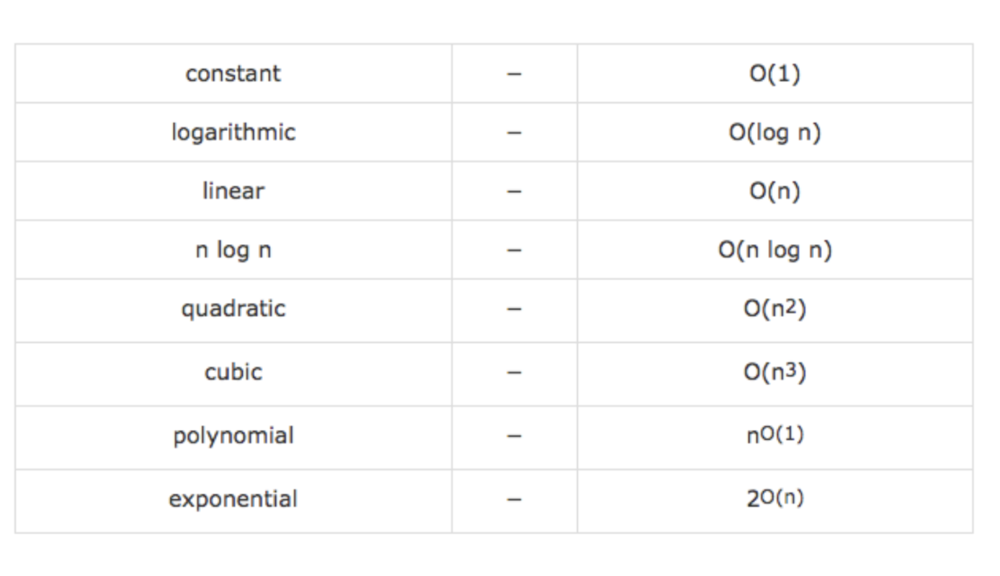
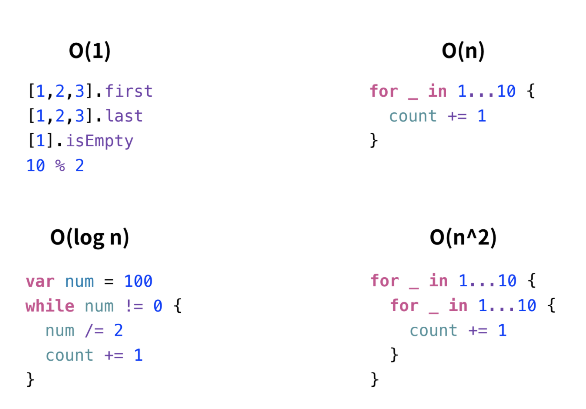

# 알고리즘


## 어원

**Algorithm [ӕlgərɪðəm]**

- 앨거리덤, 알고리듬 / 알고리즘(X)
- 어떤 문제를 해결하기 위해 정의된 절차와 방법, 명령어의 집합
- 9세기 페르시아 수학자, 무하마드 알콰리즈미(Muhammad al-Kwarizmi) 의 이름에서 유래
'콰라즘에서 온 사람이 가르쳐 준 수 (알 콰라즘)’ -> 알고리즘


### Flowchart


## Alforithm 조건

알고리즘은 다음의 조건을 만족해야 함

• 입력 : 외부에서 제공되는 자료가 0개 이상 존재한다.
• 출력 : 적어도 1개 이상의 결과물을 출력해야 한다.
• 명확성 : 수행 과정은 명확해야 하고 모호하지 않은 명령어로 구성되어야 한다.
• 효율성 : 모든 과정은 명백하게 실행 가능(검증 가능)한 것이어야 한다.
• 유한성(종결성) : 알고리즘의 명령어들은 계산을 수행한 후 반드시 종료해야 한다.


## Examples

- 택배를 가장 빠르게 배달할 수 있는 루트
- 로봇 청소기의 움직임
- 자동 주식 거래 시스템
- 최적의 검색 결과
- 얼굴 / 지문 인식
- Siri


## Google Search Alforithm 

세르게이 브린, 래리 페이지 논문
- The Anatomy of a Large-Scale Hypertextual Web Search Engine 
[[링크]](http://infolab.stanford.edu/~backrub/google.html)
- PageRank : 특정 페이지를 인용하는 다른 페이지가 얼마나 많이 있는지를 통해 랭킹 반영


## Why Algorithm?

[ 알고리즘을 공부해야 하는 이유 ]
- 문제 해결력 상승
- 관련된 케이스를 알고 있으면 다음에 유사한 문제를 쉽게 해결 가능
- 평상시 화면 구현 집중. 시간 복잡도 / 공간 복잡도 / 메모리 관심 X
알고리즘 학습을 통해 해당 부분에 대한 관심 + 고민 + 접근법 향상


### Common Astmptotic Notations 


위로 갈수록 좋음 



- O (n!)-요인 복잡성
예 : 정렬 알고리즘에 요인이 복잡하다고 가정하면, 배열에 10 개의 요소가있는 경우 배열을 정렬하려면 3628800 단계 (10! 또는 10 * 9 * 8 * 7 * 6 * 5 * 4 * 3 * 2 * 1)가 걸림

- O (2 n )-지수 복잡성
예 : 정렬 알고리즘이 지수 적으로 복잡하다고 가정하면, 배열에 10 개의 요소가있는 경우 배열을 정렬하는 데 1024 단계 (2 ^ 10)가 걸림.

- O (n 2 )-이차 복잡성
예 : 정렬 알고리즘에 2 차 복잡성이 있다고 가정하면,. 배열에 10 개의 요소가 있으면 배열을 정렬하는 데 100 단계 (10 ^ 2)가 걸림.

- O (n log 2 n)-선형 복잡성
예 : 정렬 알고리즘에 선형 복잡성이 있다고 가정하면, 배열에 10 개의 요소가있는 경우 배열 을 정렬하는 데 ~ 33-34 단계 (10 * (log 2 10)) 가 걸림 .

- O (n)-선형 복잡도
예 : 정렬 알고리즘에 선형 복잡성이 있다고 가정하면, 배열에 10 개의 요소가 있으면 배열을 정렬하는 데 10 단계가 필요. 선형 복잡도는 요소 수만큼 많은 단계를 수행.

- O (log 2 n)-로그 복잡성
예 : 정렬 알고리즘에 로그 복잡성이 있다고 가정하면, 배열에 10 개의 요소가있는 경우 배열 을 정렬하는 데 ~ 3-4 단계 (log 2 10) 가 걸림 .


# Sortiong Algorithm (정렬 알고리즘)

정렬 알고리즘 - 알고리즘을 소개할 때 가장 대표적으로 소개되는 케이스
worst, average, best case 등을 이해하기 쉽고 시각적으로 표현하기 좋음
다양한 곳에서 자주 쓰이기 때문에 이미 다양한 알고리즘이 나와있고 현재도 계속 연구중

- [15 Sorting Algorithms](https://www.youtube.com/watch?v=kPRA0W1kECg)
- [Visualization and Comparison of Sorting Algorithms](https://www.youtube.com/watch?v=ZZuD6iUe3Pc)
- [Bubble-sort with Hungarian ("Csángó") folk dance](https://www.youtube.com/watch?time_continue=108&v=lyZQPjUT5B4)
- [Merge Sort vs Quick Sort](https://www.youtube.com/watch?v=es2T6KY45cA)
- [Sorting](http://sorting.at/)
- [swift-algorithm-club](https://github.com/raywenderlich/swift-algorithm-club)


# Bubble Sort(버블정렬)

- 인접한 두 원소의 크기를 비교하여 큰 값을 배열의 오른쪽으로 정렬해 나가는 방식
- 이미 대 부분 정렬되어 있는 자료에서는 좋은 성능을 보이지만 그 외에는 매우 비효율적인 알고리즘
- 단, 직관적이어서 쉽고 빠르게 구현 가능하여 많이 알려져 있음
시간복잡도 - O(n2(제곱임)) 
- 서로의 두 수를 비교하여 오른쪽으로 나아감
- 최상의 케이스 복잡성 : О (n) 최악의 케이스 복잡성 : О (n ^ 2)


이런 식으로 
(정렬이 될 때까지 반복. )


### 실습 

1) 기본형
```swift
func bubbleSort(arr: [Int]) -> [Int]{
  var array = arr
  for _ in 0..<array.count - 1
  {
    for j in 0..<array.count - 1
    {
      if (array[j] > array[j+1]) {
      let temp = array[j]
      array[j] = array[j+1]
      array[j+1] = temp
    }
  }
}
return array
}
let unsortedArray = [4,3,6,8,2,9]
print(bubbleSort(arr: unsortedArray))
```
2) 심화
```
func bubbleSort(input: inout [Int]) {
  guard !input.isEmpty else {return}
  
  for i in 1..<input.count { //마지막 부분까지 정렬되었을때, 다시 처음으로 돌아가서 정렬
    var isSorted = true //(추가1.)시간아끼기: 첨부터 정렬되어있는지 확인.
  
    for idx in 0..<input.count - i { //2개를 비교해가면서 위로 올라가는 실제
   print("\(i):", input)
      guard input[idx] > input[idx + 1] else { continue }
    //좌측 숫자가 우측 숫자보다 클 때
    input.swapAt(idx, idx + 1)
    isSorted = false//(추가2.)
    }
    guard !isSorted else {break}  //(추가3.)만약, 정렬이 다 됐으면 break
    print("\(i):", input)
  }
  
}
```
2.5) 심화내용이 잘 되었는지 확인
```swift
// 정답지 - 기본 정렬 함수
let sorted = inputCases.map { $0.sorted() }

// 직접 만든 정렬 함수 적용
for idx in inputCases.indices {
  bubbleSort(input: &inputCases[idx])
}

// 결과 비교. 정렬 완료가 나오면 성공ㅎ
func testCases() {
  inputCases.enumerated().forEach { idx, arr in
    guard sorted[idx] != arr else { return }
    print("케이스 \(idx + 1) 정렬 실패 - \(inputCases[idx])")
  }
}
let isSuccess = sorted == inputCases
isSuccess ? print("정렬 완료") : testCases()
```

```
5: [256, 377, 519, 542, 529, 621, 720, 778, 926, 943]
6: [256, 377, 519, 542, 529, 621, 720, 778, 926, 943]
6: [256, 377, 519, 542, 529, 621, 720, 778, 926, 943]
6: [256, 377, 519, 542, 529, 621, 720, 778, 926, 943]
6: [256, 377, 519, 542, 529, 621, 720, 778, 926, 943]
6: [256, 377, 519, 529, 542, 621, 720, 778, 926, 943]
7: [256, 377, 519, 529, 542, 621, 720, 778, 926, 943]
7: [256, 377, 519, 529, 542, 621, 720, 778, 926, 943]
7: [256, 377, 519, 529, 542, 621, 720, 778, 926, 943]
```
프린트 이런식으로 나옴. 


실습하긴 했는데, [swift-algorithm-club](https://github.com/raywenderlich/swift-algorithm-club)에서는 **버블정렬**과 **느린정렬**은 잘못된 정렬 알고리즘으로 권장하지는 않고 있다. 오로지 학습용으로만! ! 🤔


# Selection Sort(선택정렬)


데이터를 반복 순회하며 최소값을 기억해 놓았다가 정렬되지 않는 숫자 중 가장 좌측의 숫자와 위치 교환하는 방식
- 최소값 선택 정렬 (Min-Selection Sort) : 가장 작은 값을 기준으로 정렬 (오름차순)
- 최대값 선택 정렬 (Max-Selection Sort) : 가장 큰 값을 기준으로 정렬 (내림차순)
시간복잡도 - O(n2)
- 최상의 케이스 복잡성 : О (n ^ 2) 최악의 케이스 복잡성 : О (n ^ 2)


```
[3,4,5,1,0,8,1]
[0]|[3,4,5,1,8,1]
[0,1]|[3,4,5,8,1]
[0,1,1]|[3,4,5,8]
[0,1,1,3]|[4,5,8]
[0,1,1,3,4]|[5,8]
[0,1,1,3,4],5|[8]
[0,1,1,3,4,5,8]
```
왼쪽부터 차례대로 쭉 올라가기. (내림차순)


이런 식으로 ..


### 실습 
 
 1) 실습
```swift
func selectionSort(input: inout [Int]) {

  for i in input.indices {
    var minIndex = i //0,1,2,3,4,5 //minIndex로 시작해서 서서히 올라가면 됨.
    for idx in (i + 1)..<input.count {
      guard input[minIndex] > input[idx] else {continue} //1부터시작, 2부터시작, 3부터 시작..등..
      minIndex = idx // minIndex를 현재 숫자가 있는 위치로 바꾸는 것.
    }
    input.swapAt(i, minIndex)
    print("\(i + 1 ): ", input)
  }
}
```
2) 결과확인 코드
```swift
// 정답지 - 기본 정렬 함수
let sorted = inputCases.map { $0.sorted() }

// 직접 만든 정렬 함수 적용
for idx in inputCases.indices {
  selectionSort(input: &inputCases[idx])
}

// 결과 비교. 정렬 완료가 나오면 성공
func testCases() {
  inputCases.enumerated().forEach { idx, arr in
    guard sorted[idx] != arr else { return }
    print("케이스 \(idx + 1) 정렬 실패 - \(inputCases[idx])")
  }
}
let isSuccess = sorted == inputCases
isSuccess ? print("정렬 완료") : testCases()
```

```
1:  [61, 285, 105, 119, 837, 558, 874, 467, 618, 958]
2:  [61, 105, 285, 119, 837, 558, 874, 467, 618, 958]
3:  [61, 105, 119, 285, 837, 558, 874, 467, 618, 958]
4:  [61, 105, 119, 285, 837, 558, 874, 467, 618, 958]
5:  [61, 105, 119, 285, 467, 558, 874, 837, 618, 958]
6:  [61, 105, 119, 285, 467, 558, 874, 837, 618, 958]
7:  [61, 105, 119, 285, 467, 558, 618, 837, 874, 958]
8:  [61, 105, 119, 285, 467, 558, 618, 837, 874, 958]
9:  [61, 105, 119, 285, 467, 558, 618, 837, 874, 958]
10:  [61, 105, 119, 285, 467, 558, 618, 837, 874, 958]
정렬 완료
```
print시 이런 식으로 나옴..


# Insertion Sort (삽입 정렬)

- 배열을 순회하며 현재 위치와 그보다 작은 인덱스의 값들을 비교해 적절한 위치에 삽입해 나가는 방식
- O(n^2) 정렬 알고리즘 삼대장 (버블, 선택, 삽입) 중 일반적으로 가장 빠른 알고리즘
시간복잡도 - O(n2)
- 최상의 케이스 복잡성 : О (n) 최악의 케이스 복잡성 : О (n ^ 2)


```
[3,4,5,1,0,8,1]
[3]|[4,5,1,0,8,1]
[3,4]|[5,1,0,8,1]
[3,4,5]|[1,0,8,1]
[1,3,4,5]|[0,8,1]
[0,1,3,4,5]|[8,1]
[0,1,3,4,5,8]|[1]
[0,1,3,4,5,8,1]
```

오른쪽에서 왼쪽으로 순차적으로 이동되는 모습. (비교후 멈춤. 재시작 필요)


### 실습 
1) 실습
```swift

```

2) 실습 결과 확인 
```swift
```


# Quick Sort


- 기준이 되는 pivot 을 선정해 이를 기준으로 작은 값은 좌측, 큰 값을 우측에 재배치하는 것을 반복하는 방식
- 분할 정복 방식 (Divide and Conquer) 사용
- 일반적으로 실세계 데이터에 대입했을 때 가장 빠르다고 알려져있고 가장 많이 활용되는 정렬 알고리즘
- 시간복잡도 - 평균적으로 O(nLogn), 최악의 경우 O(n2)
- 최상의 케이스 복잡성 : О (n ^ 2) 최악의 케이스 복잡성 : О (n ^ 2)


피봇 = 기준점(15)

영역(범위)들을 정렬해 나가는 방식 

```
[3,4,5,1,0,8,1]
[0]|[3,4,5,1,8,1]
[0,1]|[3,4,5,8,1]
[0,1,1]|[3,4,5,8]
[0,1,1,3]|[4,5,8]
[0,1,1,3,4]|[5,8]
[0,1,1,3,4],5|[8]
[0,1,1,3,4,5,8]
```


# Merge Sort

- 재귀함수를 통해 큰 데이터를 더 이상 나눌 수 없는 단위까지 잘개 쪼갠 후 다시 합치면서(merge) 정렬하는 방식
- 병합된 부분은 이미 정렬되어 있으므로 전부 비교하지 않아도 정렬 가능
- 분할 정복 방식 (Divide and Conquer) 의 대표적인 케이스 중 하나
- 데이터를 분해하고 합치는 작업에 필요한 (데이터 크기와 동일한) 추가 메모리 공간 필요
- 평균적으로 퀵 정렬에 비해 느리지만 퀵이나 힙과 달리 Stable 한 정렬이며 데이터 상태에서 영향을 거의 받지 않음
- 시간복잡도 - 항상 O(nLogn)
- 최고 사례 복잡도 : O (n log (n)) 최악의 경우 복잡도 : O (n log (n))


```
[3,4,5,1,0,8,1]
[3,4,5,1] [0,8,1]
[3,4] [5,1] [0,8] [1]
[3][4][5][1][0][8][1]
[3,4][5,1][0,8][1]
[3,4][1,5][0,8][1]
[1,3,4,5] [0,1,8]
[0,1,1,3,4,5,8]
```

이런 식으로 범위를 점점 넓혀감 


[[정렬에 대해 참고된 사이트 : https://www.codingame.com/playgrounds/506/sorting-in-swift/merge-sort]](https://www.codingame.com/playgrounds/506/sorting-in-swift/merge-sort)
및 사진 출저. 


# Swift Sorting Algorithm

```
[Swift 기본 정렬 알고리즘 ]
- Intro Sort (Insertion Sort + Quick Sort + Heap Sort)
䢗
- Timsort (Insertion Sort + Merge Sort)
```

일반적으로 퀵소트가 가장 빠름. 


[[참고링크]](https://github.com/apple/swift/blob/master/stdlib/public/core/Sort.swift)
[[참고링크]](https://github.com/apple/swift/commit/e5c1567957e8bd159beb7ef21f5fbb25bebf34e8#diff-d8682241e4e146bde02399e918c36837)


