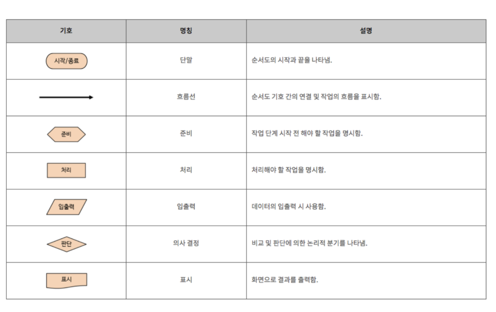
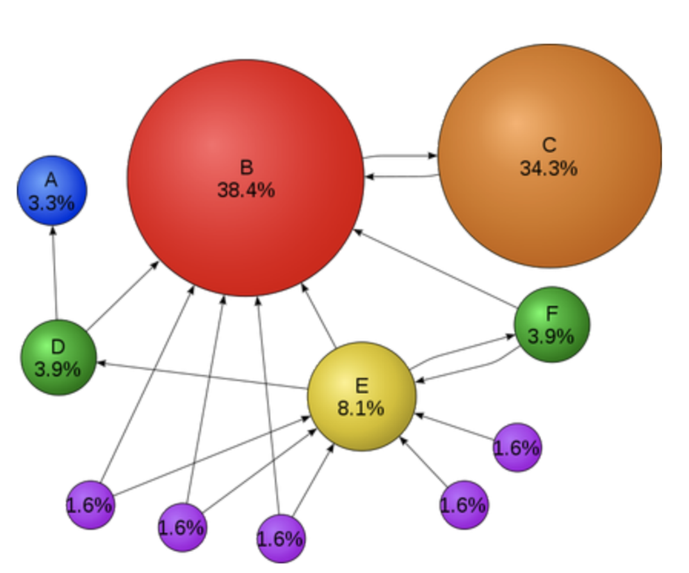

# 알고리즘

## 어원

**Algorithm [ӕlgərɪðəm]**

- 앨거리덤, 알고리듬 / 알고리즘(X)
- 어떤 문제를 해결하기 위해 정의된 절차와 방법, 명령어의 집합
- 9세기 페르시아 수학자, 무하마드 알콰리즈미(Muhammad al-Kwarizmi) 의 이름에서 유래
'콰라즘에서 온 사람이 가르쳐 준 수 (알 콰라즘)’ -> 알고리즘

### Flowchart

## Alforithm 조건

알고리즘은 다음의 조건을 만족해야 함

• 입력 : 외부에서 제공되는 자료가 0개 이상 존재한다.
• 출력 : 적어도 1개 이상의 결과물을 출력해야 한다.
• 명확성 : 수행 과정은 명확해야 하고 모호하지 않은 명령어로 구성되어야 한다.
• 효율성 : 모든 과정은 명백하게 실행 가능(검증 가능)한 것이어야 한다.
• 유한성(종결성) : 알고리즘의 명령어들은 계산을 수행한 후 반드시 종료해야 한다.

## Examples

- 택배를 가장 빠르게 배달할 수 있는 루트
- 로봇 청소기의 움직임
- 자동 주식 거래 시스템
- 최적의 검색 결과
- 얼굴 / 지문 인식
- Siri

## Google Search Alforithm 

세르게이 브린, 래리 페이지 논문
- The Anatomy of a Large-Scale Hypertextual Web Search Engine 
[[링크]](http://infolab.stanford.edu/~backrub/google.html)
- PageRank : 특정 페이지를 인용하는 다른 페이지가 얼마나 많이 있는지를 통해 랭킹 반영

## Why Algorithm?

[ 알고리즘을 공부해야 하는 이유 ]
- 문제 해결력 상승
- 관련된 케이스를 알고 있으면 다음에 유사한 문제를 쉽게 해결 가능
- 평상시 화면 구현 집중. 시간 복잡도 / 공간 복잡도 / 메모리 관심 X
알고리즘 학습을 통해 해당 부분에 대한 관심 + 고민 + 접근법 향상

