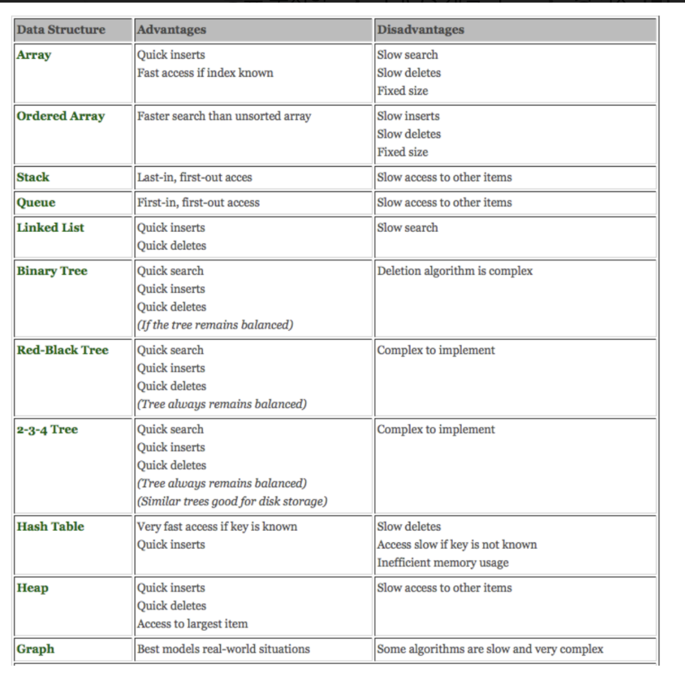

# [자료구조]

## Data Structure

### Abstract Data Type

- 추상 자료형 : 어떤 문제를 해결하기 위한 자료 형태와 그것을 다루는 연산을 수학적으로 정의한 모델
데이터와 연산 두 가지 부분에 대한 명세서(Specification)로 구성

  - 인터페이스와 구현을 분ㅎ리하여 추상화 계층(인터페이스)를 둔 것
  - 내부 구현을 알지 못해도 (동작할 수 있도록)ADT명세만 알면 활용가능 예) TV리모컨을 누를 떄 내부 구현을 알지 못해도 버튼만 누르면 동작 - powerOn, volumeUp등..
  - 관련 자료형으 기본 특성은 가지지만 정해진 표준은 없고 정의하는 회사나 사람에 따라 다를 수 있음.  - 연산에 대한 복잡도나 구현 내용은 정의하지 않음

- 추상 자료 구조 : 추상 자료형에 각 연산에 대한 복잡도까지 정의한 가상의 자료구조 


### Data Structure

```
자료를 효율적으로 이용할 수 있도록 저장하는 방법을 의미
1차원 형태의 메모리 공간과 현실 세계의 다차원 데이터를 어떻게 변환할 것인지 다루는 일이기도 함
추상자료형에서 정의한 내용을 실제로 구체화한 형태
> 추상화 - 무엇(What) 을 할 것인가
> 구체화 - 어떻게(How) 할 것인가
잘 짜여진 자료구조는 적은 메모리 용량과 연산 시간을 갖게 되므로 효과적인 알고리즘 구현에 중요한 역할
주요 관점 : 검색, 삽입, 변경, 삭제
```

자료구조 팩트 : 얼마나 빠르게, 변경, 삭제, 삽입할 것인가

[좋은자료구조]
- 해결하고자 하는 문제와 관련된 자료의 추가, 삭제, 검색이 효율적으로 수행되고 복잡한 구조를 간결하게 표현할 수
있는 형태. 따라서 무조건 더 좋은 자료 구조는 없으며 구현 내용에 따라 적절한 데이터 구조가 다를 수 있다.


### Types of Data Syructure 


선형자료구조 : arrays, Linked list, Stack, Queue  
비선형자료구조 : Trees, Graghs 


### 자료구조가 가져야할 특징

• 정확성(Correctness) - 필요한 자료에 필요한 연산을 정확히 적용 할 수 있어야 함
• 효율성(Efficiency) - 상황에 맞는 구조를 사용하여 자료 처리의 효율성 상승
• 추상화(Abstraction) - 복잡한 자료의 핵심 개념 또는 기능을 추상화하여 간단하고 쉽게 사용할 수 있도록 설계
• 재사용성(Reusability) - 추상화된 개념을 모듈화하여 독립적이고 쉽게 재사용 가능하도록 함

자료 구조 선택 기준
• 자료의 크기와 처리시간
• 자료의 활용 및 갱신 빈도
• 활용 용이성





인덱스를 알고있으면 빠르게 접근이 가능하다. 
스택이 스택을 쓰는 경우..
필요하면 만들어 쓸 수도 있고..


### Complexity(복잡성) 

시간복잡성 - 데이터 연산 시간은 가능한 작아야 함
공간복잡성 - 데이터 연산 및 저장에 필요한 메모리 공간은 가능한 작아야 함


Worst Case을 특별히 중요하게 생각한다./알고리즘의 효율 많이 따짐


 : 끝에 것만 가져오면 됨 
0(n) : n번것 만 가져오면 됨 
0(log n) : 100번을 나눠서
0(n^2) : 제곱안에 100번 안에 끝나는 것

단위가 작을 수록 좋음. 


## Linked List 


Single Linked List (단일 연결 리스트)
: 하나의 포인터 멤버로 다른 노드 데이터를 가르키는 것 (HEAD 없이 TAIL 만 존재)
: 앞으로 돌아갈 수 없으며, 중간 위치로 바로 접근하지 못 함. O(N)
: Head 노드 주소를 잃어버리면 데이터 전체 접근 불가. 중간이 유실되면 그 이후 노드들에 접근 불가
: Queue 구현에서 많이 사용. 파일 시스템 중 FAT 시스템이 이런 형태로 연결. 랜덤 엑세스 성능이 낮고 불안정

Double Linked List (이중 연결 리스트)
: HEAD 가 이전, TAIL 이 이후 노드 데이터를 가르키는 것
: 끊어진 체인 복구 가능

Circular Linked List (환형 연결 리스트)
: 처음 노드와 마지막 노드가 서로 연결된 구조
: 스트림 버퍼의 구현에 많이 사용되며 할당된 메모리 공간 삭제 및 재할당의 부담이 없어서 큐 구현에도 적합


<노드>
회색 : 'A' 헤드 
노란색 : 다음번에 가져야할 데이터가 있어야할 위치를 가르키는 포인터. (노드 데이터라고도함)
노드 데이터는 A->B->C로 순차적으로 이동, A -> C로 바로 갈 수 없음


### ADT Example 

(이런 기능은 있어야한다고 정의)

```
Insertion − Adds an element at the beginning of the list.
Deletion − Deletes an element at the beginning of the list.
Display − Displays the complete list.
Search − Searches an element using the given key.
Delete − Deletes an element using the given key.
```


### Single Linked List - insert Node 


B에서 D로가는 연결을 끊은 경우,  
C에서 D로 연결(확보)을 해놓은 후, B->C로 연결해야함(그래야 날아가지 않음)

(  B는 D만 알고 있었는데, C에게 알려줌으로써, C에게도 D를 나눠준 것 ) 

노드가 가지고 있는 값, 데이터에 접근하기 위한 경로~ 관정.. 


- 실습 
```swift

```


### Double Linked List 


